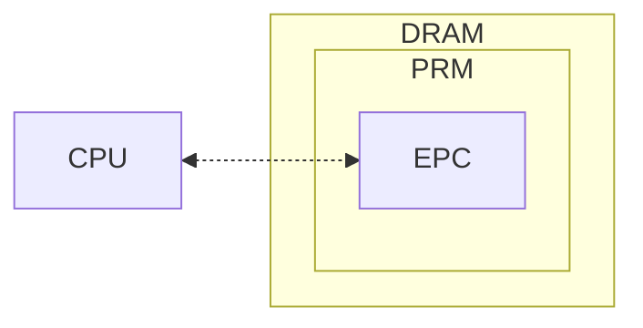
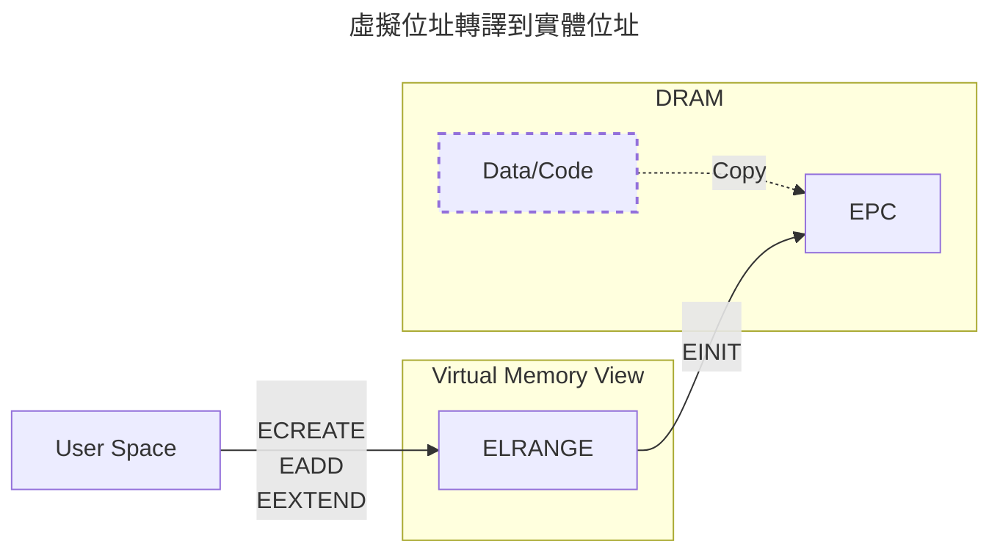
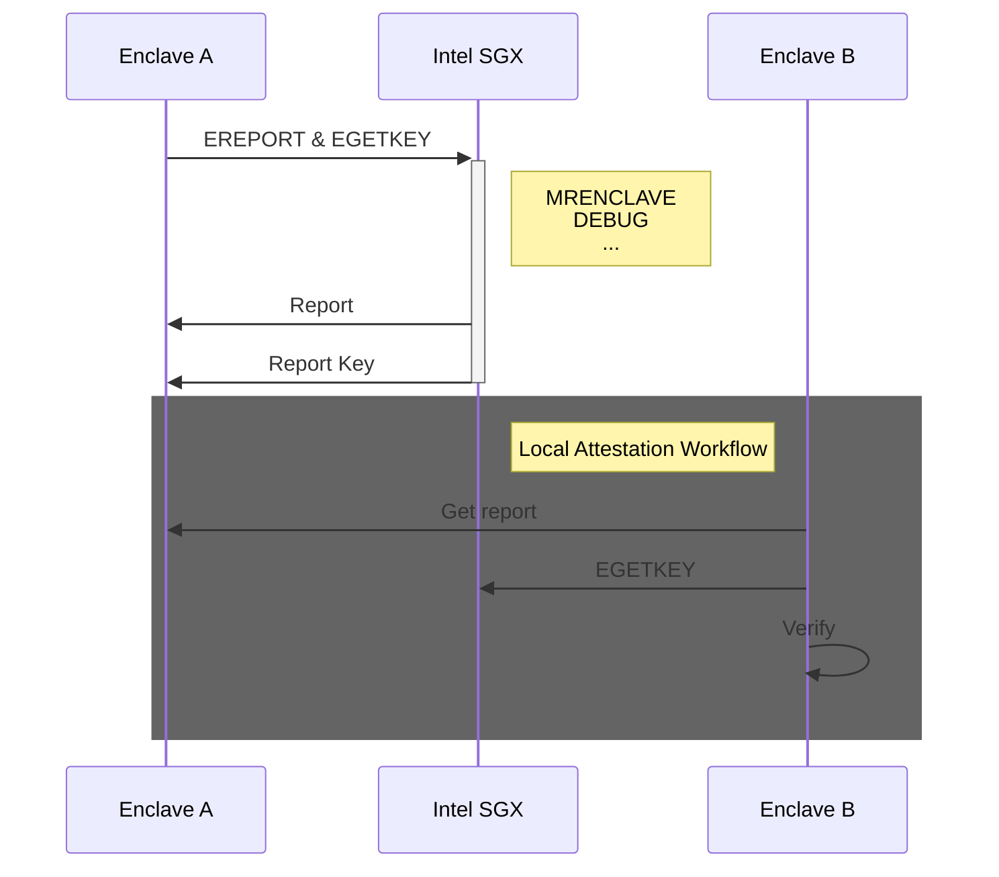
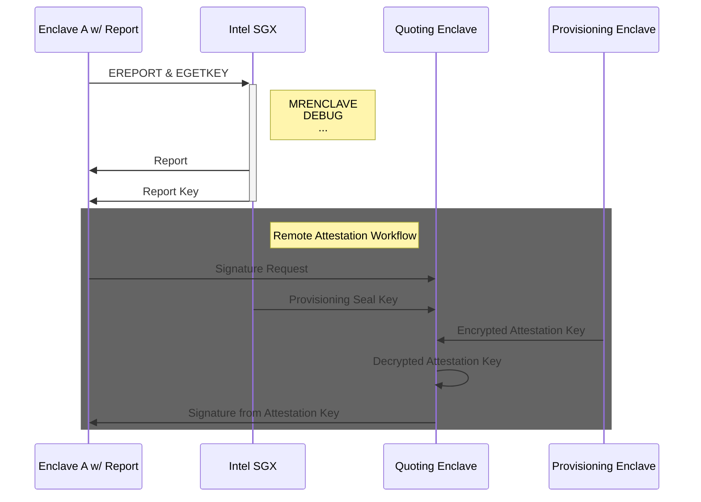

自從我知道可以透過一些 Linux 工具，把執行中的記憶體整個複製出來分析後，
我就在想，**如果某個程序取得了 root 權限，是不是代表它可以對所有應用程式做所有事？**
即使應用程式有 TLS 做點對點的加密，但是在記憶體複製大法下仍然變成赤裸的羔羊，
直接把解密後的傳輸內容取出來，根本不用考慮 TLS 內的金鑰。

帶著這樣的想法搜尋了下，發現有個叫機密運算（Confidential Computing）的東西，
就是以硬體的方式，避免計算和記憶體被窺視，本篇將透過 Intel SGX 闡述其作法。

!!! info "參考於"
    主要參考這篇論文 [Intel SGX Explained](https://eprint.iacr.org/2016/086.pdf)。

## 歷史和定位

2014 年 Apple 首先推出 Secure Enclave Processors (SEP) 在產品 iPhone 5s 中，
而後 2015 年，Intel 推出 Software Guard Extensions (SGX) 之後，
這種保護機制開始陸續被推廣，
最終於 2019 年促成 [Confidential Computing Consortium](https://confidentialcomputing.io/) (CCC)
的成立，共同推動開放標準及跨平台的 *可信執行環境*（Trusted Execution Environment, TEE）

以下，便是 CCC 的宗旨。

> Securing data in use and accelerating the adoption of confidential computing
> through open collaboration.

### Encryption in use

在使用一些機敏或隱私性的資料時，會有三個地方可能的地方暴露其內容，分別是：

- 儲存（at rest），資料被存進資料庫或任何載體時；
- 傳輸（in transit），資料透過網路或任何傳輸方式時；
- 使用（in use），資料正被拿來計算或使用時。

儲存的話，
Mac 有[檔案保險箱](https://support.apple.com/zh-tw/guide/mac-help/mh11785/mac)，
Windows 有 [BitLocker](https://support.microsoft.com/zh-tw/windows/windows-%E4%B8%AD%E7%9A%84%E8%A3%9D%E7%BD%AE%E5%8A%A0%E5%AF%86-cf7e2b6f-3e70-4882-9532-18633605b7df)
等等。
除此之外，也可以透過一些工具和資料庫整合，進行檔案落地的加密，例如
[Vormetric](https://cpl.thalesgroup.com/encryption/vormetric-data-security-platform)。

傳輸的話最常見就是 Transport Layer Security, TLS。

在 *儲存* 和 *傳輸* 方面，我們已經有很成熟的方式了，至於使用中的資料要怎麼保護？這就是本篇的重點。

## Intel SGX

Intel SGX 是一種架構，而不是指任一個組件。
核心邏輯就是**把你需要進行機密計算的程式碼和資料放進一個被保護好的記憶體區塊**，
而這個記憶體區塊無法被除你之外的人存取，並稱其為 enclave，翻譯為「飛地」。

如圖所示，DRAM 中有一塊 Processor Reserved Memory (PRM)，
PRM 代表一種只允許被特定指令集操作的記憶體，
其中針對 SGX 的 PRM 則被稱為 Enclave Page Cache (EPC)。
而在 [SGX 指令集](https://www.intel.com/content/dam/develop/external/us/en/documents/329298-002-629101.pdf)中，
每個指令在到處理器計算時，會進行應盡的檢查，確保資料將不被其他外部組件取得。

!!! note "換句話說"
    只要確保 SGX 指令集是安全的，就能確保 EPC 的存取是安全的，
    因為只有 SGX 指令集可以和 EPC 的資料進行互動。

這裡有 Intel 列出[支援 SGX 的處理器](https://www.intel.com/content/www/us/en/architecture-and-technology/software-guard-extensions-processors.html)，
以當下（2024）最新的處理器 Xeon 6 代來說，每個 CPU 提供 512MB 的 PRM 來提供運算。
舉例來說，
[Intel Xeon 6980P](https://ark.intel.com/content/www/us/en/ark/products/240777/intel-xeon-6980p-processor-504m-cache-2-00-ghz.html)
提供 128 個 CPU，就有總計 64GB 的 PRM 給你做使用，
還沒有加上額外提供 512GB 用作 PRM 外的儲存空間，詳見 [Sealing](#sealing)。

### Enclave

飛地是一個只接受特定指令出入的一個安全區域，接下來將闡述一下怎麼建構和管理飛地。

我們透過 [SGX Linux SDK](https://github.com/intel/linux-sgx/tree/main)
的 `sgx_create_enclave` 函式在 PRM 中標誌出一個專屬於應用程式的飛地，
其中 SDK 內部會接續呼叫 `ECREATE`、`EADD`、`EEXTEND` 和 `EINIT` 這幾個指令集。

- `ECREATE` 會在虛擬記憶體中開一個區域，並在此時指定之後飛地的屬性；
- `EADD` 會把需要被放進飛地的函式複製進虛擬記憶體，在 `EINIT` 之前可被多次呼叫；
- `EEXTEND` 會重新計算這塊虛擬記憶體目前的程式碼簽章，換句話說是在 `EADD` 後使用；
- `EINIT` 則是最後一步，會把這塊虛擬記憶體複製進 PRM 中，
  正式成為一塊飛地並進入無法被編寫的狀態，接著開始進入 ring 3 應用程式階段。

有了這層程式碼上的抽象理解，接著就來理解其內部實際運作的邏輯，然後再說明儲存內容的細節。

#### 虛擬記憶體管理

首先，程式碼或資料一樣會被放在一般的記憶體中，並在呼叫 `EADD` 後，被放進某個集中的虛擬位址。
這個虛擬位址稱為 Enclave Linear Address Range (ELRANGE)，
它和其他虛擬位址沒有什麼本質上的差異，僅僅只是把這塊被標記的區域用來存放和 EPC 對映的位址。
通過這機制，OS 可以用和處理一般記憶體的相同方式進行管理這些記憶體，降低學習和調整的成本。

但這也代表飛地會受到惡意 root 權限的程序進行地址轉譯攻擊（address translation attack）。
有鑑於此，SGX 把虛擬地址儲存在 EPC 中，確保 CPU 在運算時，都會比對來源虛擬地址是否和記錄的一樣。

EPC 中，記憶體被切分成一塊塊 4 KB 大小的記憶體分頁，而每個分頁都會有一組對應的屬性
Enclave Page Cache Map (EPCM)，上面提到的虛擬位址就被放在 EPCM 的其中一個 entry 中。

| 名稱 | Bits | 說明 |
| - | - | - |
| VALID       | 1  | 0 代表尚未分配的 EPC 分頁 |
| BLOCKED     | 1  | 1 代表分頁已經回收 |
| R           | 1  | 飛地的程式碼可以進行讀出此分頁 |
| W           | 1  | 飛地的程式碼可以進行寫入此分頁 |
| X           | 1  | 飛地的程式碼可以執行此分頁內容 |
| PT          | 8  | 分頁的種類 |
| ADDRESS     | 48 | 虛擬位址，用來避免地址轉譯攻擊 |
| ENCLAVESECS |    | 飛地的槽號，透過 SECS 來表示哪個飛地正在使用此分頁 |

> EPCM 欄位內容

??? note "PT，分頁種類"
    上面提到的 `PT` 有哪些？

    | 種類 | 建立於 | 用途 |
    | - | - | - |
    | `PT_REG`  | `EADD`    | 一般應用邏輯的程式碼和資料 |
    | `PT_SECS` | `ECREATE` | 詳見 [Enclave 管理](#enclave-管理) |
    | `PT_TCS`  | `EADD`    | 詳見 [Thread Control Structure](#thread-control-structure-tcs) |
    | `PT_VA`   | `EPA`     | Version Array，詳見論文章節 5.5.2 |

    > Page Type 的種類

#### Enclave 管理

當我們透過 `EINIT` 建立好飛地後，他會被切分成一塊一塊的記憶體分頁，
但是針對飛地的管理則是透過一個特殊分頁 SGX Enclave Control Structure (SECS)。
然後我們再透過每個 EPCM 中的 `ENCLAVESECS` 屬性來回推他的 SECS 位置，
並近一步確認這分頁屬於哪個飛地。

SECS 同時也記錄著特定飛地的設定和狀態。

| Field | 說明 |
| - | - |
| BASEADDR | 飛地的記憶體初始位置 |
| SIZE | 飛地的大小 |
| DEBUG | 是否啟用 debug 模式，會允許使用者存取大部分飛地內容，提供機制排查問題 |
| XFRM | 在編譯飛地程式碼時指定要哪些編譯器功能 |
| MRENCLAVE | *Measurement Enclave*，也就是每次呼叫 `EEXTEND` 會更新的資料 |
| TCS 相關 | 詳見 [Thread Control Structure](#thread-control-structure-tcs) |
| 本地驗證報告相關 | 詳見 [Attestation 產生的流程](#attestation-產生的流程) |

> SECS 大致有哪些欄位

### 關於飛地的更多說明

還有很多內容，但是有點細節，就不在上面展開。
雖然學習後會知道很多硬體和 OS 的互動關係，但這邊先只做簡單引言，歡迎做更多延伸學習。

#### Thread Control Structure (TCS)

如果希望應用程式同時進行多核運算，需要有一個地方去安全地管理多個執行緒在飛地內的執行，
也就是 Thread Control Structure (TCS)。
雖然作業系統通常負責多執行緒的控制，但在 SGX 的設計中， 飛地的執行需要與不受信任的作業系統隔離，
因此需要 TCS 來確保飛地程式碼在多執行緒環境下的安全性和隔離性。

| 欄位 | 說明 |
| - | - |
| OENTRY | 指定飛地的入口點 |
| OFSBASGX | thread 進行 switch 的時候，儲存 CPU state 到哪個 thread local storage (TLS) 地址。 |
| OGSBASGX | 同上，只是 by OS 的不同名稱，[參考](https://stackoverflow.com/questions/10810203/what-is-the-fs-gs-register-intended-for) |

> TCS 大致有哪些欄位

除上述欄位之外，還有很多欄位，
這些資訊都儲存在 `PT` 為 `PT_TCS` 的記憶體分頁中，詳見章節 5.2.4。

#### State Save Area (SSA)

除了 thread 的切換，有時候程式執行錯誤會拋出的 exception、硬體中斷（例如 NIC）等等，
也需要一個記憶體位置儲存，如果直接用一般的記憶體，就有可以能受到不信任的作業系統存取。

State Save Area (SSA) 就是一個用來儲存這些資訊的地方，他的分頁種類和一般程式碼或資料相同，
都是 `PT_REG`。

若想了解更多，可以參考章節 5.2.5。

#### 系統飛地

除了應用程式用的飛地外，也有很多系統用的飛地，這些飛地存在目的通常就是提高 attestation 安全性，
應用程式用的飛地生命週期被更完整的保護等等。

- Launch Enclave, LE：主要負責審查和批准其他飛地的啟動請求。
  LE 會根據預設的啟動控制策略來決定是否允許特定飛地啟動，
  並在 `EINIT` 時發布相關權杖 (`EINITTOKEN`) 來批准飛地的啟動。
- Provisioning Enclave, PvE：和 [Attestation](#attestation) 相關的飛地。
- Quoting Enclave, QE：和 [Attestation](#attestation) 相關的飛地。

### Attestation

當應用程式執行飛地相關操作時，我們要怎麼確保這個應用程式沒有被篡改？
Intel 提供一種機制為這個應用程式提出證明（attestation），若這組證明被驗證為合法，
就能斷定他是當初申請飛地的那個應用程式，並沒有被篡改。

也因為每個飛地都有可以被反覆驗證的證明，
所以任何需要驗證的使用方（不管是本地的其他程序或者外部網路的系統）都能以此為信賴基礎，信賴該程式碼。
例如，有個服務跑在雲端服務商中，當你在和該服務互動時，
可以先要求提交證明，並依此來驗證該服務的安全性。

#### 信賴基礎

在做證明前，就像 TLS 一樣，需要有一個信賴的起點，所有從這起點延伸的金鑰都應該被信任。
在 SGX 中，這個原點分別是*佈建秘密* (Provisioning Secret) 和*密封秘密* (Seal Secret)。

??? question "為什麼稱為秘密？"
    在[各種和 Attestation 相關的金鑰][keys]中，
    可以注意到金鑰都是依照這兩者秘密去做延伸（derived）的，
    所以我在這邊不稱信賴基礎中的佈建秘密和密封秘密為金鑰，而是秘密。

佈建秘密是在 Intel 金鑰生產設備 (Intel Key Generation Facility, iKGF) 中產生，
通過確保線下生產過程的嚴謹性，並被唯獨的寫入在 CPU e-fuse 中，來達到可信的基礎。
同時，Intel 也會把這個秘密存放在 Intel 自己受管的資料庫中。

??? info "什麼是 e-fuse"
    e-fuse 是一種單次可程式化 (One Time Programmable, OTP) 的儲存媒介，
    可以經濟高效地整合到高性能晶片中。
  
    e-fuse 一個重要特性是在寫入資料後就無法更改，這使得它們適用於儲存敏感的秘密資訊，例如金鑰。

密封秘密相對於佈建秘密，是在生產 CPU 過程中被獨立且秘密的放在 CPU e-fuse 中，
也就是說，只有通過該設備的指令才能存取密封秘密，任何其他系統和設備都無法知道，包括 Intel。

#### Attestation 產生的流程

主要分成 2 段：

1. 飛地產生本地驗證報告 (Local Attestation Report)；
2. 如果需要遠端驗證的話，可以根據報告產生驗證簽章 (Attestation Signature)。

當我們透過 SDK 執行 `sgx_create_enclave` 時，
其內部在呼叫 `EINIT` 後就會呼叫 `EREPORT` 來產生本地驗證報告。
這份報告和我們 TLS 機制中的 Certificate Sign Request (CSR) 很類似，
其中存放了我們透過 `EEXTEND` 反覆產生的 `MRENCLAVE` 還有各種屬性，例如 `DEBUG` 等等。
這份報告會被透過 *[報告金鑰][keys]*（Report Key）計算出
Message Authentication Code (MAC) 來確保其完整性。

如果只是要內部飛地彼此驗證，到這裡即結束，但如果需要外部服務去進行驗證，則需要進行以下步驟。

當產生報告後，會把報告送給 Quoting Enclave (QE)，
該飛地是一種系統飛地，負責執行 SGX 軟體驗證流程。
QE 接收來自飛地的本地驗證報告後，會同樣使用 `EGETKEY` 指令產生的報告金鑰進行 MAC 的驗證。
接著 QE 會同時取得 *佈建密封金鑰*（Provisioning Seal Key）
以及由 PvE 取得的加密後的 *驗證金鑰*（Attestation Key），
最後透過佈建密封金鑰解密驗證金鑰，並使用該驗證金鑰產生驗證簽章。

??? note "Provisioning Enclave, PvE"
    一種系統飛地，負責與 Intel 的金鑰佈建服務進行溝通，
    取得飛地驗證所需的驗證金鑰 (Attestation Key)。

    首先，PvE 會使用 `EGETKEY` 指令產生佈建金鑰 (Provisioning Key)，
    並利用該金鑰向 Intel 的佈建服務進行身分驗證，
    最終取得驗證金鑰並使用佈建密封金鑰 (Provisioning Seal Key) 加密後儲存。

最後，透過 Intel 提供的公開資訊來驗證簽章的有效性，
其中我們使用 [Enhanced Privacy ID](https://www.intel.com/content/www/us/en/developer/articles/technical/intel-enhanced-privacy-id-epid-security-technology.html) (EPID)
的群組公鑰來驗證驗證簽章的有效性，而不需要知道個別飛地的身分。

#### 各種和 Attestation 相關的金鑰

### Sealing

除了 PRM 之外，透過把資料加密可以讓飛地擁有更多的記憶體空間，這手法稱作 sealing。

## 程式範例

## 其他機密運算的架構

## Take away

[keys]: #各種和-attestation-相關的金鑰
