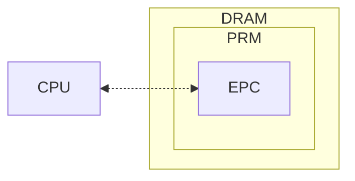
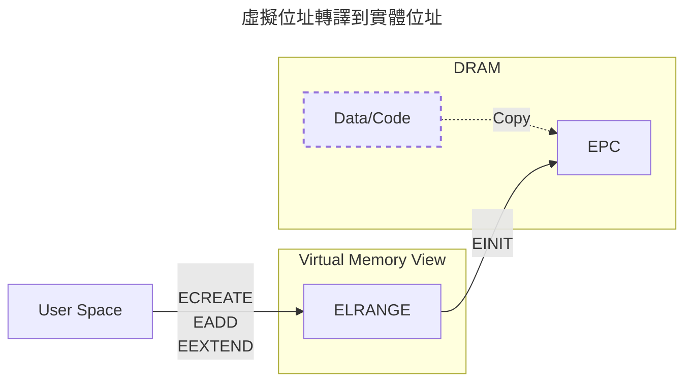

自從我知道可以透過一些 Linux 工具，把執行中的記憶體整個複製出來分析後，
我就在想，**如果某個程序取得了 root 權限，是不是代表它可以對所有應用程式做所有事？**
即使應用程式有 TLS 做點對點的加密，但是在記憶體複製大法下仍然變成赤裸的羔羊，
直接把解密後的傳輸內容取出來，根本不用考慮 TLS 內的金鑰。

帶著這樣的想法搜尋了下，發現有個叫機密運算（Confidential Computing）的東西，
就是以硬體的方式，避免計算和記憶體被窺視，本篇將透過 Intel SGX 闡述其作法。

!!! info "參考於"
    主要參考這篇論文 [Intel SGX Explained](https://eprint.iacr.org/2016/086.pdf)。

## 歷史和定位

2014 年 Apple 首先推出 Secure Enclave Processors (SEP) 在產品 iPhone 5s 中，
而後 2015 年，Intel 推出 Software Guard Extensions (SGX) 之後，
這種保護機制開始陸續被推廣，
最終於 2019 年促成 [Confidential Computing Consortium](https://confidentialcomputing.io/) (CCC)
的成立，共同推動開放標準及跨平台的 *可信執行環境*（Trusted Execution Environment, TEE）

以下，便是 CCC 的宗旨。

> Securing data in use and accelerating the adoption of confidential computing
> through open collaboration.

### Encryption in use

在使用一些機敏或隱私性的資料時，會有三個地方可能的地方暴露其內容，分別是：

- 儲存（at rest），資料被存進資料庫或任何載體時；
- 傳輸（in transit），資料透過網路或任何傳輸方式時；
- 使用（in use），資料正被拿來計算或使用時。

儲存的話，
Mac 有[檔案保險箱](https://support.apple.com/zh-tw/guide/mac-help/mh11785/mac)，
Windows 有 [BitLocker](https://support.microsoft.com/zh-tw/windows/windows-%E4%B8%AD%E7%9A%84%E8%A3%9D%E7%BD%AE%E5%8A%A0%E5%AF%86-cf7e2b6f-3e70-4882-9532-18633605b7df)
等等。
除此之外，也可以透過一些工具和資料庫整合，進行檔案落地的加密，例如
[Vormetric](https://cpl.thalesgroup.com/encryption/vormetric-data-security-platform)。

傳輸的話最常見就是 TLS。

在 *儲存* 和 *傳輸* 方面，我們已經有很成熟的方式了，至於使用中的資料要怎麼保護？這就是本篇的重點。

## Intel SGX

Intel SGX 是一種架構，而不是指任一個組件。
核心邏輯就是把你需要進行機密計算的程式碼和資料放進一個被保護好的記憶體區塊，
而這個記憶體區塊無法被除你之外的人存取，並稱其為 enclave，翻譯為「飛地」。

如圖所示，DRAM 中有一塊 Processor Reserved Memory (PRM)，
PRM 代表一種只允許被特定指令集操作的記憶體，
其中針對 SGX 的 PRM 則被稱為 Enclave Page Cache (EPC)。
而在 [SGX 指令集](https://www.intel.com/content/dam/develop/external/us/en/documents/329298-002-629101.pdf)中，
每個指令在到處理器計算時，會進行應盡的檢查，確保資料將不被其他外部組件取得。

這裡有 Intel 列出[支援 SGX 的處理器](https://www.intel.com/content/www/us/en/architecture-and-technology/software-guard-extensions-processors.html)，
以當下（2024）最新的處理器 Xeon 6 代來說，每個 CPU 提供 512MB 的 PRM 來提供運算。
舉例來說，
[Intel Xeon 6980P](https://ark.intel.com/content/www/us/en/ark/products/240777/intel-xeon-6980p-processor-504m-cache-2-00-ghz.html)
提供 128 個 CPU，就有總計 64GB 的 PRM 給你做使用，
還沒有加上額外提供 512GB 用作 PRM 外的儲存空間，詳見 [Sealing](#sealing)。

### Enclave

飛地可以把它想像成一個只接受特定出入口的一個安全區域，
接下來將闡述一下怎麼建構和如何管理飛地。

我們透過 [SGX Linux SDK](https://github.com/intel/linux-sgx/tree/main)
的 `sgx_create_enclave` 函式在 PRM 中標誌出一個專屬於應用程式的飛地，
其中 SDK 內部會接續呼叫 `ECREATE`、`EADD`、`EEXTEND` 和 `EINIT` 這幾個指令集。

- `ECREATE` 會在虛擬記憶體中開一個區域，並在此時指定之後飛地的屬性；
- `EADD` 會把需要被放進飛地的函式複製進虛擬記憶體，在 `EINIT` 之前可被多次呼叫；
- `EEXTEND` 會重新計算這塊虛擬記憶體目前的程式碼簽章，換句話說是在 `EADD` 後使用；
- `EINIT` 則是最後一步，會把這塊虛擬記憶體複製進 PRM 中，
  正式成為一塊飛地並進入無法被編寫的狀態，接著開始進入 ring 3 應用程式階段。

有了這層程式碼上的抽象理解，接著就來理解其內部實際運作的邏輯，然後再說明儲存內容的細節。

#### 虛擬記憶體管理

首先，程式碼或資料一樣會被放在一般的記憶體中，並在呼叫 `EADD` 後，被放進某個集中的虛擬位址。
這個虛擬位址稱為 Enclave Linear Address Range (ELRANGE)，
它和其他虛擬位址沒有什麼本質上的差異，僅僅只是把這塊被標記的區域用來存放和 EPC 對映的位址。
通過這機制，OS 可以用和處理一般記憶體的相同方式進行管理這些記憶體，降低學習和調整的成本。

但這也代表飛地會受到惡意 root 權限的程序進行地址轉譯攻擊（address translation attack）。
有鑑於此，SGX 把虛擬地址儲存在 EPC 中，確保 CPU 在運算時，都會比對來源虛擬地址是否和記錄的一樣。

EPC 中，被切分成一塊塊 4 KB 大小的記憶體分頁，而每個分頁都會有一組對應的屬性
Enclave Page Cache Map (EPCM)，這個虛擬位址就被放在 EPCM 中。

| 名稱 | Bits | 說明 |
| - | - | - |
| VALID       | 1  | 0 代表尚未分配的 EPC 分頁 |
| BLOCKED     | 1  | 1 代表分頁已經回收 |
| R           | 1  | 飛地的程式碼可以進行讀的操作 |
| W           | 1  | 飛地的程式碼可以進行寫的操作 |
| X           | 1  | 飛地的程式碼可以執行此分頁內容 |
| PT          | 8  | 分頁的種類 |
| ADDRESS     | 48 | 虛擬位址，用來避免地址轉譯攻擊 |
| ENCLAVESECS |    | 飛地的槽號，透過 SECS 來表示哪個飛地正在使用此分頁 |

> EPCM 欄位內容

??? note "分頁種類"
    | 種類 | 建立於 | 說明 |
    | - | - | - |
    | `PT_REG`  | `EADD`    | enclave code and data |
    | `PT_SECS` | `ECREATE` | SECS |
    | `PT_TCS`  | `EADD`    | TCS |
    | `PT_VA`   | `EPA`     | VA |

#### Enclave 屬性

### Sealing

除了 PRM 之外，透過把資料加密可以讓 enclave 擁有更多的記憶體空間，這手法稱作 sealing。

### Attestation

當應用程式執行 enclave 相關操作時，我們要怎麼確保這個應用程式沒有被篡改？
Intel 提供一種機制為這個應用程式提出證明（attestation），若這組證明被驗證為合法，
就能斷定他是當初申請 enclave 的那個應用程式，並沒有被篡改。

## 其他機密運算的架構

## Take away
