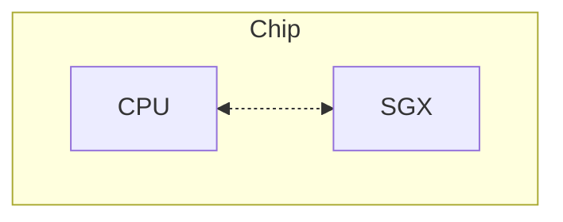

自從我知道可以透過一些 Linux 工具，把執行中的記憶體整個複製出來分析後，
我就在想，**如果某個程序取得了 root 權限，是不是代表它可以對所有應用程式做所有事？**
即使應用程式有 TLS 做點對點的加密，但是在記憶體複製大法下仍然變成赤裸的羔羊，
直接把解密後的傳輸內容取出來，根本不用考慮 TLS 內的金鑰。

帶著這樣的想法搜尋了下，發現有個叫機密運算（Confidential Computing）的東西，
就是以硬體的方式，避免計算和記憶體被窺視，本篇將透過 Intel SGX 闡述其作法。

## 抽象概念

2015 年，Intel 推出 Software Guard Extensions (SGX) 之後，
這種保護機制開始被推廣，
最終促成 [Confidential Computing Consortium](https://confidentialcomputing.io/)（CCC）的成立，
共同推動開放標準及跨平台的 *可信執行環境*（Trusted Execution Environment, TEE）。

以下，便是 CCC 的宗旨。

> Securing data in use and accelerating the adoption of confidential computing
> through open collaboration.

### Encryption in use

在使用一些機敏或隱私性的資料時，會有三個地方可能的地方暴露其內容，分別是：

- 儲存（at rest），資料備存進資料庫或任何載體時；
- 傳輸（in transit），資料透過網路或任何傳輸方式時；
- 使用（in use），資料正被拿來計算或使用時。

在 *儲存* 和 *傳輸* 方面，我們已經有很成熟的方式了。

儲存的話，
Mac 有[檔案保險箱](https://support.apple.com/zh-tw/guide/mac-help/mh11785/mac)，
Windows 有 [BitLocker](https://support.microsoft.com/zh-tw/windows/windows-%E4%B8%AD%E7%9A%84%E8%A3%9D%E7%BD%AE%E5%8A%A0%E5%AF%86-cf7e2b6f-3e70-4882-9532-18633605b7df)
等等。
除此之外，也可以透過一些工具和資料庫整合，進行檔案落地的加密，例如
[Vormetric](https://cpl.thalesgroup.com/encryption/vormetric-data-security-platform)。

傳輸的話最常見就是 TLS。

至於使用中的資料要怎麼保護？當一個服務透過網路傳輸得到的金鑰，
要怎麼避免在使用金鑰加解密時，被別人直接把記憶體複製出來查看金鑰本體？
這就是本篇的重點。

## Intel SGX

簡單來說，就是把你需要進行機密計算的程式碼放進一個被保護好的黑盒子，而這個黑盒子就是 SGX。

如圖所示，他被包裝到和 CPU 旁邊的位置，提供一組
[專屬於 SGX 的指令集](https://www.intel.com/content/dam/develop/external/us/en/documents/329298-002-629101.pdf)，
他需要的計算將不被任何（物理上或邏輯上）外部組件所取得。

這裡有 Intel 列出[支援 SGX 的處理器](https://www.intel.com/content/www/us/en/architecture-and-technology/software-guard-extensions-processors.html)，
以當下（2024）最新的處理器 Xeon 6 代來說，每個 CPU 提供 512MB 的 SGX 儲存空間來提供運算。
舉例來說 Intel Xeon 6980P 處理器提供 128 個 CPU，就有總計 64GB 的 SGX 儲存資源給你做使用，
還沒有加上額外提供 512GB 用作 SGX 外的儲存空間，詳見 [Sealing](#sealing)。

### Enclave

### Sealing

### Attestation

## 其他機密運算的架構

## Take away
