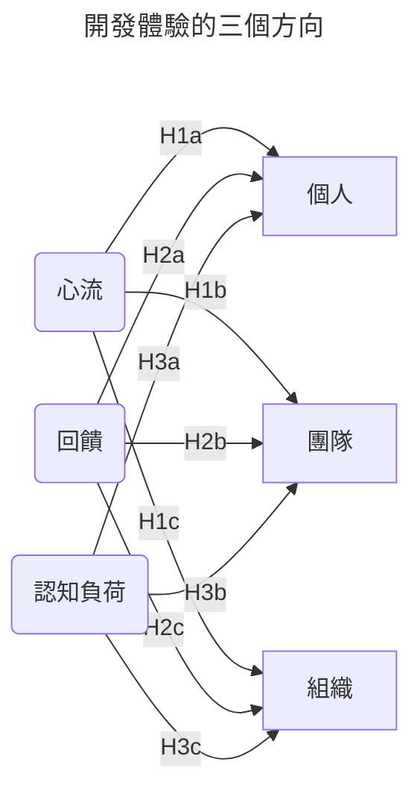
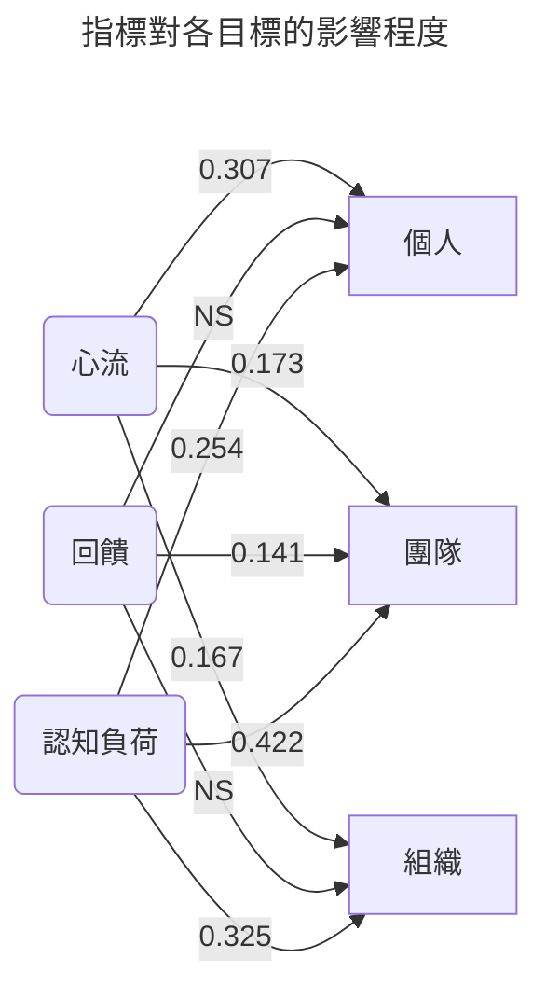

!!! quote "摘要"
    本文摘錄自：[DevEx in Action](https://queue.acm.org/detail.cfm?id=3639443)。

    文中闡述為什麼優化開發體驗很重要，並依此來設計出一個優質的工作環境。

優化工程開發體驗（假設）有三個目標要滿足：

- 個人，工作效率、創造力、學習；
- 團隊，程式碼品質、技術債；
- 組織，員工留任、創新、獲利、更寬廣的目標。

在優化開發體驗上，（假設）有三個指標可以考慮：

- [**心流**](https://zh.wikipedia.org/zh-tw/心流理論)，開發時的沈浸度。
    可透過環境的改善（如安靜的環境）、工具的優化（如統一介面，瀏覽器和 IDE 是否常常切換）、
    個人或團隊的時間規劃（如讓工程自行規劃專心開發的時間）。
- **回饋**，需要從外部去獲得進一步往前的推力，速度和品質是其中的重要衡量點。
    例如程式碼多久得到審閱並放行、一個內部系統疑問（例如依賴的 API 介面）多久得到回答。
- [**認知負荷**](https://zh.wikipedia.org/zh-tw/認知負荷)，腦力運作時資訊的負載程度。
    認知負荷又分為三個類別。
    *內部固有*（intrinsic），處理問題時本來就須具備的知識、
    *外顯行為*（extraneous），資訊呈現的方式，可透過更直觀的呈現來降低、
    *意義關聯*（germane），多個資訊之間的關係，越鬆散代表需要花更多腦力去串聯。

!!! example "只有這三個嗎？"
    這些只是作者提供的指標，根據情境可以自行設計。

    但是要注意，根據 PLS-SEM（後面的分析工具）最佳指南，
    指標數量越高，樣本數要跟著提高才能降低誤差。

總結來說，就會有這三對三的線圖：

## 問卷

透過問卷和 [PLS 的分析](./pls-sem.md)，
首先確保問卷項目（前三項）和目標（心流、回饋、認知負荷）有關係且合理，
接著找出假設（x 利於 y）和項目（後三項）的關係程度並確認假設是否合理。

下面是 PLS-SEM 中的外生構念（exogenous construct），
每個構面又包含個自的形成性指標（formative indicator）。

| 指標 | 平均得分 | 標準差 | 負荷量 |
| - | - | - | - |
| 在工時中，我有大量時間進行專注地開發[^1] | 3.383 | 0.845 | 0.826 |
| 在日常工作週中，你多長被非預期的工作干擾或中斷[^2] | 3.826 | 1.087 | 0.557 |
| 一般來說，我的程式碼工作是吸引人的[^1] | 3.580 | 0.871 | 0.796 |

> 心流構念，組成信度: 0.776，平均變異抽取量: 0.542

| 指標 | 平均得分 | 標準差 | 負荷量 |
| - | - | - | - |
| 面對公司內部工程的疑問（例如程式碼、系統或商務邏輯），多常會花超過十分鐘來解決[^3] | 2.799 | 1.309 | 0.793 |
| 多少比例的程式碼審閱（code review），會在四小時內完成[^4] | 2.895 | 1.412 | 0.698 |

> 回饋構念，組成信度: 0.715，平均變異抽取量: 0.558

| 指標 | 平均得分 | 標準差 | 負荷量 |
| - | - | - | - |
| 在你主要的團隊中，部署應用的容易程度如何[^5] | 3.735 | 0.858 | 0.728 |
| 你多常輕易的理解工作中的程式碼[^1] | 3.827 | 0.788 | 0.648 |
| 一般來說，必須遵守的工作流程對我來說是輕易理解和操作的[^1] | 3.607 | 0.841 | 0.759 |
| 一般來說，我擁有的開發工具是可以直觀操作的[^1] | 3.689 | 0.854 | 0.780 |

> 認知負荷構念，組成信度: 0.820，平均變異抽取量: 0.534

接著下面是 PLS-SEM 中的內生構念（endogenous construct），
由反映性指標（reflective indicator）組成。

| 指標 | 平均得分 | 標準差 | 負荷量 |
| - | - | - | - |
| 在過去一個月中，我學到和我工作相關的新技能[^6] | 3.922 | 0.995 | 0.670 |
| 在過去一個月中，我感到很有生產力[^6] | 3.680 | 0.990 | 0.816 |
| 在過去一個月中，我在工作中有創造力的表現[^6] | 3.635 | 0.993 | 0.852 |

> 個人影響構念，組成信度: 0.825，平均變異抽取量: 0.614

| 指標 | 平均得分 | 標準差 | 負荷量 |
| - | - | - | - |
| 你會如何評比團隊中的程式碼品質[^5] | 3.584 | 0.865 | 0.945 |
| 你多常會因為技術債而影響你完成新的工作項目[^1] | 2.826 | 0.917 | 0.653 |

> 團隊影響構念，組成信度: 0.790，平均變異抽取量: 0.660

| 指標 | 平均得分 | 標準差 | 負荷量 |
| - | - | - | - |
| 你多常查看其他公司的職缺（本回答只會用作研究用途）[^7] | 3.922 | 1.024 | 0.607 |
| 我的公司支持創意發想[^6] | 3.922 | 0.999 | 0.869 |
| 我的公司完成它制定的目標[^6] | 3.680 | 0.828 | 0.830 |
| 我的公司是獲利的[^6] | 3.635 | 0.913 | 0.605 |

> 組織影響構念，組成信度: 0.823，平均變異抽取量: 0.545

[^1]: 1=從不、2=鮮少、3=偶爾、4=經常、5=幾乎
[^2]: 1=數個小時一次、2=每日至少一次、3=每兩天至少一次、4=每週至少一次、5=每周小於一次
[^3]: 1=每兩天至少一次、2=每周至少一次、3=每兩周至少一次、4=每月至少一次、5=每月小於一次
[^4]: 1=0-20%、2=21-40%、3=41-60%、4=61-80%、5=81-100%
[^5]: 1=非常糟、2=糟糕、3=可接受、4=好、5=非常好
[^6]: 1=非常不同意、2=不同意、3=無法決定、4=同意、5=非常同意
[^7]: 1=每日、2=每週、3=每月、4=每數月、5=從不

*[構念]: Construct； PLS-SEM 的分析中，代表你預期得到的結果或影響，通常是理論中的目標。
*[負荷量]: Loading； PLS-SEM 的分析中，用來判斷這個項目對構念的貢獻，越高越好，通常 0.7 以上代表其是優秀的項目。
*[組成信度]: Component Reliability； 越高代表真實變異佔總變異的比例越高，亦即內部一致性也是越高。
*[平均變異抽取量]: Average Variance Extracted； 越高代表潛在變項相較於誤差受到觀察變項的貢獻較多。

## 結果

透過問卷和 PLS-SEM，統計並計算得到 *各個指標對各個目標的重要程度*：

以圖中為例，「回饋」就只對「團隊」有較積極的影響；
而「認知負荷」則是對「團隊」和「組織」有最積極的影響；
最後則是「心流」對「個人」影響最高。

### 心流

提供工程人員專注的開發，不只是優化個人效率，也能同時優化團隊和組織。

能夠擁有足夠時間的沈浸開發，會讓開發者增加 50% 的生產效率。
雖然在多人開發的情況下，很難準確讓每個人都能沈浸開發，
但卻是一個可以努力的目標，不管是環境上（安靜的空間）還是團隊協作方式上（減少會議）。

針對有興趣的事物進行工程開發會增加 30% 的生產效率。
透過團隊內的工作互換或甚至組織內部多團隊的工作互換，可以讓開發者有機會體驗不同開發環境。
也可以透過黑客松來讓開發者有機會學習和挑戰。

### 回饋

好的回饋僅能優化團隊的效能。

擁有快速的代碼審閱會提高產品 20% 的創新，快速的代碼審閱會加快團隊走下一步的速度。

快速回應內部開發問題也會降低 50% 的技術債發生率，
它需要讓代碼文件化，同時要放在一個可供快速查閱的地方，並提出最佳實作的指南。

### 認知負荷

若開發者能夠高度熟悉處理的程式碼，能夠提高 42% 的開發效率。
一些工具和會議可以幫助跨團隊或團隊內的程式碼認知程度。

開發者如果認為他們使用的工具或工作流程是直觀的，將會提升 50% 的創新。
反之，則不僅是減低效率，更可能降低留任的意願，
換句話說，這會影響個人、團隊和組織的品質。

## 總結

總結來說，**降低開發的認知負荷**對於個人、團體和組織是最有效的。

但是這邊的精華在於 **用數據展示**，換句話說，我們可以知道如何衡量改變。
例如公司開始設計一個工具加速開發，這樣的優化如果可以透過數字知道某方面提升 40%，某方面降低 10%，
就可以知道這工具的優勢和劣勢，進一步改善。

這樣的機制不管是公司目前對於優化開發體驗是剛起步還是正在路上，都能有機制衡量和設定目標。
