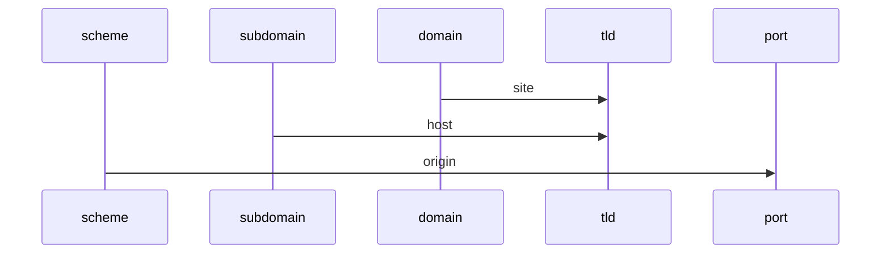

# URL 長什麼樣子

URL: `scheme://host:port/path`

## Scheme

`http`, `https`

## Host

`subdomain.domain.tld`

### Top layer Domain (TLD)

- `com`
- `com.tw`
- `io`
- `github.io`

## Port

- `http` default `80`
- `https` default `443`

## Path

`/path?query_key=query_value#fragment`

## Diagram

## Example

- `https://example.com:443` is same origin to `https://example.com`
- `http://eample.com:443` is different origin to `http://example.com` (why? `http` default `port` is 80)
- `http://api.example.com` is same site of `http://auth.example.com`

## Extension

- `schemeful-same-site` consider scheme on `site`
- HTTP header `Sec-Fetch-Site`([time=April, 2020]) can know where request came from
  - `same-site`
  - `same-origin`
  - `cross-site`
  - `none`
