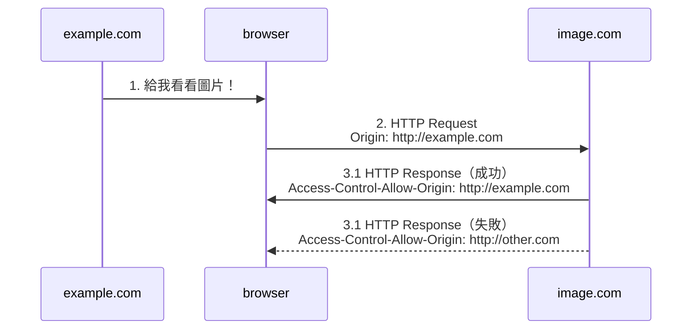

[What is Origin?](url-structure.md)

## 歷史

為了保護使用者的隱私和被要求的網站隱私。

## 圖表說明

1. 使用者進到 `http://example.com` 的網站。
2. 使用者的瀏覽器透過網站需求可能會去跟其他網站（`http://image.com`）要檔案（圖片，CSS 檔...）。
3. 為了保護被要求的網站隱私，若該網站回傳的標頭不允許該存取，瀏覽器會判定要求失敗，反之則成功。

## Access-Control-Allow-Origin

- `http://example.com`
- `http://example.com | http://other.com`
- `*`

## 細節

1. 若 HTTP request [夾雜了些東西](SimpleRequest)，HTTP response 就會[需要更多標頭來表達意願](https://developer.mozilla.org/zh-TW/docs/Web/HTTP/CORS#Access-Control-Expose-Headers)。
2. 若 HTTP request [夾雜了些東西](SimpleRequest)，瀏覽器可能還需要做[預先檢查](https://developer.mozilla.org/zh-TW/docs/Web/HTTP/CORS#預檢請求)，若檢查失敗，不會做進一步的要求。

> 夾雜的東西常常就是使用者的隱私。

## 攻擊

若允許所有的要求，攻擊者可以在自己網站（`devil.com`）要求一個在被攻擊網站（`example.com`）中的會員專屬圖片，並透過圖片或其他互動方式要到會員個人可辨識的資料或甚至 `cookie` 的值。

## 延伸

**very new feature!!**

1. [Cross Origin Embedder Policy (COEP)](https://wicg.github.io/cross-origin-embedder-policy/)
   - 網站是否需要使用 `CORP` 和 `CORS`
2. [Cross Origin Opener Policy (COOP)](https://github.com/whatwg/html/pull/5334/files)
   - 能否在不移動網址情況下打開其他網頁（popup）
3. [Cross Origin Resource Policy (CORP)](<https://developer.mozilla.org/docs/Web/HTTP/Cross-Origin_Resource_Policy_(CORP)>)
   - `Cross-Origin-Resource-Policy`
     - `same-origin`
     - `same-site`
     - `cross-origin`
4. [Cross Origin Read Blocking (CORB)](https://www.chromium.org/Home/chromium-security/corb-for-developers)
   - `Cross-Origin-Embedder-Policy`
     - `require-corp`

[simplerequest]: (https://developer.mozilla.org/zh-TW/docs/Web/HTTP/CORS#簡單請求)
