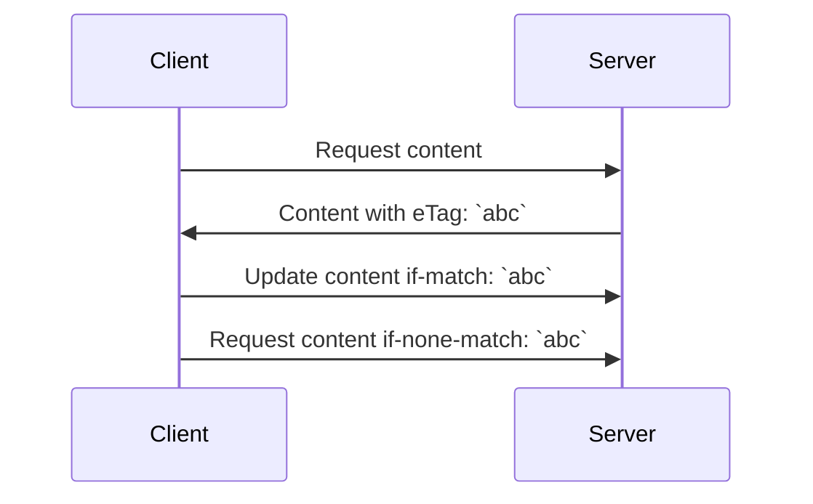

# HTTP

HTTP（HyperText Transfer Protocol）超文本傳輸協定的說明和注意事項。

## OSI 中扮演的角色

傳輸層（Transport Layer）之上，通常包辦會議層、表現層、應用層，
但在第三版（HTTP/3）之後，連傳輸層也一起包進去了，
詳見 [QUIC 官網](https://www.chromium.org/quic/)和[實際封包內容](https://quic.xargs.org/)。

HTTP 建立在 [TCP](./tcp.md) 之上，雖然 TCP 可以確保連線的穩定，
但是我們需要更高層次的會話（Session）和設定機制，例如：
*這次請求的人，是不是一個月前登入的那個使用者*。
這種驗證邏輯，在任何傳輸層協定都無法辦到，因為這已經牽涉到「應用邏輯」了。

從上面也可以得知，HTTP 其實就是一種針對應用程式邏輯的協定，
所謂的超文本（Hypertext）就是不再像底層協定那樣，
透過位元（bit）去做一些參數設定，例如 [TCP 選項](./tcp.md#tcp-選項)，
而是透過純文字來控制參數，
例如 HTTP 用 [HSTS](https://developer.mozilla.org/en-US/docs/Web/HTTP/Headers/Strict-Transport-Security)
去協調請求方（通常是瀏覽器）應該用哪個版本的協定。

整個協定非常單純的分成三個區塊：*協定資訊*，*參數設定*，*溝通內容*。
並分別用 [CRLF](https://developer.mozilla.org/en-US/docs/Glossary/CRLF) 這個換行符號，
來標示這三個區塊的位置。

### 協定資訊

這是請求或回應的第一行。

如果是請求方，內容就包括你用了什麼版本的 HTTP，
你針對應用程式的哪個地方（[HTTP Path](https://developer.mozilla.org/en-US/docs/Web/API/URL/pathname)），
做什麼樣的請求（[HTTP Method](https://developer.mozilla.org/en-US/docs/Web/HTTP/Methods)），例如：

```text
GET /hello HTTP/2
...接下來是參數設定...
```

就是使用 `GET` 方法到應用程式的 `/hello` 這個位置去做 HTTP/2 的請求。

如果是回應，
則是會有版本和回應的狀態（[HTTP Status](https://developer.mozilla.org/en-US/docs/Web/HTTP/Status)），例如：

```text
HTTP/2 200
...接下來是參數設定...
```

就是回應 *200* 這個編號，
在 [RFC-9110](https://httpwg.org/specs/rfc9110.html#overview.of.status.codes) 中，
*200* 這個編號代表 `OK`。

### 參數設定

讓這個協定擁有非常多眉角的地方就是參數設定，
位置在請求（或回應）的第二行到下一個空行：

```text
GET / HTTP/2
header1: value
header2: value

payload
```

上述範例可以看到標頭（[Header](https://developer.mozilla.org/en-US/docs/Web/HTTP/Headers)）總共有兩個，
這是因為第二行到下一個空行之間總共有兩行。

標頭的格式很單純，行首到冒號之前為鍵（key），大小寫沒差，不可以有空格；
冒號後為值（value），大小寫有差，需要忽略前面的空格。

由此誕生極其複雜的應用設定環境。
身為使用者通常你不用太擔心這件事情，因為偉大的瀏覽器和相關規範，例如
[W3C](https://www.w3.org/standards/)、
[IANA](https://www.iana.org/assignments/message-headers/message-headers.xhtml#perm-headers)
和很受公信的
[MDN](https://developer.mozilla.org/en-US/docs/Learn/Getting_started_with_the_web/The_web_and_web_standards)
等等，
都幫你管理好了，但是身為應用程式的開發者，你可能就要開始頭大了。

### 溝通內容

在第一個空行之後的文字，通常存放應用程式邏輯的內容，例如：

```text
POST /give-me-ticket HTTP/2
header1: value
header2: value

我的名字是呂學洲，幫我訂機票。
```

至於存放的內容要[用什麼格式](../../feedback/distributed-systems-with-node.js/protocol.md)，
就可以根據應用程式自己去選擇了。

## 標頭：參數設定

### 維運要注意的標頭

#### Access-Control-Max-Age

[MDN](https://developer.mozilla.org/en-US/docs/Web/HTTP/Headers/Access-Control-Max-Age)

它是用來處理 Preflight 請求的快取。

### 資安要注意的標頭

#### X-Forwarded-For

把請求方的 IP 傳遞下去，但是在開放網路下，是可以被篡改，要小心使用。

#### Meta

set the cookie

#### Content-Encoding

避免 [CRLF Injection](https://www.praetorian.com/blog/using-crlf-injection-to-bypass-akamai-web-app-firewall/)

#### Connection

如果請求有這個 Header，服務方在回應後，就會主動關閉連線。
關閉連線的那方是要負擔較大的 TCP 開銷，並貯存 [TCP `TIME_WAIT`](./tcp.md#關閉連線的信號) 的連線。

#### ETag

用來標誌資源的版本，可以使用這個增加快取機制，例如：



Server 收到 `if-match` 後就可以檢查是否有競賽問題（同時有兩個人更新該 content），
或者也可以透過 `if-none-match` 檢查是否為舊版的 content 然後就回傳 304（Not Modified），
避免網路資源的耗用。

### 靜態網站要注意的標頭

#### Cache-Control

設定 `public max-age=0 must-revalidate` 代表：

> 幫我快取這東西，但是馬上讓他過期，並重新和我驗證這東西的
>
> [More Aggressive Cache Header](https://macarthur.me/posts/more-aggressive-cache-headers)

## 不同版本的差異

目前 HTTP 主流上共有三種版本：1.1、2 和 3。
整個公開網路環境中，HTTP/3 的使用率在 2024/06 時，已經來到
[30%](https://w3techs.com/technologies/details/ce-http3)，
但是 [Cloudflare 的文章](https://blog.cloudflare.com/http3-usage-one-year-on)指出，
大部分使用 HTTP/3 的場景是在瀏覽器和服務的溝通。
如果是 API 形式，則主要還是 HTTP/1.1，
這也說明任何一個新協定的推廣都需要漫長的適應期。

## 一些常見的問題

!!! question "我的應用程式是用 HTTP 溝通嗎"

    這其實是個很微妙的問題，通常來說，你的應用程式遵守了**部分** HTTP 協定。

    HTTP 相關的 RFC 非常非常多，光是版本就有四個：1.0/1.1/2.0/3.0，
    其中你使用的套件可能也沒有實作 1xx 的回應編號（前面的範例是 200），
    例如 [101 Switching Protocol](https://developer.mozilla.org/en-US/docs/Web/HTTP/Status/101)，
    有時這個編號也被用來切換到 [WebSocket](https://developer.mozilla.org/en-US/docs/Web/API/WebSockets_API)。

    再例如，HTTP 2.0 拒絕實作
    [Transfer-Encoding](https://developer.mozilla.org/en-US/docs/Web/HTTP/Headers/Transfer-Encoding)，
    你的 HTTP 套件有正確實作嗎？
    當版本為 HTTP 1.1 時，又有正確實作其和
    [Content-Encoding](https://developer.mozilla.org/en-US/docs/Web/HTTP/Headers/Content-Encoding)
    的差異嗎？
