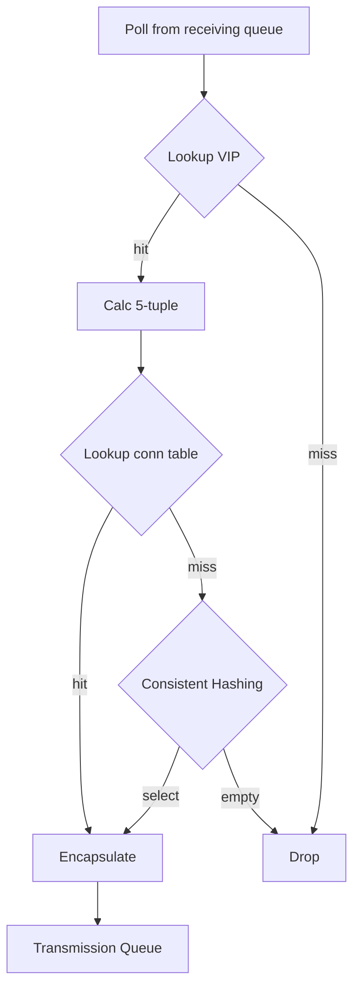

# Maglev

本篇針對 2016 年的論文
[Maglev: A Fast and Reliable Software Network Load Balancer](https://static.googleusercontent.com/media/research.google.com/zh-TW//pubs/archive/44824.pdf)
進行說明。

## 概述

Maglev 是個軟體 L4 負載均衡器（Load Balancer, LB），他被建構在一般的 Linux 機器上，
所以可以很大地節省維護硬體設備的成本（人力、專業等等）。
除此之外，他不像硬體設備那樣通常都是 active-standby，
而是每台設備都能有效地處理封包，輕易達到水平擴展。
在使用 8 core、128 GiB 和 10 Gbps NIC (Network Interface Card) 的當代（2016）硬體下，
每台設備達到約 12 Mpps 的處理能力。
對應到 Google 當時每個叢集每天會需要處理 10Gbps 個頻寬，
這相當於 813Kpps 的 1500-byte IP 封包、或者 9.06 Mpps 的 100-byte IP 封包。

??? question "為什麼硬體設備通常都是 active-standby"
    說到 L4 負載均衡器，勢必會提供 TCP 的負載，然而 TCP 為了做到連線的效果，
    需要紀錄獨自處理所有的封包（為了做計數）。

    如果有兩台 LB，封包分散開來就會出錯。

網路在傳輸時，實際的邏輯會被封裝好幾層，這就是 [OCI 分層](./network-routing.md)。
當 Maglevs 前面的 *路由器*（router）收到封包的時候，會透過 ECMP 決定分派該封包給哪個 Maglev。
此時，Maglev 根據 L3 和 L4 的資訊組成一個組合，稱為 5-tuple[^1]，
也就是：來源 IP、目的 IP、來源阜、目的阜、協定類別。
透過這個組合，計算 consistent hashing 來指定最終服務叢集裡的特定節點。

換句話說，Maglev 沒有真正處理 L4 的連線問題，而是透過確保特定流（flow）的封包流入特定的節點。

這些就是 Maglev 的抽象結構，說起來簡單，但是論文內介紹的一些實作，做起來卻並不簡單。

### 背景知識

在開始講細節前，先簡單補足一下背景知識。

#### ECMP

Equal-cost multi-path routing (ECMP) 是一種路由演算法，我們來透過實際案例了解他吧！

假設有一個路由器 (R) 連接到三台伺服器 (S1, S2, S3) 和一台客戶端機器 (C)。
從 R 到達伺服器有兩個等價成本的路徑，*路徑 1* (R -> 介面 1) 和*路徑 2* (R -> 介面 2)。
ECMP 的封包流動如下：

- 客戶端啟動流量：客戶端 C 向伺服器 S1 發送封包。
- 封包到達路由器：封包到達路由器 R。
- ECMP 選擇：由於有兩個等價成本的路徑 (*路徑 1* 和*路徑 2*) 可達 S1，因此 ECMP 將發揮作用。
  路由器使用雜湊算法（基於源和目的地 IP 地址等因素）來確定此特定封包的路徑。
  - 假設雜湊函數為此封包選擇了*路徑 1* (介面 1)。
- 封包轉發：路由器 R 將封包轉發到介面 1，朝向伺服器 S1。

現在，想像客戶端 C 向伺服器 S1 發送另一個封包。ECMP 將再次根據雜湊算法計算路徑。
有兩種可能性：

- 如果雜湊函數再次選擇路徑 1，此封包將遵循與前一個封包相同的路徑。
- 如果雜湊函數這次選擇了路徑 2 (介面 2)，則封包將採取不同的路由到達 S1，從而實現負載平衡。

ECMP 的優點：

- 增加頻寬：通過利用多條路徑，ECMP 可以分佈流量並潛在提高整體網路吞吐量。
- 容錯性：如果一條路徑不可用，流量可以自動重新路由到剩餘路徑，從而提供冗餘。

需要考慮的事項：

- 連線的處理：如果封包走到另外一台設備，原本的連線根據實作可能會中斷

然而 Maglev 透過一些手段，來避免連線的中斷。

#### BGP

Border Gateway Protocol (BGP)，號稱最複雜和重要的路由協定之一，主要目的有幾個：

- 路由佈達，對其他 ISP 宣告自己內部擁有的 IP 前綴；
- 路由調整，每次路由設定的調整（例如 IP 下線），都需要對外做宣告；
- 路徑選擇，透過路由的各種參數（例如 hop 數量），選擇走到特定 IP 的最佳路徑；
- 傳遞流量，路由器根據 BGP 的資訊，進行封包傳導。

#### Linux Bypass

Linux 在[處理封包的時候](https://www.thebyte.com.cn/network/networking.html)是複雜的，
這是因為他需要處理很多 L3/L4 的實作邏輯。
而在 Maglev 實作中，則是使用 Linux [kernel bypass](https://blog.cloudflare.com/kernel-bypass) 這個模組，透過客製化達到高效性。

## 實作細節

### 服務發現

注入設定之後，透過 Config Manager 分發所有上游的設定，
包含上游服務各個節點的實體 IP 和代表服務的 VIP。
同時會有個 Health Checker 檢查上游，並決定哪些上游可以接收封包。

Maglev 也會透過注入的設定，把相關的 VIP 透過 BGP（圖上的 VIP Announcer）做路由佈達。

由於分散式的架構，兩台 Maglev 有可能會有短暫的時間，同時擁有不同的設定，
這時透過相關的 consistent hashing 機制，依照相同的 5-tuple 仍然可以選擇到相同的上游，
這段詳見 [Consistent Hashing](#Consistent Hashing)。

> However, consistent hashing will make connection flaps between
> Maglevs with similar backend pools mostly succeed even
> during these very short windows.

### Forwarder

Forwarder 透過 NIC 收到封包之後，Maglev 會選擇出特定的上游，
把相關封包進行包裝（encapsulation）後，傳遞給該上游。

一開始讓每個封包透過 5-tuple 選擇 receiving queues 有兩個好處：

- 同個上下游的封包都在同個 queue 中處理，比較不會造成處理速度不一致，並進而導致失序。
- 同個上下游的封包在進入相同的 queue 之後，就只會選擇一次 backend，不用每次都重選一次。

但是當特定 queue 塞滿時，就會開始使用 round-robin 的選擇演算法，避免封包一直排不到隊。

以下是 backend selection 的邏輯：

之所以不使用 steering 的 5 tuple 是為了避免跨 thread 之間的衝突，
每個 thread 維護自己的 connection table 也是同樣的原因。

另外當上游沒有任何可用的節點時，consistent hashing 就會得到 `empty` 然後 drop 掉相關封包。

前面有提到 ECMP 會透過雜湊來選擇上游，理論上當 Maglev 叢集數量沒變，相同請求，
都會被選擇到同一個 Maglev 上。
但這個假設會隨著維運日常而被打破，也因此，在這邊的 consistent hashing 就很重要，
因為不同的 Maglev 會根據相同的 hash 結果，而去選擇相同的上游。

### Packet Pool

由於 Maglev 的其中一個特色是可以在 Linux 機器中進行部署，
所以需要透過 bypass Linux kernel 來避免中間的無謂消耗。

在 Maglev 啟動時，會去要一定大小的 packet pool 去儲存封包，
除此之外，steering 和 muxing 模組也會分別要到一定大小的 ring queue 來儲存封包的指標。
而這兩個模組，各自又在 ring queue 上放了三種不同意義的探針：

- *received*：steering 收到 NIC 的封包後，會把該封包的指標放在這；
- *processed*：steering 會把該指標上的封包分配給對應的 receiving queue；
- *reserved*：steering 會把 packet pool 裡的空閒位置，進行預約使用；
- *sent*：muxing 會把在這的封包送出封包給 NIC；
- *ready*：muxing 會把 transmission queue 的封包拿出來放這；
- *recycled*：因為任務完成，muxing 會把這裡在 packet pool 佔用的位置給釋放。

這裡每個探針在處理相應的任務後，就會加 1，換句話說，這些探針會互相追趕他們下個任務的探針。

!!! note "優化調整"
    為了追求效率，每個探針都是批次處理任務，所以探針可能會一次加超過 1。

    為了達到這個批次處理，兩個模組會在等到封包達到一定大小後，
    或者等到超過 $50\mu s$ 後，才去處理，這就會損失一定的潛時。

    前面提到的 forwarder 的每個 thread 在處理一個封包上，會花到約 350ns，
    在這樣的背景下，低流量時期可能會讓封包處理速度變慢，可能的做法就是動態調整這個批次大小。

這裡也一起計算一下 Maglev 理論上的極限值，假設 packet pool 存放最多 3000 個封包
（假設一個封包大小為 1500-byte，就會需要 4.5 MB 的記憶體），
然後假設整個 forwarder 可以處理 10 Mpps 的量，
也就是說他需要使用 $3000\text{p} / 10^7\text{pps} = 0.0003\text{s}$ 秒來完全處理這些封包。
這代表 Maglev 會造成特定封包最高 $300\mu s$ 的延遲。

### Consistent Hashing

### VIP Matching

### Fragment Handling

### Monitoring and Debugging

## 測試

## 延伸

### Sharding

[^1]: 參閱第三段 3，Forwarder Design and Implementation
*[VIP]: Virtual IP，虛擬 IP，透過中間人去把虛擬的 IP 轉化成實體 IP。
*[LB]: Load Balancer，負載均衡器，用來分散流量的服務，達到均衡流量的目的。
