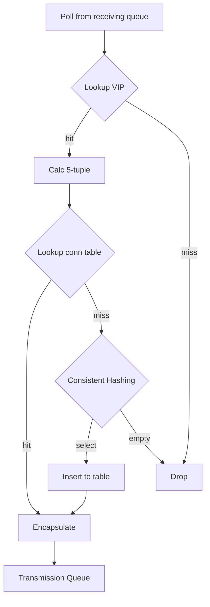

# Maglev

本篇針對 2016 年的論文
[Maglev: A Fast and Reliable Software Network Load Balancer](https://static.googleusercontent.com/media/research.google.com/zh-TW//pubs/archive/44824.pdf)
進行說明。

## 概述

Maglev 是個軟體 L4 負載均衡器（Load Balancer, LB），他被建構在一般的 Linux 機器上，
所以可以很大地節省維護硬體設備的成本（人力、專業等等）。
除此之外，他不像硬體設備那樣通常都是 active-standby，
而是每台設備都能有效地處理封包，輕易達到水平擴展。
在使用 8 core、128 GiB 和 10 Gbps NIC (Network Interface Card) 的當代（2016）硬體下，
每台設備達到約 12 Mpps 的處理能力。
對應到 Google 當時每個叢集會需要處理 10Gbps 的流量，
這相當於 813Kpps 的 1500-byte IP 封包、或者 9.06 Mpps 的 100-byte IP 封包。

??? question "為什麼硬體設備通常都是 active-standby"
    說到 L4 負載均衡器，勢必會提供 TCP 的負載，然而 TCP 為了做到連線的效果，
    需要紀錄獨自處理所有的封包（為了做計數）。

    如果有兩台 LB，封包分散開來就會出錯。

網路在傳輸時，實際的邏輯會被封裝好幾層，這就是 [OSI 分層](./network-routing.md)的概念。
當 Maglev 前面的 *路由器*（router）收到封包的時候，會透過 ECMP 決定該分派封包給哪個 Maglev。
此時，Maglev 根據 L3 和 L4 的資訊組成一個組合，稱為 5-tuple[^1]，
也就是：來源 IP、目的 IP、來源阜、目的阜、協定類別。
透過這個組合，計算 consistent hashing 來指定最終服務叢集裡的特定節點。

換句話說，Maglev 沒有真正處理 L4 的連線問題，而是透過確保特定流（flow）的封包流入特定的節點。

這些就是 Maglev 的抽象結構，說起來簡單，但是論文內介紹的一些實作，做起來卻並不簡單。

### 背景知識

在開始講細節前，先簡單補足一下背景知識。

#### ECMP

Equal-cost multi-path routing (ECMP) 是一種路由演算法，我們來透過實際案例了解他吧！

假設有一個路由器 (R) 連接到三台伺服器 (S1, S2, S3) 和一台客戶端機器 (C)。
從 R 到達伺服器有兩個等價成本的路徑，*路徑 1* (R -> 介面 1) 和*路徑 2* (R -> 介面 2)。
ECMP 的封包流動如下：

- 客戶端啟動流量：客戶端 C 向伺服器 S1 發送封包。
- 封包到達路由器：封包到達路由器 R。
- ECMP 選擇：由於有兩個等價成本的路徑 (*路徑 1* 和*路徑 2*) 可達 S1，因此 ECMP 將發揮作用。
  路由器使用雜湊算法（基於源和目的地 IP 地址等因素）來確定此特定封包的路徑。
  - 假設雜湊函數為此封包選擇了*路徑 1* (介面 1)。
- 封包轉發：路由器 R 將封包轉發到介面 1，朝向伺服器 S1。

現在，想像客戶端 C 向伺服器 S1 發送另一個封包。ECMP 將再次根據雜湊算法計算路徑。
有兩種可能性：

- 如果雜湊函數再次選擇路徑 1，此封包將遵循與前一個封包相同的路徑。
- 如果雜湊函數這次選擇了路徑 2 (介面 2)，則封包將採取不同的路由到達 S1，從而實現負載平衡。

ECMP 的優點：

- 增加頻寬：通過利用多條路徑，ECMP 可以分佈流量並潛在提高整體網路吞吐量。
- 容錯性：如果一條路徑不可用，流量可以自動重新路由到剩餘路徑，從而提供冗餘。

需要考慮的事項：

- 連線的處理：如果封包走到另外一台設備，原本的連線根據實作可能會中斷

然而 Maglev 透過一些手段，來避免連線的中斷。

#### BGP

Border Gateway Protocol (BGP)，號稱最複雜和重要的路由協定之一，主要目的有幾個：

- 路由佈達，對其他 ISP 宣告自己內部擁有的 IP 前綴；
- 路由調整，每次路由設定的調整（例如 IP 下線），都需要對外做宣告；
- 路徑選擇，透過路由的各種參數（例如 hop 數量），選擇走到特定 IP 的最佳路徑；
- 傳遞流量，路由器根據 BGP 的資訊，進行封包傳導。

#### Linux Bypass

Linux 在[處理封包的時候](https://www.thebyte.com.cn/network/networking.html)是複雜的，
這是因為他需要處理很多 L3/L4 的實作邏輯。
而在 Maglev 實作中，則是使用 Linux [kernel bypass](https://blog.cloudflare.com/kernel-bypass) 這個模組，透過客製化達到高效性。

## 實作細節

### 服務發現

注入設定之後，透過 Config Manager 分發所有上游的設定，
包含上游服務各個節點的實體 IP 和代表服務的 VIP。
同時會有個 Health Checker 檢查上游，並決定哪些上游可以接收封包。

Maglev 也會透過注入的設定，把相關的 VIP 藉由 BGP（圖上的 VIP Announcer）做路由佈達。

由於分散式的架構，兩台 Maglev 有可能會有短暫的時間，同時擁有不同的設定，
這時透過 ECMP 和 consistent hashing 機制，依照相同的 5-tuple 仍然可以選擇到相同的上游。

> However, consistent hashing will make connection flaps between
> Maglevs with similar backend pools mostly succeed even
> during these very short windows.

### Forwarder

Forwarder 透過 NIC 收到封包之後，Maglev 會選擇出特定的上游，
然後把相關封包進行包裝（encapsulation）後，傳遞給該上游。

一開始讓每個封包透過 5-tuple 選擇 receiving queues 有兩個好處：

- 同個上下游的封包都在同個 queue 中處理，比較不會造成處理速度不一致，並進而導致失序。
- 同個上下游的封包在進入相同的 queue 之後，就只會選擇一次 backend，不用每次都重選一次。

但是當特定 queue 塞滿時，就會開始使用 round-robin 的選擇演算法，避免封包一直排不到隊。

以下是 backend selection 的邏輯：

之所以不使用 steering 的 5 tuple 是為了避免跨 thread 之間的衝突，
每個 thread 維護自己的 connection table 也是同樣的原因。

另外當上游沒有任何可用的節點時，consistent hashing 就會得到 `empty` 然後 drop 掉相關封包。

### Packet Pool

由於 Maglev 的其中一個特色是可以在 Linux 機器中進行部署，
所以需要透過 bypass Linux kernel 來避免中間的無謂消耗。
為了讓封包在 steering 和 muxing 等模組之間傳遞時，不要用複製，他們都是使用指標進行處理，
同時，為了限制服務的記憶體使用，就需要建立一個 packet pool 來限制服務的資源使用。

在 Maglev 啟動時，會去要一定大小的 packet pool 去儲存封包，
除此之外，steering 和 muxing 模組也會分別要到一定大小的 ring queue 來儲存封包的指標。
而這兩個模組，各自又在 ring queue 上放了三種不同意義的探針：

- *received*：steering 收到 NIC 的封包後，會把該封包的指標放在這；
- *processed*：steering 會把該指標上的封包分配給對應的 receiving queue；
- *reserved*：steering 會把 packet pool 裡的空閒位置，進行預約使用；
- *sent*：muxing 會把在這的封包送出封包給 NIC；
- *ready*：muxing 會把 transmission queue 的封包拿出來放這；
- *recycled*：因為任務完成，muxing 會把這裡在 packet pool 佔用的位置給釋放。

這裡每個探針在處理相應的任務後，就會加 1，換句話說，這些探針會互相追趕他們下個任務的探針。

!!! note "優化調整"
    為了追求效率，每個探針都是批次處理任務，所以探針可能會一次加超過 1。

    為了達到這個批次處理，兩個模組會在等到封包達到一定大小後，
    或者等到超過 $50\mu s$ 後，才去處理，這就會損失一定的潛時。

    前面提到的 forwarder 的每個 thread 在處理一個封包上，會花到約 350ns，
    在這樣的背景下，低流量時期可能會讓封包處理速度變慢，可能的做法就是動態調整這個批次大小。

這裡也一起計算一下 Maglev 理論上的極限值，假設 packet pool 存放最多 3000 個封包
（假設一個封包大小為 1500-byte，就會需要 4.5 MB 的記憶體），
然後假設整個 forwarder 可以處理 10 Mpps 的量，
也就是說他需要使用 $3000\text{p} / 10^7\text{pps} = 0.0003\text{s}$ 秒來完全處理這些封包。
這代表 Maglev 會造成特定封包最高 $300\mu s$ 的延遲。

### Consistent Hashing

前面有提到 ECMP 會透過雜湊來選擇上游，理論上當 Maglev 叢集數量沒變，
相同請求都會被選擇到同一個 Maglev 上。
但這個假設會隨著維運日常而被打破，例如新增、減少機器。
也因此，在這邊的 consistent hashing 就很重要，
因為不同的 Maglev 會根據相同的 hash 結果，而去選擇相同的上游。

!!! info "邊際狀況"
    當在 Maglev 節點新增減少時（ECMP 重算時），如果同時去更新 Maglev 的設定檔，
    就很可能會遇到[前面提到](#服務發現)的邊際狀況，導致連線錯位（connection flaps）。

早在 1990s Rendezvous 就提出第一個 consistent hashing 的機制，
想像一下如果用 mod 來做上游的挑選，假設總共有 5 個上游節點，
根據 5-tuple 去做一個 hash 然後用 `mod 5` 的結果，來平均分配給這 5 個節點。
但是如果服務從 5 個節點變成 6 個，就會讓幾乎所有連線都被重新分配，
例如 `10 mod 5` 從 0 變成 4。
consistent hashing 就是在解決這個問題。

這裡提一下早前的演算法套用在 Maglev 上會有的一些狀況：

1. 當同個服務上游節點數量達到數百時，需要很大的表來達到足夠均衡的負載；
2. 在 Maglev 中是可以稍微接受表重建，因為 ECMP 在 Maglev 數量不變情況下，
   可以確保相同 5-tuple 送到同個 Maglev，在 [Forwarder](#forwarder) 的機制下，
   仍會走到同個上游。

換句話說，在犧牲第 2 點的情況下，我們可以嘗試改善第 1 點。

!!! note "什麼是「表」"
    這裡的表在展示演算法細節時就會看到，概念就是 consistent hashing 會建立一個表，
    以達到穩定散列的目的。

    每次表重建，就有可能導致相同的 5-tuple 對應到不同上游。

#### Maglev 的 Consistent Hashing

假設我們有個表大小為 $M$、上游數量為 $N$，
並選定兩個 hash 函式，`h1`、`h2`，
然後依此找出每個上游的 `offset` 和 `skip`：

\begin{aligned}
\mathit{offset}_i = h1(\mathit{name}_i) \mod M \qquad
\forall \quad i \in N\\
\mathit{skip}_i = h2(\mathit{name}_i) \mod (M-1) + 1 \qquad
\forall \quad i \in N\\
\end{aligned}

最後就可以建立出對照表：

\begin{aligned}
\mathit{permutation}_{ij} = (\mathit{offset}_i + j \times \mathit{skip}_i) \mod M \qquad
\forall \quad i \in N , j \in M
\end{aligned}

但這裡要記得把 M 設為質數，否則在用 `skip` 遍歷 `permutation` 就會跳不出循環。

最後根據上述的演算法得出一個長度為 M 的散列表 `entry`。

#### 範例

假設有 3 個上游，表大小為 7，且 3 個上遊的 `offset` 和 `skip` 分別是：
`(3, 4)`、`(0, 2)` 和 `(3, 1)`，得出 `permutation` 表如下：

| `j` | `i=0` | `i=1` | `i=2` |
| - | - | - | - |
| 0 | 3 | 0 | 3 |
| 1 | 0 | 2 | 4 |
| 2 | 4 | 4 | 5 |
| 3 | 1 | 6 | 6 |
| 4 | 5 | 1 | 0 |
| 5 | 2 | 3 | 1 |
| 6 | 6 | 5 | 2 |

在前面的演算法中，我們展示在第 5 行的 while loop 一步一步推演下的情況（假設 B0 代表 `i=0` 的上游）：

| Step | B0 | B1 | B2 |
| - | - | - | - |
| 1 | 3 | 0 | 3, 4 |
| 2 | 0, 4, 1 | 2 | 5 |
| 3 | 5, 2, 6 | - | - |

在上述推演下，可以得出 `entry`：

| j | Backend |
| - | - |
| 0 | B1 |
| 1 | B0 |
| 2 | B1 |
| 3 | B0 |
| 4 | B2 |
| 5 | B2 |
| 6 | B0 |

當 B1 這個上游下線之後，重新推演：

| Step | B0 | B2 |
| - | - | - |
| 1 | 3 | 3, 4 |
| 2 | 0 | 5 |
| 3 | 4, 1 | 6 |
| 4 | 5, 2 | - |

得出的新 `entry`，並進行比較：

| j | Old | New |
| - | - | - |
| 0 | B1 | B0 |
| 1 | B0 | B0 |
| 2 | B1 | B0 |
| 3 | B0 | B0 |
| 4 | B2 | B2 |
| 5 | B2 | B2 |
| 6 | B0 | B2 |

可以看到大部分的 hash 仍在原本位置，但是部分仍會有變更，例如 `j=6`。
從以上範例可以知道這是一組上游，如果你有很多個服務，每個服務都有自己的一群上游，
這時就會需要建置相應數量的表，所以表的大小，對於服務的資源用量就是一項重要議題。

### Monitoring and Debugging

除了透過白箱（以 HTTP 方式暴露指標）和黑箱（探針）去定期監控外，Maglev 也有一些除錯手段。

由於從 router 走到 Maglev 再走到上游節點的路徑很多種，有時為了除錯，
會需要一個方法知道 Maglev 到底把這個封包送給誰。
開發團隊讓 Maglev 可以辨識特定 L3 和 L4 的表頭，當收到這個表頭，
就會把這次的路由歷程等等用來除錯的資訊發送到特定的 IP 中。

開發者顯然很愛這個除錯工具：

> This tool is extremely helpful in debugging production
> issues, especially when there is more than one Maglev
> machine on the path, as happens in the case of fragment
> redirection.

## 測試

收集歐洲叢集中，458 個上游（包括 Google Search）的 connections per second (cps) 後，
他們計算出其整體的 cps 平均值和標準差，標準差都落在 6%~7%。
從平均值（藍線）中也可以看出高低封和作息的關係（時間軸並非當地時間）。

黃色線則代表是否過度建置機器，在流量高峰時大約落在 9 成的負載能力，
也就是説，假設服務可以最高承載 10 rps 的流量，實際流量則落在 9 rps。
離峰時因為流量低本身就很較難抓資源，所以就容易有過度建置的問題，但是也落在 7.5 成左右。

這項指標代表著 Maglev 是否正確的均衡負載，因為越不均衡的越容易造成過度建置。

`SYN` 的封包代表著第一次通過 Maglev，所以會需要計算 consistent hashing 來尋找上游；
`non-SYN` 則是代表連線建立後的封包，因為不用計算 consistent hashing 所以通量較高；
最後則是極端的 5-tuple，完全相同的來源和目的，用來測試理論上的最高通量。

當 thread 數拉高到 6 和 7 的時候，就可以看到瓶頸不是算力，而是在於 NIC。
當 NIC 為 40 Gbps 時，就可以順利上去，但是再上去的瓶頸又變成了 steering 模組，
所以這也是未來可以優化的方向。

透過 Maglev 的 consistent hashing 演算法，
只需要 65537 的表 [^2]，不需要 65537 這麼大的表，就可以讓負載達到足夠均衡。

上圖的實驗是設定 1000 個上游，並對應兩種不同大小的表和三個不同的演算法，
縱軸代表每個上游在這張表出現的比例，換句話說，每個上游分配到 0.001 的表就是完美的均衡負載。
可以看到除了 Maglev 的演算法之外，剩下兩個都容易會有不均衡負載的狀況。

由於 *Karger* 演算法和 *Rendezvous* 演算法都不會因為上游變動，而改變其對應位置，
所以上圖只有展示 Maglev 對於上游變動的負荷能力。
隨著一定比例的上游失能（橫軸），可以看到這張表的錯位比例會上升，而表越大，越能容錯。

即使如此，Maglev 預設的表大小仍然是 65537，這是因為 65537 大小的表重建需要約 1.8ms，
而 655373 的表則需要 22.9ms，這是因為一次性大量上游失能的情況不多，
犧牲的數十毫秒就顯得不夠划算。

## 延伸

以下是一些實務上會遇到的問題和相關擴展的應用。

### VIP Matching

Google 有很多叢集，並且會替各個叢集分類（classes），越大的叢集其內部擁有的 IP 就越多，
換句話說，它的 IP 前綴會更短，例如 `121.113.17.0/20` 就比 `74.125.137.0/24` 還要大。

當上游發生災難的時候，Maglev 會需要把流量轉移到不同的叢集上游中，
這時，它們就需要個方法知道各個叢集的上游 VIP。
比起透過設定等方式讓各個 Maglev 認出對方來，開發團隊提出另一個方式來解決。

我們讓不同叢集，但是相同上游的 BP 都會擁有相同「後綴」的 VIP。
這時，如果我們限制 Maglev 只能把流量轉導到相同等級的叢集，
就可以不需要知道對方上游 VIP 的狀況下，單純把封包前綴改成對應的叢集，
就可以順利轉導。

以上圖為例，`173.194.71.1` 的 `Service 1` 被轉導為 `173.194.72.1` 的相同服務。

### Fragment Handling

在 IP 中，有一個技術稱為 IP 分片 (IP fragmentation)，
它的目的是最大化封包效率，例如大資料的傳輸。
該協定只會讓第一個封包擁有 L4 的標頭，換句話說，前面提到的 5-tuple 因為沒有 port 的資訊，
所以計算出的 5-tuple 會失準，導致送到不同的上游。

Maglev 會先透過 3-tuple（來源 IP、目的 IP、協定類別），
決定該封包要讓 Maglev 叢集中的哪個 Maglev（透過設定讓它們認識對方）處理。
當確保同個流的封包都進到同個 Maglev 後，就可以在其內部決定上游要走哪一個節點，其演算法如下：

- 第一個封包用和 forwarder 相同的演算法決定上游，接著紀錄該 3-tuple 和上游對照的表；
- 後續封包計算 3-tuple 後，根據該表的結果，決定送給哪個上游。

如果後續封包比第一個封包早到，就會快取等到第一個封包抵達，或者過期。
由於限制可以使用 fragmentation 的服務，所以這個表不需要多大的資源就能處理。

### Sharding

文中有提到 Maglev 理論上是可以做 sharding 的，但是並沒有太多細節，
我認為這個題目滿適合當作回家作業的，可以拿來自己想想該怎麼實作比較好，就不在這邊闡述了！

## 總結

和硬體負載均衡器相，Maglev 可以做到水平擴展，通過一些巧妙的設計也能有效維持長連線。
市面上其實也有一些軟體負載均衡器如
[Microsoft Ananta](https://conferences.sigcomm.org/sigcomm/2013/papers/sigcomm/p207.pdf)
，但是並沒有針對 kernel 的高效使用和上游節點異動的狀況來優化。
其他如 NGINX 的通用型負載均衡器，雖然可以搭配 ECMP 的路由器和 consistent hashing 的外掛，
但是為了滿足更多的客製化和便利性，犧牲部分效能。

其他軟體優化細節的參考放在下面，有興趣再看吧！
不過看到 Maglev 簡單的設計，讓我想到同事的一句話，就以此句話做為結尾：

> 分散式的問題是個很好理解的問題，也很直觀，但是為什麼解決這個問題的方式都這麼複雜？

??? quote "實作細節參考"
    Smith et al [^3] 建議減少軟中斷和物件複製來增加應用程式的通量。
    Mogul et al [^4] 開發 polling-based 的方式來避免鎖的中斷。
    Edwards et al [^5] 提出使用 userspace 的網路來做隔離。
    Marinos et al [^6] 顯示使用特定 userspace 網路堆棧和 kernel bypass 可以大幅提高通量。
    Hanford et al [^7] 建議把分散的封包放在不同 CPU 處理，提高快取命中率。
    CuckooSwitch [^8] 是個高校的軟體 L2 交換器，其中一個特色就是批次和預約式的所取記憶體。
    RouteBricks [^9] 解釋如何有效的利用平行運算來處理不同的封包。

    ...
    如同其他技術，當 Maglev 啟動時它會劫持整個 NIC，並使用 TAP 介面來把封包重新傳遞給 NIC。

[^1]: 參閱第三段，Forwarder Design and Implementation。
[^2]: 這數字沒有任何意義，只是選了一個夠大的質數做實驗。
[^3]: J. Smith and C. Traw. Giving applications access to gb/s networking. Network, IEEE, 7(4):44–52, 1993.
[^4]: J. C. Mogul and K. K. Ramakrishnan. Eliminating receive livelock in an interrupt-driven kernel. In Proceedings of USENIX ATC, 1996.
[^5]: A. Edwards and S. Muir. Experiences implementing a high performance tcp in user-space. In Proceedings of SIGCOMM, 1995.
[^6]:  I. Marinos, R. N. Watson, and M. Handley. Network stack specialization for performance. In Proceedings of SIGCOMM, 2014.
[^7]:  N. Hanford, V. Ahuja, M. Balman, M. K. Farrens, D. Ghosal, E. Pouyoul, and B. Tierney. Characterizing the impact of endsystem affinities on the end-to-end performance of high-speed flows. In Proceedings of NDM, 2013.
[^8]: D. Zhou, B. Fan, H. Lim, M. Kaminsky, and D. G. Andersen. Scalable, high performance ethernet forwarding with cuckooswitch. In Proceedings of CoNEXT, 2013.
[^9]: M. Dobrescu, N. Egi, K. Argyraki, B.-G. Chun, K. Fall, G. Iannaccone, A. Knies, M. Manesh, and S. Ratnasamy. Routebricks: Exploiting parallelism to scale software routers. In Proceedings of SOSP, 2009.

*[VIP]: Virtual IP，虛擬 IP，透過中間人去把虛擬的 IP 轉化成實體 IP。
*[LB]: Load Balancer，負載均衡器，用來分散流量的服務，達到均衡流量的目的。
