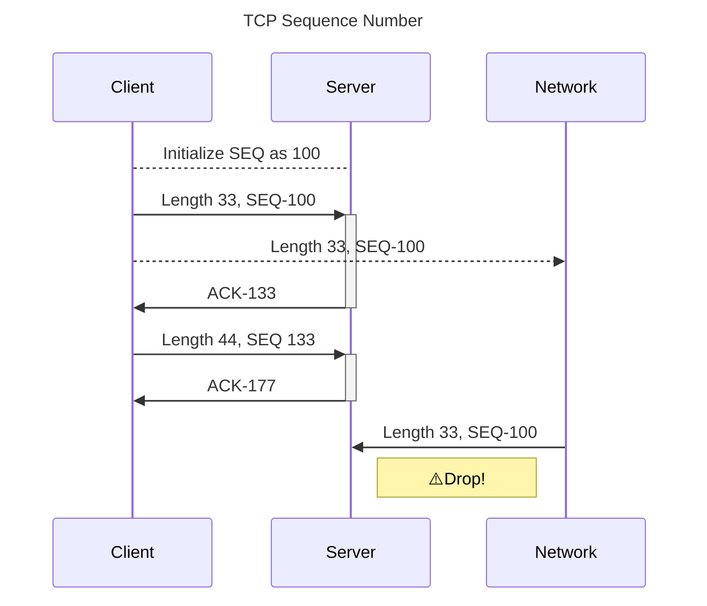
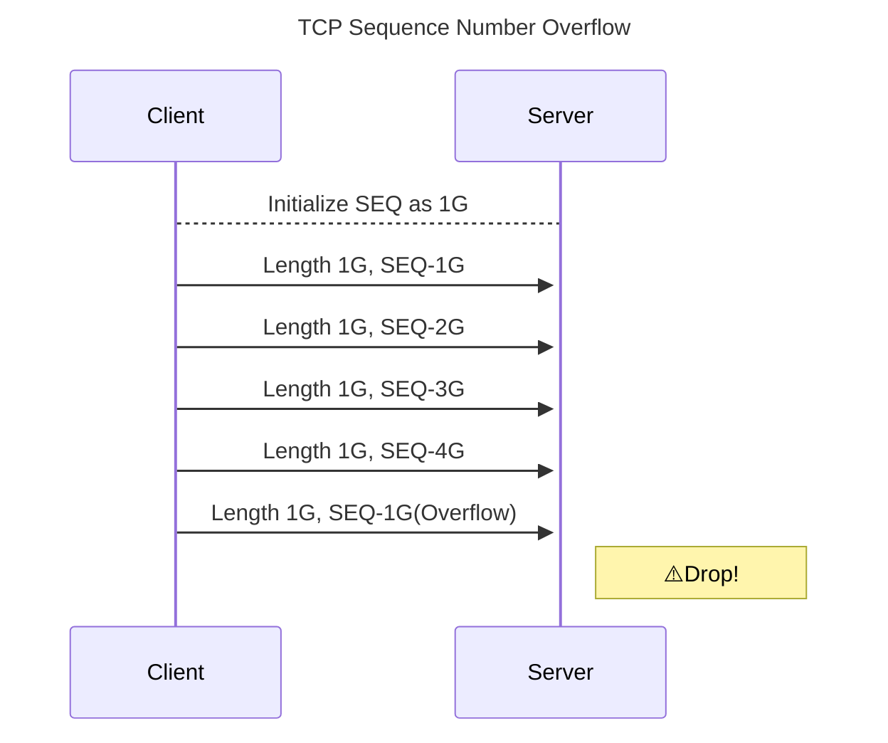
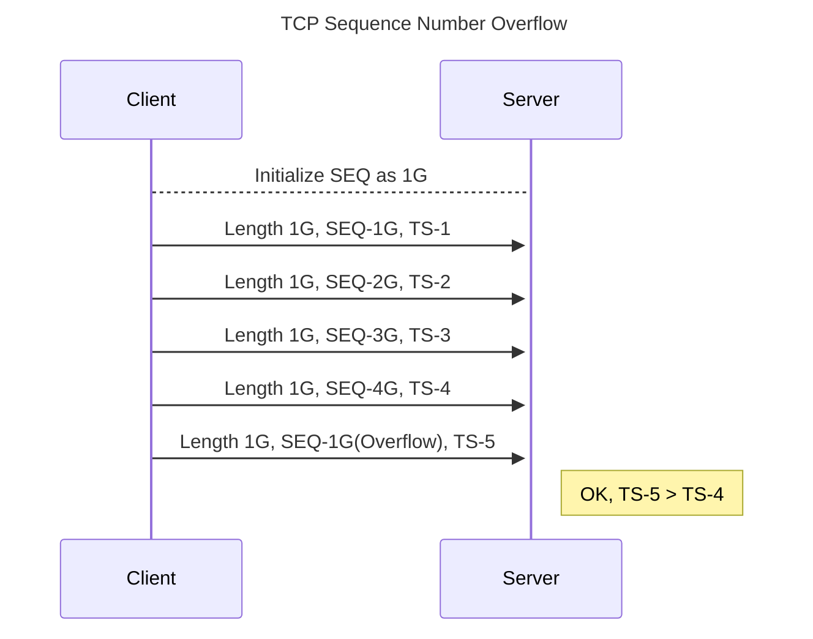

# TCP

Transmission Control Protocol 傳輸控制協定的作用說明。

## OSI 中扮演的角色

Network 之上，Application 之下。

Network 中的 IP 是一種不考慮連線的協定，他只需要負責把封包路由給指定的目的地。在此之上的 TCP
則會透過類似於 HTTP session 的機制，反復確認段（segment）裡的訊號和編號來確保兩端的連線。

換句話說，TCP 是被設計成雙向（bidirectional）、序列性（ordered）和可靠（reliable）的資料傳輸協定。

- 雙向：開啟連線時，這個連線雙方都可以寫入和讀取的；
- 序列：透過序列（Sequence 或簡稱 SEQ) 和確認（Acknowledgement 或簡稱 ACK）的編號確認；
- 可靠：透過反覆寄送、檢查信號 ACK，確認雙方認知一致。

## 內容物


> [鄭中勝](https://notfalse.net/26/tcp-seq)

TCP 會透過上述各種編號和標記來完成連線所需的溝通。
當建立連線（三次握手）後，雙方就不存在監聽方和發起方。
兩者皆可以做監聽和送訊息，同時雙方也都可以要求中斷連線，
並且雙方都要同意關閉連線，此時連線才能優雅而完整的關閉連線（四次揮手）。
其完整生命的程如下：


建立連線：

- 監聽方透過 [socket API](#bsd-socket-api) CONNECT 來等待連線；
- 請求方 *要求建立*；
- 監聽方 *同樣要求建立* 且 *同意該請求*；
- 請求方 *同意建立請求* 自此，連線完成建立。
  此時，請求方可能會同時把資料一起送出。

關閉連線：

- 任意一方 *要求關閉*，進入主動關閉方；
- 收到的人，照常回應 ACK 同步認知，進入關閉等待期。
  如確認資料都送出，且同意關閉後會同樣送出 *關閉要求* 並結束該連線；
- 此時，主動關閉方根據根據收到的標記，進入不同狀態，最終走入暫置區（`TIME_WAIT`)。

各個標記（flag）代表的意義在下段展示。

### TCP 信號

不同的 TCP 信號代表這個 TCP 段（segment）的意義是什麼，
以下依照該信號在封包的位置順序來排列：

- Reserved：保留，供未來可能需求使用；
- Explicit Congestion Notification, ECN：一種明確告知接收方壅塞的協定，避免丟包；
- Urgent, URG，緊急的封包：
  - 告知接收方這個封包不需要進入佇列（queue），請直接處理；
  - 目前我沒看過這個使用的實際場景。
- Acknowledgment, ACK，代表我收到你剛剛的封包了：
  - 通常用來告知對方，我收到你剛剛傳的信號了；
  - 有時會夾帶其他信號，表明同意某些要求，
    例如 SYN+ACK 代表我收到你的連線要求，我也同時告知對方這個連線應該要被建立。
- Push, PSH，代表有資料需要儲存：
  - 添加這個信號代表接收方不需要做暫存，可以直接把資料往上傳遞
  - 通常用在小段的資料，因為大資料會被分成多段，然後會有順序議題
- Reset, RST，代表我不認識這個封包：
  - 已經捨棄的連線又收到訊號（例如 ACK），就會回應此；
  - 埠不存在，通常是因為你請求的埠沒被打開；
  - IP 不存在，通常是因為你監聽的 IP 不是 `0.0.0.0:port`；
  - 連線被棄用，對方會出現 Connection closed by peer 的錯誤；
  - 對方的佇列（queue）已經滿了；
  - 防火牆清除了 session table，導致不認識這段連線，就可能回傳該訊號。
- Synchronize, SYN，代表我們來建立連線吧：
  - 接受者需要回應 ACK。
- Finish, FIN，代表連線的關閉：
  - 被動方需要回應 ACK。

### 三次握手


> [鄭中勝](https://notfalse.net/26/tcp-seq)

彼此會在三次握手中確認接下來的 `SEQ` 號碼：

- 主動方（或稱發起方、客戶端）送出要求連線的同步信號（Synchronous 或稱 SYN）
- 監聽方（或稱服務端、私服端）允許連線（ACK）並同樣賦予同步信號（SYN）
- 主動方允許連線

### 四次揮手

主動關閉（Active Close）的那方可以根據需求關閉連線，但是對被動關閉（Passive Close）的那方來說，傳送的資料可能還沒完成，這時就需要等應用層資料都送出去之後，才會再一次做關閉的動作。


所以流程大致如下：

- *主動方* 要求關閉連線 `FIN`，並進入 `FIN_WAIT1` 狀態。
- *被動方* 告知收到這個資訊 `ACK`。
- *主動方* 進入等待 `FIN_WAIT2` 狀態。
- *被動方* 確保資料都送完後，關閉連線 `FIN`。
- *主動方* 告知收到這個資訊 `ACK`，此時被動方不用管有沒有收到這個 `ACK`。
- *主動方* 進入 `TIME_WAIT` 狀態，等到超過兩次 MSL（Maximum Segment Lifetime）的時間後，關閉連線。

這時你就會注意到一件事，身為主動關閉的那方，是需要付出代價的！他需要進入等待對方關閉的狀態（`FIN WAIT 1` 或 `FIN WAIT 2`）；相較而言，被動那方就只要確認關閉後，就可以瀟灑說再見了。

之所以要進入 `TIME_WAIT` 這個狀態是因為如果直接使用這個來源埠，下次的連線很可能會收到上次連線的重送（Retransmission）資訊。

### TCP 選項

TCP 選項（TCP Option）大部分都是在握手階段確認的，
[詳見](https://www.geeksforgeeks.org/options-field-in-tcp-header/)：

- 0: End of options
- 1: no-op
- 2: MSS(Maximum TCP Segment Size)，協商段的大小
- 3: Window Scaling，提高客戶端可用頻寬
- 4: SACK（Selective ACK），避免每次都要等超時才重傳，且只重傳丟失的封包，用來加速重傳的機制
- 8: Timestamp，精準 RTT
- 34: TFO（TCP Fast Open）

Kernel options 可以參考 [sysctl-explorer](https://sysctl-explorer.net/net/)

- `TCP_NODELAY`：啟用時，當資料大於 MSS，就送出；反之則累積直到收到上一個封包的 ACK。
    缺點自然就是如果應用程式本身就是小資料送出（例如 Streaming），就會常常體驗到延遲。
    除此之外，如果對方也啟用，就可能會有鎖死（deadlock）的狀況，兩邊都在等 ACK。
- `TCP_CORK`：啟用時，只有當累積到一定的量才會送出（限制在 200ms 以下），和 `TCP_NODELAY` 差在一個是等 ACK 一個是等量到一定程度。
    當你在送出大量資料時，這會很有用，但是請小心服用。

### Congestion Control

避免封包壅塞，TCP 提供幾種演算法：

- [BBR](https://github.com/evan361425/evan361425.github.io/issues/34)
- [Queue-Discipline](https://sysctl-explorer.net/net/core/default_qdisc/)

### 範例

以連線到 google.com 中產生的多個封包做說明。

> 如果是 HTTP/3 就不是 TCP 了，到時要看看用什麼網站比較好。

```bash
tcpdump -i <interface> port <port> -w - -U | tee /tmp/evan.pcap | tcpdump -r -
```

#### 三次握手

MSS(Maximum TCP Segment Size) v.s. MTU(Maximum Transmission Unit):

```text
MTU = MSS + 40 (IP header + TCP header)
```

#### SEQuence number

TBD

#### ACKnowledge number

TBD

#### Options

TBD

## 指標

指標名稱都有前綴：`node_netstat_TcpExt_`。

!!! note "來源"
    本列表示使用 Node Exporter 提供的指標。

    你可以透過以下指令來取得各個指標的上升幅度：
   
    ```text
    increase(label_replace({__name__=~"node_netstat_Tcp.*"}, "na", "$1", "__name__", "node_netstat_Tcp(.+)")[5m:1m])
    ```

| 名稱 | 原理 | 說明 |
| - | - | - |
| ArpFilter                 | Basic | 接收到 ARP 封包時，拿到未知的 entry 時 |
| EmbryonicRsts             | Basic | `SYN_RECV` 時收到不合理的封包，並回傳 `RST` |
| ListenDrops               | Basic | `LISTEN` 因任何原因建立連線失敗，大於等於 ListenOverflows |
| TCPTimeouts               | Basic | 第一次發生 RTO 或 SYN-ACK 超時 |
| TW                        | Basic | `TIME_WAIT` 數量 |
| TCPTimeWaitOverflow       | Basic | `TIME_WAIT` 數量太多了 |
| TWKilled                  | Basic | `TIME_WAIT` 在未達時限時，強制回收的數量 |
| TWRecycled                | Basic | `TIME_WAIT` 被回收的數量 |
| TCPAbortFailed            | Basic | 程式發生錯誤時，強制關閉連線 |
| TCPAbortOnClose           | Basic | 在進入 `FIN_WAIT_1` 或 `FIN_WAIT_2` 時，強制關閉連線 |
| TCPAbortOnData            | Basic | 在連線還有資料時，強制關閉連線 |
| TCPAbortOnMemory          | Basic | 資源超過限制時，強制關閉連線 |
| TCPAbortOnTimeout         | Basic | RTO/probe/keepalive timer 達到最高上限時，強制關閉連線 |
| TCPSynRetrans             | Basic | 重新嘗試送出 `SYN` |
| TCPRetransFail            | Basic | 重新嘗試送出 `SYN` 卻仍失敗？ |
| TCPKeepAlive              | Basic | Keep-Alive 次數 |
| TCPFastRetrans            | [Fast Retransmission] | 收到新的 `ACK`，舊的還沒收到就直接 retrans |
| TCPSlowStartRetrans       | [Delayed ACK] | Delayed ACK 開始啟用 |
| DelayedACKLocked          | [Delayed ACK] | Timer 被本機 lock 住而無法正確發送 `ACK` |
| DelayedACKLost            | [Delayed ACK] | 送出的 `ACK` 被認為不合法 |
| DelayedACKs               | [Delayed ACK] | 送出 Delayed ACK 次數 |
| ListenOverflows           | [Backlog] | `LISTEN` 成功完成握手後，準備移交連線時發現 queue 滿了 |
| TCPBacklogCoalesce        | [Backlog] |  |
| TCPBacklogDrop            | [Backlog] | 進入佇列時失敗 |
| PAWSActive                | [PAWS] | `SYN_SENT` 後的 `ACK` 檢查 PAWS 失敗 |
| PAWSPassive               | [PAWS] | `SYN_RECV` 後的 `ACK` 檢查 PAWS 失敗 |
| PAWSEstab                 | [PAWS] | 連線建立後 PAWS 檢查失敗 |
| TCPTSReorder              | [PAWS] | Timestamp 亂序了 |
| TCPDSACKIgnoredNoUndo     | [Selective ACK] | 收到非法 D-SACK 時，話句話說，SACK 中的序號太舊 |
| TCPDSACKIgnoredOld        | [Selective ACK] | 收到非法 D-SACK 時，話句話說，SACK 中的序號太舊 |
| TCPDSACKOfoRecv           | [Selective ACK] | 本機發送的舊封包還沒送到，新的封包已經送去了 |
| TCPDSACKOfoSent           | [Selective ACK] | 本機舊的封包還沒收到，新的封包已經來了 |
| TCPDSACKOldSent           | [Selective ACK] | 對方傳本機已經看過的封包，換句話說，對方收不到本機的 `ACK` |
| TCPDSACKRecv              | [Selective ACK] | 對方收到本機的封包重傳，換句話說，本機收不到對方的 `ACK` |
| TCPDSACKUndo              | [Selective ACK] | |
| TCPLostRetransmit         | [Selective ACK] | 送過去的封包沒有得到相應的 SACK |
| TCPSACKDiscard            | [Selective ACK] | 收到非法 SACK 時，話句話說，SACK 中的序號太舊 |
| TCPSACKReneging           | [Selective ACK] | 本機已經丟掉了之前接收的數據，本機食言了 |
| TCPSACKReorder            | [Selective ACK] | 本機收不到對方封包，開始等待舊資料 |
| TCPSackRecovery           | [Selective ACK] | 本機送不出去封包，開始整理封包順序 |
| TCPSackFailures           | [Selective ACK] | RTO 發生，不再重傳對方沒接收到的封包 |
| TCPSackRecoveryFail       | [Selective ACK] | RTO 發生，不再重整接收的封包順序 |
| TCPSackShifted            | [Selective ACK] | Linux 成功整理順序 |
| TCPSackShiftFallback      | [Selective ACK] | Linux 整理順序失敗 |
| TCPSackMerged             | [Selective ACK] | 得到亂序資料後，進行整併成功 |
| TCPRenoFailures           |                 | 在不啟用 SACK 的狀態 |
| TCPRenoRecovery           |                 | 在不啟用 SACK 的狀態 |
| TCPRenoRecoveryFail       |                 | 在不啟用 SACK 的狀態 |
| TCPRenoReorder            |                 | 在不啟用 SACK 的狀態 |
| TCPDeferAcceptDrop        | [Defer Accept] | Defer accept 的連線被丟棄 |
| TCPFastOpenActive         | [Fast Open] | 發送方成功建立 |
| TCPFastOpenActiveFail     | [Fast Open] | 發送方建立失敗 |
| TCPFastOpenBlackhole      | [Fast Open] | 避免 firewall 阻擋導致失能的機制被觸發 |
| TCPFastOpenCookieReqd     | [Fast Open] | Server 回應 Cookie Required |
| TCPFastOpenListenOverflow | [Fast Open] | 接收方連線佇列滿溢 |
| TCPFastOpenPassive        | [Fast Open] | 接收方獲得新連線 |
| TCPFastOpenPassiveAltKey  | [Fast Open] | 接收方獲得新連線且 cookie 有效 |
| TCPFastOpenPassiveFail    | [Fast Open] | 接收方嘗試建立連線失敗 |
| TCPFromZeroWindowAdv      | [Zero Window] | |
| TCPToZeroWindowAdv        | [Zero Window] | |
| TCPWantZeroWindowAdv      | [Zero Window] | |
| TCPZeroWindowDrop         | [Zero Window] | |
| SyncookiesFailed          | [SYN Cookies] | 驗證失敗 |
| SyncookiesRecv            | [SYN Cookies] | 收到有 cookie 的 SYN |
| SyncookiesSent            | [SYN Cookies] | 送出有 cookie 的 SYN |
| TCPAutoCorking            | [CORK] | 滿了或時間到了，直接送出 |
| TCPRcvCoalesce            | [Coalescing] | 收到整併的封包 |
| TCPAbortOnLinger          | [Linger] | 進入 `FIN_WAIT_2` 時，強制關閉連線 |
| TCPChallengeACK           | | |
| TCPSYNChallenge           | | |
| TCPACKSkippedChallenge    | | |
| TCPOFODrop                | | |
| TCPOFOMerge               | | |
| TCPOFOQueue               | | |
| TCPMTUPFail               | | |
| TCPMTUPSuccess            | | |
| PruneCalled               | | |
| OfoPruned                 | | |
| RcvPruned                 | | |
| BusyPollRxPackets         | | |
| IPReversePathFilter       | | |
| LockDroppedIcmps          | ICMP | ICMP 封包本應被丟棄，但因為是本機的請求，所以被 handle 了 |
| OutOfWindowIcmps          | ICMP | 在已有的連線中偵測出錯誤狀態 |
| PFMemallocDrop            | | |
| TCPACKSkippedFinWait2     | | |
| TCPACKSkippedPAWS         | | |
| TCPACKSkippedSeq          | | |
| TCPACKSkippedSynRecv      | | |
| TCPACKSkippedTimeWait     | | |
| TCPAckCompressed          | | |
| TCPPureAcks               | | |
| TCPFullUndo               | | |
| TCPPartialUndo            | | |
| TCPLossUndo               | | |
| TCPDelivered              | | |
| TCPDeliveredCE            | | |
| TCPHPAcks                 | | |
| TCPHPHits                 | | |
| TCPHystartDelayCwnd       | | |
| TCPHystartDelayDetect     | | |
| TCPHystartTrainCwnd       | | |
| TCPHystartTrainDetect     | | |
| TCPLossFailures           | | |
| TCPLossProbeRecovery      | | |
| TCPLossProbes             | | |
| TCPMemoryPressures        | | |
| TCPMemoryPressuresChrono  | | |
| TCPMinTTLDrop             | Basic | 封包的 TTL 過小，換句話說，傳了太久或太遠 |
| TCPOrigDataSent           | | |
| TCPRcvCollapsed           | | |
| TCPRcvQDrop               | | |
| TCPReqQFullDoCookies      | | |
| TCPReqQFullDrop           | | |
| TCPSpuriousRTOs           | | |
| TCPSpuriousRtxHostQueues  | | |
| TCPWinProbe               | | |
| TCPWqueueTooBig           | | |
| TCPMD5Failure             | | |
| TCPMD5NotFound            | | |
| TCPMD5Unexpected          | | |

相關說明可以參考：

- [Linux Network Statistics Reference](https://loicpefferkorn.net/2018/09/linux-network-statistics-reference/#tcpext)
- [TCP netstat -s 各项参数意义](https://www.cnblogs.com/lovemyspring/articles/5087895.html)

### Backlog

連線建立後會被儲存在一個佇列中，這個佇列稱為 backlog。
Linux 的實作是把 *三次握手階段* 和 *連線建立完成* 分別放在不同的佇列。

詳見 Linux man page [listen](https://linux.die.net/man/2/listen)，
以及 [How TCP backlog works in Linux](https://veithen.io/2014/01/01/how-tcp-backlog-works-in-linux.html)。

### Linger

- [參考](https://breezetemple.github.io/2019/07/04/tcp-option-SO-LINGER/)

Linux 透過 `SO_LINGER` 來啟用，透過 `RST` 來關閉連線。
這時可能會遇到緩衝區還有資料時，被迫中斷。

有兩種階段，這邊不贅述。

### Defer Accept

Linux 透過 `TCP_DEFER_ACCEPT` 來啟用，只在收到資料後才把該連線認定為成功。

### Fast Retransmission

本來如果送出的封包在 `RTO` 內沒有收到 ACK，則會重新發送（retransmission），
但是如果發送方收到大於最低的 ACK 號碼時，就會直接回傳舊的封包，一種快速回傳的機制。

### Zero Window

- [參考](https://blog.51cto.com/u_15060507/3641387)

當接受方的緩存滿溢了，代表接受方實在過於忙碌，消化不完寄過來的封包。

Full window 則代表發送方需要等待對方的 `ACK` 以接著發送更多資訊，換句話說，對方一直沒有回 `ACK` 給我，
我不敢送更多封包給他。

### Coalescing

- [RFC-896](https://datatracker.ietf.org/doc/html/rfc896)
- 相關：[Delayed ACK]、[Cork]

用來減少網路負荷的，等到時機純熟後一次性送出多個封包，時機包括：

- 累積的封包超過 MSS（Maximum Segment Size, `MSS=MTU – 40`）
- 所有送出的封包都收到相應的 `ACK`

透過 `TCP_NODELAY=1` 來單獨為特定 socket 關閉本功能。

#### 問題

如果搭配 [Delayed ACK] 可能會造成我在等你的 `ACK` 再繼續送封包，而你在等我的 `ACK` 才會繼續送封包。

### CORK

- [參考](https://baus.net/on-tcp_cork/)
- 相關：[Coalescing]

和 [Coalescing] 相似，等到緩衝填滿了才把資料送出，
這個功能適用於有多個分段的區塊要送出，例如 HTTP Header 和 HTTP Body。

和 [Coalescing] 的差異主要在於：

- 無視上段封包送回的 `ACK`
- 200 ms 過後就會強制送出封包

透過 `TCP_CORK=1` 來單獨為特定 socket 開啟本功能。

### Delayed ACK

- [RFC-1122](https://datatracker.ietf.org/doc/html/rfc1122)
- 相關：[Coalescing]

用來減少網路負荷的，不用每次收到封包都回 ACK，而是：

- 整合達到一定數目後再送一個 ACK；
- 超過時限，500ms，仍沒收到資料就直接回傳 ACK。

Linux 透過 `TCP_QUICKACK=1` 來關閉本功能。

#### 問題

如果搭配 [Coalescing] 可能會造成我在等你的 `ACK` 再繼續送封包，而你在等我的 `ACK` 才會繼續送封包。

### Selective ACK

- [RFC-2018](https://datatracker.ietf.org/doc/html/rfc2018)
- [參考](https://blog.csdn.net/wdscq1234/article/details/52503315)

用來避免重複傳送的機制，可以指定特定封包重傳，而不用一直等待最舊的那個重傳。

#### Duplicated

- [RFC-2883](https://datatracker.ietf.org/doc/html/rfc2883)
- 相關：[Forward RTO]

透過 SACK 來告知對方我收到了重複的封包，例如：


或者告知舊的封包還沒收到，新的封包已經來了（Out-of-order, OFO），例如：


### SYN Cookies

- [RFC-4987](https://datatracker.ietf.org/doc/html/rfc4987)
- [參考](https://cs.pynote.net/net/tcp/202205052/)

接收方在收到 `SYN` 時，回傳一個 cookie，
並等到下次收到相應 cookie 的 `ACK` 後才開始分配記憶體給這個連線。
這樣可以避免大量 `SYN` 傳入時，每個都分配相應連線的記憶體時，導致的服務忙碌。


#### 問題

一開始小封包的延遲，可能會造成封包順序的誤判，詳見
[SYN cookies ate my dog](https://wpbolt.com/syn-cookies-ate-my-dog-breaking-tcp-on-linux/)。

<!-- ### TLP

https://perthcharles.github.io/2015/10/31/wiki-network-tcp-tlp/ -->

### PAWS

- [RFC-1323](https://datatracker.ietf.org/doc/html/rfc1323)
- [參考](https://blog.csdn.net/mrpre/article/details/124633999)

PAWS(Protection Against Wrapping Sequence)，是用來避免 `SEQ` 溢位造成的判斷錯誤。
實作上會使用時間戳記來驗證之。

每個 TCP 封包都會有個 `SEQ` 號碼來代表之，如果收到舊的 `SEQ` 號碼就代表這是之前重傳的封包，需要捨棄之，如下圖所示。



!!! tip
    初始化的 `SEQ` 是隨機產生的，避免被猜到，做出偽造封包的攻擊。

SEQ 是一個 $2^32$ 的值，最大的值約為 43 億，換句話說一條連線如果傳送了 4GB 的資料，就會遇到溢位，然後就會丟棄該封包。
不管這個連線是長連線還是短時間大量資料傳遞。



於是就開始使用時間戳記（Timestamp, TS）在每個封包上，這樣即時傳大量的資料，仍不會因為溢位而拒絕封包。



要注意的是時間戳記的初始值也是隨機產生的。

#### 問題

Client-A 的請求通過 SNAT 被轉發到 Server，並以時間戳記 TS-A 訪問並結束連線。
Client-B 的請求在送出請求時如果也因為 SNAT 被使用到相同的 Port，此時 Client-B 可能會因為時間戳記不同而被拒絕。

### Forward RTO

- [RFC-5682](https://datatracker.ietf.org/doc/html/rfc5682)
- 相關：[Selective ACK]


透過在一段時間內等待當下兩個 `ACK` 封包，並發現大於重傳的封包，這代表這是虛假重傳。
從而達到避免單純網路延遲導致的錯誤重送。


### Fast Open

- [RFC-7413](https://datatracker.ietf.org/doc/html/rfc7413)
- [參考](https://kb.nssurge.com/surge-knowledge-base/technotes/tfo)


接收方和發送方同時紀錄 cookie，並在下次連線時忽略握手階段。

### 特殊

一些在指標上看不到的功能。

#### ECN

- [RFC-3168](https://datatracker.ietf.org/doc/html/rfc3168)

使用顯式擁塞通知（Explicit Congestion Notification, ECN）可以測量擁塞的程度。

## 有用指令

查看為什麼 kernel reject 封包（段）：

```bash
$ netstat -s | grep reject
416177 passive connections rejected because of time stamp
    13 packets rejects in established connections because of timestamp
```

查看封包 kernel 設定：

```bash
$ sysctl -ae | grep 'net\.ipv4\.tcp_'
net.ipv4.tcp_abort_on_overflow = 0
...
```

## BSD Socket API

TCP 在 Berkeley Socket 之上的流程。

Socket 為包裝底層運作的 API，包括 Data Link Layer 和 Network Layer。


| 名稱   | 功能                                            |
| ------ | ----------------------------------------------- |
| Socket | 建立 Socket 來監聽（listen）連線                |
| Bind   | 綁定 address 和 port，可設定 IP 遮罩            |
| Listen | 監聽 TCP 連線和限制連線數，UDP 不需要呼叫本函式 |
| Accept | 迴圈去接受連線，並進行後續的交握行為            |

> 各流程簡介

??? note "實作範例"

    綁定 port 和位置（IPv4）後建立連線：

    ```c
    bzero((char *)&server, sizeof(struct sockaddr_in));
    server.sin_family = AF_INET;
    server.sin_port = htons(port);
    server.sin_addr.s_addr = htonl(INADDR_ANY);
    if (bind(sd, (struct sockaddr *)&server, sizeof(server)) == -1) {
        fprintf(stderr, "Can't bind name to socket\n");
        exit(1);
    }
    ```

    ```c
    listen(sd, 5); // (1)

    while (1) {
        client_len = sizeof(client);
        new_sd = accept(sd, (struct sockaddr *)&client, &client_len); // (2)
        if (new_sd == -1) {
            fprintf(stderr, "Can't accept client\n");
            exit(1);
        }
        // ...
    }
    ```

    1. 限制最高五個連線
    2. 拿 `new_sd` 去讀寫資料，`sd` 則繼續監聽連線請求。

## 問題

??? question "為什麼會有遺失、重複寄送和失序的問題？"

    遺失：很可能實際有送到指定位置，但是因為傳輸過程訊號被干擾了，導致[檢驗和](https://notfalse.net/27/tcp-error-control)的檢查失敗。

    重複寄送：建立在遺失之上的問題，當目的地收到並回傳 `ACK` 時，發送方很可能沒收到這個訊號，就誤以為沒送成功，就再送一次。

    失序：原本是照 1,2,3,... 的順序送出去，收到卻很可能是 3,1,4,...，這可能是因爲壅塞或網路延遲造成的，甚至可能每個封包路由路徑不同（IP 的協定會決定這一系列的封包怎麼送）

??? question "當 TCP 連線被開滿了，會發生什麼事？"

    需要先定義被開滿了是什麼意思，是部分進入 `TIME_WAIT` 狀態嗎，還是所有都是 Active 的狀態？

    如果是 `TIME_WAIT` 的狀況可以考慮關閉 `TIME_WAIT` 的連線。
    
    若都是 Active 的狀態，且資源的允許下則可以考慮用 Virtual IP 建立更多連線，因為 TCP 的每個連線都是以 IP 和 Port 為一個組合。詳見 [The Road to 2 Million Websocket Connections in Phoenix](https://www.phoenixframework.org/blog/the-road-to-2-million-websocket-connections)。

??? question "如何關閉 TIME_WAIT 狀態的連線？"

    你可以賦予該連線一個選項：[`SO_REUSEADDR`](http://www.unixguide.net/network/socketfaq/4.5.shtml)，在 Linux 中，你也可以調整 [`TCP_TW_REUSE` 或 `TCP_TW_RECYCLE`](https://docs.ukcloud.com/articles/vmware/vmw-ref-twreuse.html)：

    > This socket option tells the kernel that even if this port is busy (in the TIME_WAIT state), go ahead and reuse it anyway. If it is busy, but with another state, you will still get an address already in use error. It is useful if your server has been shut down, and then restarted right away while sockets are still active on its port. You should be aware that if any unexpected data comes in, it may confuse your server, but while this is possible, it is not likely.

    或者調整 Maximum Segment Lifetime(MSL)：
    
    ```bash
    # 看一下現在狀態
    $ sysctl net.ipv4.tcp_fin_timeout
    # VI 改
    $ vi /proc/sys/net/ipv4/tcp_fin_timeout
    # Hot reload
    $ sysctl -p /etc/sysctl.conf
    ```

??? question "什麼是 TCP Timeout？"

    就是應用層的某些 HTTP Client 套件會寫的 Connection Timeout，通常系統層的預設為十分鐘。

現在有一個狀況：

- 網路頻寬正常偏高，但沒有突破限制。
- 應用層的資源使用率低，CPU/Mem 維持在 5% 左右。
- HTTP 的潛時非常高，數十秒

??? question "請問上述狀況可能的原因？"

    當然不能一概而論，不過有遇過這個經驗。那次的原因是因為下游的服務系統層連線數被吃滿了，但是資源使用率仍在正常的水平。

    因為系統層連線被吃滿了，所以開始造成服務需要花很多時間才能建立連線（等待其他連線被關閉），同時下游服務會因為 TCP 天生的機制開始反壓（back-pressure），在上游仍會有一定的網路頻寬耗用率。

    這時的解決辦法除了前面「當 TCP 連線被開滿了，會發生什麼事？」的解決之道之外，有幾個應用層面的處理機制：

    - 新增節點，恩，單純而暴力
    - 分散服務，就是提供微服務
    - 應用程式的調整，因為單一應用請求會打很多個不同資料庫的請求：
      - 使用[事件機制](../../feedback/designing-data-intensive-applications/derived-stream.md)，降低前端需要定期確認資料是否更新
      - 使用快取，並利用快取減少需要和多個資料庫溝通的過程
      - 和資料庫的溝通中增加一個代理器，只需要和他建立連線即可
      - 調整前端應用層協定
        - [GraphQL](../../feedback/distributed-systems-with-node.js/protocol.md#graphql)
        - [HTTP/3](https://github.com/evan361425/evan361425.github.io/issues/27)

## Referer

[RFC-9293](https://www.rfc-editor.org/info/rfc9293) - TCP，取代過時的 RFC-793, 879, 1011, 1122, 2873, 6093, 6429, 6528, and 6691
[RFC-2018](https://www.rfc-editor.org/info/rfc2018) - SACK 說明
[RFC-7323](http://www.rfc-editor.org/info/rfc7323) - TCP Options: Window Scale, Timestamp

之前有看到一個 RFC（忘記編號）說明棄用 TCP Timestamp，因為它佔用很多空間，故推薦其他做法，包括使用 TLS。

[Backlog]: #backlog
[Linger]: #linger
[Defer Accept]: #defer-accept
[Fast Retransmission]: #fast-retransmission
[Zero Window]: #zero-window
[Coalescing]: #coalescing
[CORK]: #cork
[Delayed ACK]: #delayed-ack
[Selective ACK]: #selective-ack
[SYN Cookies]: #syn-cookies
[PAWS]: #paws
[Forward RTO]: #forward-rto
[Fast Open]: #fast-open
