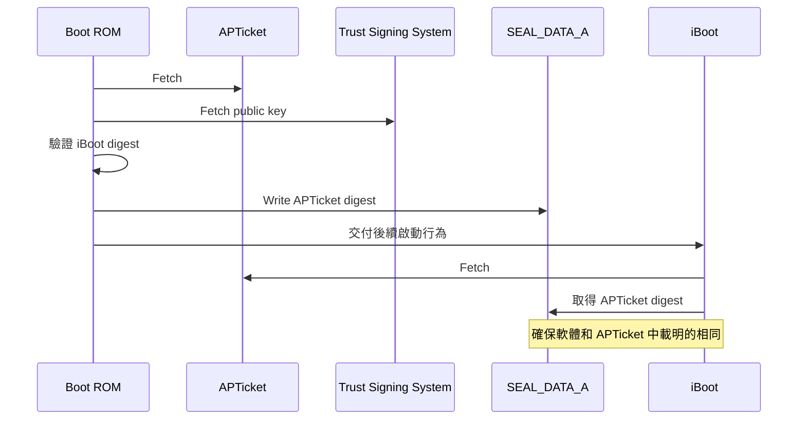

根據[目標](./requirements.md)，我們要可以讓運行在 PCC 的程式被資安專家下載並進行檢查，
同時也要有機制驗證該程式真的有運行在 PCC 中
（[可驗證的開放式架構](./requirements.md#可驗證的開放式架構)）。
另一方面，所有對 PCC 的請求都應該進行點到點的加密，使用的金鑰則是 PCC 單一節點特有的金鑰
（[無法做定向性攻擊](./requirements.md#無法做定向性攻擊)）。

為了達到前述兩個目的，使用者在對 PCC 進行 LLM 請求前會先被選擇到一個特定節點，
並且之後的請求都會被導流到該節點，在初次溝通時會獲取該節點的公鑰和證明（attestation）。
該證明就包含*該節點的特有金鑰*和*運行程式*的簽章，透過 Trust Signing System (TSS) 即可驗證該簽章。

接著就逐一根據各面向來闡述細節做法。

## 如何確保運行程式的正確性

首先我們要先了解[機密運算]中各名詞代表的意思。

- [Secure Enclave]，就像 Intel SGX 一樣，Apple 的機密運算架構。
- Public-Key Accelerator (PKA)，用來產生驗證用公私鑰，只能用特定指令去和其溝通，確保任何人都拿不到真實的私鑰。
- Data Center Identity Key (DCIK)，透過 PKA 和固定種子產生的長期金鑰，並把公鑰存放進 Apple 資料庫中。

TODO: 闡述流程

最後，我們可以把 `SEAL_DATA_A` 的值和 PKA 的公鑰做雜湊，
並使用長期金鑰（如 DCIK）製作簽章，這樣就可以把兩者進行綁定，保證了 PKA 簽署的資料或憑證，
只有當裝置處於*受信任的開機狀態*時才有效。

另外在做[機密運算]時使用的
[Secure Enclave Processor](https://support.apple.com/zh-tw/guide/security/sec59b0b31ff/web) (SEP)
也同樣有類似的啟動做法，就把名詞替換一下即可。

| 一般名稱 | SEP 架構名稱 |
| - | - |
| Boot ROM | SEPROM |
| iBoot | sepOS |
| SEAL_DATA_A | SEAL_DATA |

## 如何對程式進行簽章

類似於 [Certificate Transparency](../../essay/web/certificate-transparency.md)，
PCC 會把使用的程式的測量值放進一個[只允許附加且在密碼學上進行驗證的透明日誌](https://security.apple.com/documentation/private-cloud-compute/releasetransparency)。
而這個日誌將公開讓使用者和研究員都可以獲得並搭配[證明](#如何確保運行程式的正確性)，
確保 PCC 確實使用預期的的程式。

- 透過 Merkle 雜湊樹確保每次只能附加且提供相關證明
- 透過 MASQUE proxy ([RFC 9298](https://www.rfc-editor.org/rfc/rfc9298.html))建立 HTTP/3 的通道，
  避免攻擊者可以鎖定使用者 IP。
  同時在 user 端 MASQUE 的網址是寫死在程式碼中，避免惡意設定檔的修改。

值得注意的是這個日誌被預設添加了 7 天的緩衝期，給 Apple 的程式或操作錯誤一些修復緩衝期。
當使用者檢測發現雜湊值不匹配時，需要 7 天的時間才會對使用者提出告警，
這個前提是攻擊者沒辦法把修改的日誌逐步恢復，而只有一次性的修改攻擊。

[機密運算]: ../../essay/confidential-computing.md
[Secure Enclave]: https://support.apple.com/zh-tw/guide/security/sec59b0b31ff/web

*[PKA]: Public Key Accelerator，用來產生驗證用公私鑰，只能用特定指令去和其溝通，確保任何人都拿不到真實的私鑰。
*[DCIK]: 透過 PKA 和固定種子產生的長期金鑰，並把公鑰存放進 Apple 資料庫中。
