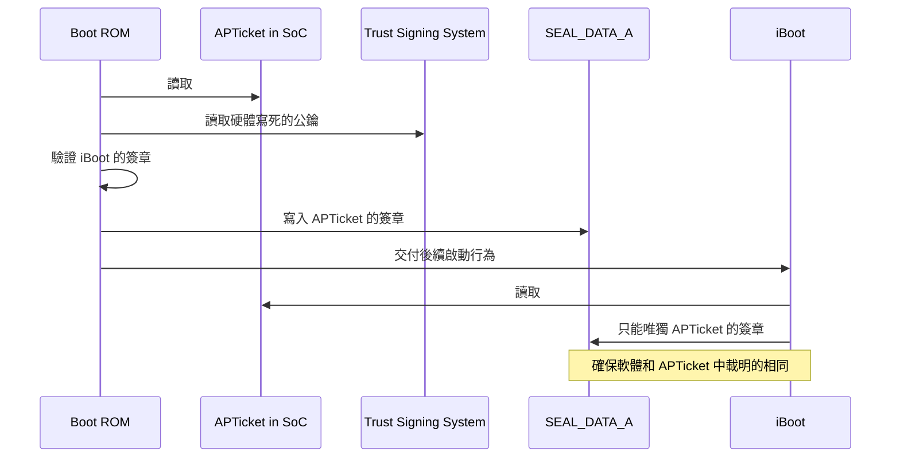

# PCC 目標和信任基礎

如果要設計一個優秀的架構，必須要時刻清楚一些最基礎的東西，我們的目標是什麼？
在考慮安全性和隱私性時，最終的信任基礎來自於合處？

## 目標

訂定好目標之後，再去實作細節，否則容易把方向走偏。
我們接著就來看看對 PCC 來說，哪些是指引道路的大方向。

### 無狀態計算使用者資料

PCC 只有在收到使用者個請求時，才會去使用個資。
個資在回傳請求後就不會在任何地方被保留，包括日誌和除錯時，這代表 Apple 員工也沒有能力取得使用者的個資。
注意措辭，這裡是指沒有*能力*，不是沒有*權限*，我個人認為只有做到讓任何人都沒有「能力」才是真正的保護。
這裡就代表 PCC 內的安全性和隱私性不能依賴於外部系統，例如負載均衡器不能做 TLS offload。

在一些需要使用快取的場景，PCC 會利用使用者給予的金鑰把個資加密後儲存，
只有在使用者下次請求且夾帶該金鑰時，這個快取才可能被解密並取得。
使用者的金鑰會定期去更新，這代表快取是可以透過使用者端強制撤除的。

### 沒辦法使用高權限的操作

Apple 員工在進行維護時，無法提升自身權限來做特殊操作，例如[所有程序的記憶體取得](../../essay/confidential-computing.md)，
或者讓特定程序擁有更高的權限。

### 無法做定向性攻擊

一般的系統架構中，我們可以透過一些零日攻擊劫持特定服務的 server，
接著利用其中的資料庫帳號密碼，竊取所有的使用者資料。
這時，我就只需要攻擊特定的 server 即可，不需要連資料庫都進行劫持，這就是定向性攻擊。

如果攻擊者需要針對多個系統進行劫持才能得到使用者的資料，這時系統架構的安全性將大大提升。
PCC 的其中一個目標便是讓攻擊者無法做定向性攻擊。

### 可驗證的開放式架構

研究員需要驗證兩件事，一個是運行在 PCC 的程式是安全且保護隱私的，
另一個是確保真的有使用公開的程式在 PCC 中。
需要注意的是所謂的開放式，可能代表僅提供可靠的第三方資安機構進行驗證，而非開源。

## 信任基礎

目標訂定好之後，接著就來談一下在目標之上的系統架構。
**我會透過提問的方式來勾勒出整個架構**，否則單純透過 Apple 給的架構文件，資訊會有點散落各地，
而這種提問法也是我自己常用的學習方式。

為了確保在和使用者溝通時，全程是使用該節點的公私鑰進行加密保護，
相同使用者的請求都會被導流到同一個節點，並在**初次溝通時會獲取該節點的證明**（attestation）。
該證明就包含 *該節點每次啟動產生的特有公鑰* 和 *運行程式* 的簽章，
使用者可以透過 Trust Signing System (TSS) 驗證該簽章。
整個架構的簡單說明就如上所說。

在後面談細節之前，我們先簡單了解 PCC 中一些名詞代表的意思。

- [Secure Enclave]，就像 Intel SGX 一樣，Apple 的[機密運算]架構。
- Public-Key Accelerator (PKA)，Secure Enclave 中用來產生驗證公私鑰的設備，只能用特定指令去和其溝通，確保任何人都拿不到真實的私鑰。
- Data Center Identity Key (DCIK)，透過 PKA 和固定種子產生的長期金鑰，專屬於該節點，並把公鑰存放進 Apple 資料庫中。

### 如何確保溝通的節點就是 PCC 的節點

相同使用者對 PCC 進行的請求，會在一段時間內都被導流到同一個節點。
但是要怎麼確認該節點真的就是 PCC 的節點呢？
Apple 提出了一個認證角色 Data Center Attestation Certificate Authority (DCA CA)。
它透過一系列嚴謹的線上和線下程序，確保該節點的正確性後會頒發憑證給節點，使用者在拿到該憑證時，
就可以確定它屬於預期的 PCC 環境中。

此憑證在簽發時遵守以下策略
（參考 [WebTrust](https://www.cpacanada.ca/business-and-accounting-resources/audit-and-assurance/overview-of-webtrust-services/principles-and-criteria)
和 [Cloud Key Vault](https://www.youtube.com/watch?v=BLGFriOKz6U&t=1946s)）：

- 該硬體與預期的記錄完全匹配；
  - 製造，從工廠到封測都有積極監控機制，包括儲存每張 X 光和光學掃描結果。
  - 移動，從出廠時間到機架上位置移動的時間都會被記錄並驗證；
  - 啟用，透過稽核確保使用未經篡改的硬體和預期的軟體；
  - 維修，停止使用的原因、時間，以及設備的替換都會被記錄。
  - 是持續的流程而非僅在初始化時執行，並由第三方審計人員隨機抽查
- 憑證內部的節點公鑰即是 DCIK，並透過 [Secure Enclave] 產生（硬體綁定無法篡改）；
- 簽核需由 Apple **三個組織的員工各自攜帶被獨立放進防篡改和保險箱中的權杖**後才能執行，
  並由第三方審計人員遵循 SOC2 和 SOC3 見證，並定期公布 SOC3 報告；
- 使用者設備（通常是 iPhone）取得這些憑證後會使用 TSS 公鑰進行驗證，從而斷定該設備的正確性。

簽發憑證的設備本身也是符合 FIPS-140-3 標準的硬體安全模組 (HSM)，
並且簽發過程是離線進行，任何操作之後都會發布一個簽署過的不可變日誌。
當這個設備沒在使用時，同樣被放進需多方人員才能開啟的保險箱的防篡改袋中。
換句話說，簽發時就需要一群人從保險箱中拿出設備，接著再由另一群人反覆驗證後進行簽發。

除了這份憑證外，在節點的硬體面，我們仍需要注意所有和設備相連的介面，例如電源和 USB。
PCC 把這些需要連結的介面封裝進基板管理控制器（Baseboard Management Controller, BMC）中，
而在這封閉的環境中會去監測蓋子是否被打開，並自動重啟內部所有設備，避免個資的外洩。
這些設備都會在記錄到清單中，並在之後定期檢測。

### 如何確保節點運行正確的韌體

PCC 的設備使用和 iOS 設備相同的堆疊，
啟動韌體、SEP、GPU、[ANE](https://github.com/hollance/neural-engine/tree/master)
和[系統延伸功能](https://support.apple.com/en-us/guide/deployment/depa5fb8376f/web)
但同時進行最小需求的限縮，只安裝實際有在使用的東西。

我們先來看看 PCC 節點是怎麼啟動的（和 iPhone 的流程類似）。



??? question "Linux 如 Android 怎麼開機的？"
    可以參考這篇整理過的[短文章](https://xdaforums.com/t/info-boot-process-android-vs-linux.3785254/)。
    總體來說就是硬體會去找特定位置的位元組然後執行該位元組的程式。

    而這段被執行的程式會獲得較高的權限，例如納管記憶體。

BootROM 是被寫死在晶片上的程式，他會控制機器啟動時的邏輯，
因為被寫死在晶片，所以他的邏輯很單純，去驗證待會真正要運行的韌體和 iBoot 後就把啟動權責交付給 iBoot。
這裡根據上圖，列出執行順序：

- 讀取 APTicket 並獲得各個韌體和 iBoot 的雜湊和 TSS 對它的簽證；
- 讀取 TSS 簽發並被硬體寫入的 Secure Boot Root CA 中的公鑰；
- 確保 APTicket、iBoot 和其他韌體的合法性；
- 把 APTicket 的簽證寫入只允許被寫入一次的暫存器，確保 iBoot 和其他程序都遵照相同的 APTicket；
- 交付 iBoot 這個可被更新的開機程序。

??? example "Secure Boot Root CA 公鑰範例"
    歡迎嘗試解譯以下內容。

    ```
    -----BEGIN CERTIFICATE-----
    MIIFWjCCA0KgAwIBAgIIUhVj+f330MYwDQYJKoZIhvcNAQEMBQAwSzEnMCUGA1UE
    AwweQXBwbGUgU2VjdXJlIEJvb3QgUm9vdCBDQSAtIEcyMRMwEQYDVQQKDApBcHBs
    ZSBJbmMuMQswCQYDVQQGEwJVUzAeFw0xNDEyMTkyMDEzMTBaFw0zNDEyMTQyMDEz
    MTBaMEsxJzAlBgNVBAMMHkFwcGxlIFNlY3VyZSBCb290IFJvb3QgQ0EgLSBHMjET
    MBEGA1UECgwKQXBwbGUgSW5jLjELMAkGA1UEBhMCVVMwggIiMA0GCSqGSIb3DQEB
    AQUAA4ICDwAwggIKAoICAQDTux7C9K3xbe6PEuTiT84VWqcLfBIhCU4NMmrHyV3q
    9tGAlH+lNxMaxzn0sw+X3HsGUsMl7pZKFLcLuj+cMGP6Tjj2AVvsC53iRKXFSS1p
    eF8ntKikOo2pfePNo+zK1faCdn11viejG/OiX2xgLnFfwbTdYYurE6lkeeScPKU8
    AAJI1FMQihZmW7CpZ/+o4+q5s47p19/3OmEMUhGWcY6JiZt7jyYUOYFC6Z5LXkKi
    apt44yypue085ndbXEocNnstAiM4q9LMPLhfqfseXZRJrHsc6kYDhq7924yk4aOa
    xPTTOQ5KS9uzaBSb2E+j/dG6z3SIxRKzHCJGmwqwqmI6bhd2EDg0irLbI4RdmMDp
    zNgS2pL9QC6Da7wr79IvXPmJP+euWvdkboKDYhfktPvpFQFCVz1CqPC5f4jtDm56
    zPs3LVfZ19WjZBY1ahZoZefwd0W7u+bUeYcjXZVA2ga+0t63nzmwFIM7VSydcBSw
    58ruNS8Yx3ATcCukEb4dupRlpounr8llXHk0rhOaLwrjWRb4dZ/VUfSSrxh8eiWW
    gT4krhn5911237dBDSkYAc/vR2dIlnz5L7cthrEiyW2sulzD+R/LMsFCmzQgA8kR
    zA5HDWo6nND5NdD62N1QiY2pjfGBptX7wthSEPkrP1Zogclmzt+zjLS34dGbloUx
    jwIDAQABo0IwQDAdBgNVHQ4EFgQUaOlZUEXxXQf5P8Qm/BwnYn2eE5QwDwYDVR0T
    AQH/BAUwAwEB/zAOBgNVHQ8BAf8EBAMCAQYwDQYJKoZIhvcNAQEMBQADggIBAIZ+
    tR4606nzPE1DEtOdQmSu0yWNDhiEUvViJAjf0KFML38JZpfuOhzoMGUIDFAoZQcs
    vyIC6JkvsiC8R8oqGkGYLbTN4PHKomjdRIafHuRkdLtKk/G2D/I2uwjeqQnLm3hR
    F6JD5MtgUgnGAuhW9b7Moe0u6IdzM44gLzOyUVYynwixmk6s9KcH+IzIgPq6NBrr
    +4GMZCzUFVid+rl7DY1hGYfgfypQAJ5EE5Ric/2x1/HOguGlwP2smXX2+RjDjapq
    GU2zeFWNhw/G6oN561Jzutfxdl1xA5GVPOol1beaq+hnxN26sZMqz43V/rmm5Gzy
    t8oU+lYFjTT58e49srJ0hkWF79DPwYF4ls6Tk+Dht2IsZtwxYoqs+DCCKdZzucHJ
    8wHpLyb/5td9yThSSMiNd8mkMuvXp/N4VaSr2U2XTc/HFBFDEbuR7+FhGGnGTuCU
    7GYohzAmh7VL9H+Qw54XL2y1hiUKzs9l7oIRy1xY3Mh5fxk7KzqB+z2QNQMDtYjH
    ob1BNc35civfvbFcN0j/qx6Mded0XZ+O0OSWk1AyZmY/x/l1wmP3NRWKOR9m3/B1
    lrpRGpnx6i+uxpjG/zcW2hmmMvPAjW6ieEnaRKQvCjnMJHSoH4qqyfCexY8H8coB
    fV7I/qWEvpCZhDJIVOtg0RIRVaX/wKufbJIwAqLX
    -----END CERTIFICATE-----
    ```

??? tip "iBoot 後面是什麼？"
    iBoot 會再把啟動邏輯交付給 Secure Page Table Monitor (SPTM)，
    他會負責啟動系統的記憶體管理單元並初始化 Trusted Execution Monitor (TXM)，
    最後把啟動邏輯交付給 kernel 去執行真正的 user space 邏輯。

    TXM 會獨立於 kernel 監控整個運行的安全狀況。

    其中在 user space 中有個值得注意的初始換任務稱作 darwin-init，
    他會負責啟動多個 cryptex（[後面](#如何確保節點運行正確的程式)會提），
    並在啟動完成後進入限制執行模式（Restricted Execution Mode）並開始服務外部請求。

最後，我們可以把 `SEAL_DATA_A` 的值和 PKA 的公鑰做雜湊，
並使用長期金鑰（如 DCIK）製作簽章，這樣就可以把兩者進行綁定，保證了 PKA 簽署的資料或憑證，
只有當裝置處於*受信任的開機狀態*時才有效。

另外在做[機密運算]時使用的
[Secure Enclave Processor](https://support.apple.com/zh-tw/guide/security/sec59b0b31ff/web) (SEP)
也同樣有類似的啟動做法，就把名詞替換一下即可。

| 一般名稱 | SEP 架構名稱 |
| - | - |
| Boot ROM | SEPROM |
| iBoot | sepOS |
| SEAL_DATA_A | SEAL_DATA |

### 如何確保節點運行正確的程式

任何在 PCC 的程式都必須是編譯過的，當系統程式要進行更動時，就必須要重啟設備，
重新跑一次[啟動流程](#如何確保節點運行正確的程式)。
換句話說，以下的程式將不允許在 PCC 節點中執行：

- 系統殼層（例如 zsh）
- 直譯器（例如 JavaScriptCore、CPython）
- Just-In-Time (JIT) 編譯器的程式（例如 PyPy）
- Debuggers（例如 debugserver）

至於 user space 裡的程式（LLM 或各種商務邏輯）是被 cryptex
（一個獨立的軟體管理工具，用來分發經過簽章和合法性驗證的程式）
納管的，所以修正應用邏輯的程式不需要重啟。
這樣就會以個疑問，APTicket 裡面不會包含 user space 的程式，這樣我們要怎麼確保其合法性呢？
於是 PCC 設計了一個 Software Sealed Register (SSR) 在 SEP 中，
其核心理念類似 TPM 的 Platform Configuration Register，會把程式簽章的雜湊值進行疊加。

例如有一個 *程式A* 雜湊結果為 `hashA`，*程式B* 雜湊結果為 `hashB`，
一開始設定 程式A 後，SSR 的結果為 `hashA`，再補上 程式B 後，
結果為 `hash(hashA || hashB) = hashC`，
最後我們就可以鎖定 SSR 並把其結果（`hashC`）放到 SEP 產生的證明（attestation）之中，
並利用 SSR 的結果產生公鑰，這把公鑰會被傳遞給使用者，並用來加密請求的內容，
當 PCC 節點要解密而 SSR 變更了，其產生的私鑰就會導致溝通內容無法解密。

### 如何對程式進行簽章

類似於 [Certificate Transparency](../../essay/web/certificate-transparency.md)，
PCC 會把使用的程式的測量值放進一個[只允許附加且在密碼學上進行驗證的透明日誌](https://security.apple.com/documentation/private-cloud-compute/releasetransparency)。
而這個日誌將公開讓使用者和研究員都可以獲得並搭配[證明](#如何確保運行程式的正確性)，
確保 PCC 確實使用預期的的程式。

- 透過 Merkle 雜湊樹確保每次只能附加且提供相關證明
- 透過 MASQUE proxy ([RFC 9298](https://www.rfc-editor.org/rfc/rfc9298.html))建立 HTTP/3 的通道，
  避免攻擊者可以鎖定使用者 IP。
  同時在 user 端 MASQUE 的網址是寫死在程式碼中，避免惡意設定檔的修改。

值得注意的是這個日誌被預設添加了 7 天的緩衝期，給 Apple 的程式或操作錯誤一些修復緩衝期。
當使用者檢測發現雜湊值不匹配時，需要 7 天的時間才會對使用者提出告警，
這個前提是攻擊者沒辦法把修改的日誌逐步恢復，而只有一次性的修改攻擊。

<!-- Footers -->

[機密運算]: ../../essay/confidential-computing.md
[Secure Enclave]: https://support.apple.com/zh-tw/guide/security/sec59b0b31ff/web

*[SoC]: System on a Chip，將系統整合到單一晶片的積體電路，硬體的方式寫死來避免篡改。
*[TSS]: Trust Signing System，Apple 用來提供公鑰的服務，實際業務包括：程式碼簽署、憑證管理和裝置信任。
*[PKA]: Public Key Accelerator，用來產生驗證用公私鑰，只能用特定指令去和其溝通，確保任何人都拿不到真實的私鑰。
*[DCIK]: 透過 PKA 和固定種子產生的長期金鑰，並把公鑰存放進 Apple 資料庫中。
*[SEP]: Secure Enclave Processor，和 Intel SGX 類似的架構，相關討論放在[機密運算]中。
*[ANE]: Apple Neural Engine，一種 Neural Processing Unit，可以加速機器學習的運算，類似的還有 Google TPU。
*[cryptex]: 一個獨立的軟體管理工具，用來分發經過簽章和正確性驗證的程式
--8<-- "abbreviations/apple-Intelligence.md"
