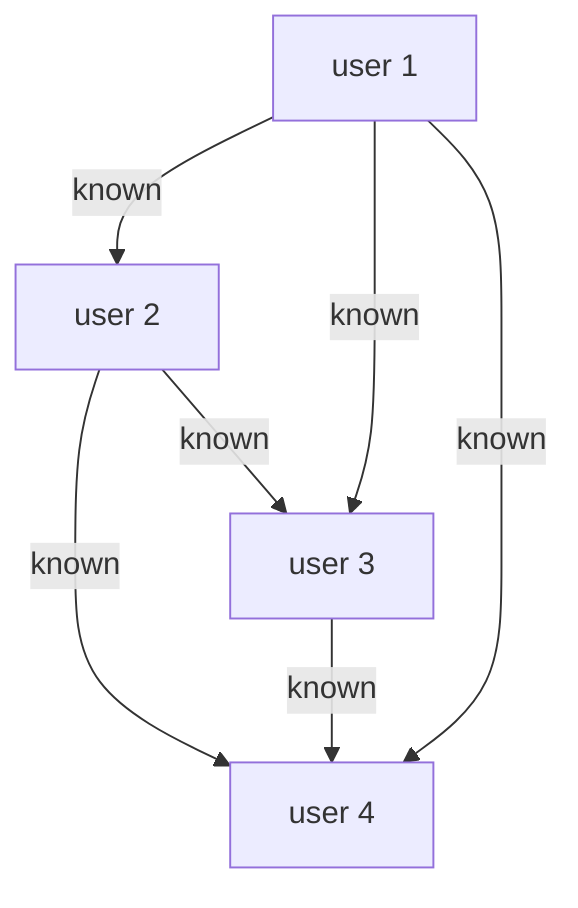

四種資料庫結構

- **Relational model**
- **Document model**
- **Graph-like model**
- Triple-stores

一開始資料儲存僅以 Hierarchical Tree 的形式儲存資料，但是當需要考慮到多對多（many-to-many）的關係時，就開始出現困境。利如：

> `post 對應 tag`，當把 tag 儲存進 post 資料時，如果要找特定 tag 哪些 post 持有？

這時便出現 Relational model，然而有些情境卻不太適合使用該模型，從而發展出「NoSQL」：

- Document model 儲存結構高變動且 document 和 document 之間連結較少的模型。例如：工作類型。
- Graph model 和 Document model 走的方向相反，適合所有資料都能和任何其他資料有所連結的模型。例如：人際關係。

## Relational vs Document

### 儲存資料方式

- one-to-many
- many-to-many
- one-to-one

#### one-to-many

**Document** 儲存階層式結構進節點而非另外開一個表單

```
post -> comment1
     -> comment2
     -> comment3
```

**Relational** 關係套用至各個表單

```
post -> comment_id1
     -> comment_id2
     -> comment_id3
```

#### many-to-many

**Document base** 在這裡較吃虧，因為需要手動做連結。
反之，**Relational based** 可以透過 `join` 把複雜度交給資料庫處理

```
post1 -> tag1
      -> tag2
post2 -> tag1
      -> tag3
```

若關係很複雜，例如人際關係、道路間接觸的網絡：



僅有 4 個人就有 6 x 2（雙向代表彼此認識、單向代表 A 知道 B）條線，若是同樣使用 **Relational based** 會讓資料數量變成非常巨大，這時候就可以使用 [**Graph-like model**](#Graph-like-model)

### one-to-one

**Document base** is similar to **Relational based**

```
post -> post_detail
```

### 其他比較

#### Schema

Document based 很好更新，且能降低把各個資訊分開放（多個 table）所造成的複雜度。

然而這並不代表 NoSQL 不需要 Schema。事實上，所有類型的資料儲存都需要一定的規則，只是有區分顯性（implicit）或隱性（implicit）。

- 顯性代表在 write 的時候必須遵守該規則
- 隱性代表在 read 的時候預期該資料有特定的 property

#### 獲得特定資料

Document based 沒辦法只取得特定階層的資料，必須完整取得後把特定資料選出來，例如：

找到特定工作的平均薪資，Document based 需要把資料都讀出來再篩選

```
user -> job -> salary
            -> hours
```

Relational based 的資料會長這樣

```
user   -> job_id
job_id -> salary
       -> hours
```

### Query 語法

```json
[
  {
    "observated_at": "Mon, 25 Dec 1995 12:34:56 GMT",
    "family": "Sharks",
    "species": "Carcharodon carcharias",
    "num": 3
  },
  {
    "observated_at": "Tue, 12 Dec 1995 16:17:18 GMT",
    "family": "Sharks",
    "species": "Carcharias taurus",
    "num": 4
  }
]
```

- SQL 宣告式語法

```sql
SELECT date_trunc('month', observated_at) AS month,
       sum(num) AS total
FROM observations
WHERE family = 'Sharks'
GROUP BY month;
```

- MapReduce 命令列式語法

```javascript
db.observations.mapReduce(
  function map() {
    var year = this.observated_at.getFullYear();
    var month = this.observated_at.getMonth() + 1;
    emit(year + "-" + month, this.num);
  },
  function reduce(key, values) {
    return Array.sum(values);
  },
  {
    query: { family: "Sharks" },
    out: "monthlySharkReport",
  }
);
```

- MongoDB’s aggregation pipeline 上述兩者中間

```javascript
db.observations.aggregate([
  { $match: { family: "Sharks" } },
  {
    $group: {
      _id: {
        year: { $year: "observated_at" },
        month: { $month: "observated_at" },
      },
      totalAnimals: { $sum: "num" },
    },
  },
]);
```

> 其他語法類型在下面介紹 Graph-like model 後討論。

## Graph-like model

[上述提到](#many-to-many)的人際關係，每個點都代表同類型的資料：人。但是此模型不僅可紀錄類型相同的資料，例如 Facebook 就把許多不同類型的資料記錄在[同一張大表](https://www.usenix.org/conference/atc13/technical-sessions/presentation/bronson)：

點：

- 人
- 位置
- 發文
- 事件
- 打卡
- 使用者留言

線：

- 人和人之間的關係
- 打卡的位置
- 誰留言哪篇發文
- 誰參加哪個事件

### 建立 Graph-like model

建立一個 **Graph-like model** 並以 **Relational based model** 的 schema 為說明，可以得到：

```cypher
CREATE TABLE vertices (
    vertex_id   integer PRIMARY KEY,
    properties  json
);

CREATE TABLE edges (
    edge_id     integer PRIMARY KEY,
    tail_vertex integer REFERENCES vertices (vertex_id),
    head_vertex integer REFERENCES vertices (vertex_id),
    label       text,
    properties  json
);

CREATE INDEX edges_tails ON edges (tail_vertex);
CREATE INDEX edges_heads ON edges (head_vertex);
```

以 Neo4j 這個資料庫為例，建立下圖的關係網絡需要：


```cypher
CREATE
  (NAmerica:Location {name:'North America', type:'continent'}),
  (us:Location       {name:'United States', type:'country'  }),
  (Idaho:Location    {name:'Idaho',         type:'state'    }),
  (Lucy:Person       {name:'Lucy' }),
  (Idaho) -[:WITHIN]->  (USA)  -[:WITHIN]-> (NAmerica),
  (Lucy)  -[:BORN_IN]-> (Idaho)
```

> Cypher 是 [Neo4j](https://neo4j.com/developer/data-modeling/) 使用的宣告式語言，和密碼學的 cipher/cypher 沒關係

### query

現在若要找「所有從美國移民到歐洲的人的名字」這資料就可以下相關 query：

```cypher
MATCH
  (person) -[:BORN_IN]->  () -[:WITHIN*0..]-> (us:Location {name:'United States'}),
  (person) -[:LIVES_IN]-> () -[:WITHIN*0..]-> (eu:Location {name:'Europe'})
RETURN person.name
```

如同 **Relational based model** 一樣，下完該語法後，資料庫會自行判斷該用何種演算法去執行搜尋，可能從 `persion` 往 `location` 找，也可能相反。

### 以 Relational based 的方式建立 Graph-like model

**PostgreSQL**

```sql
WITH RECURSIVE

  -- in_usa is the set of vertex IDs of all locations within the United States
  in_usa(vertex_id) AS (
      SELECT vertex_id FROM vertices WHERE properties->>'name' = 'United States'
    UNION
      SELECT edges.tail_vertex FROM edges
        JOIN in_usa ON edges.head_vertex = in_usa.vertex_id
        WHERE edges.label = 'within'
  ),

  -- in_europe is the set of vertex IDs of all locations within Europe
  in_europe(vertex_id) AS (
      SELECT vertex_id FROM vertices WHERE properties->>'name' = 'Europe'
    UNION
      SELECT edges.tail_vertex FROM edges
        JOIN in_europe ON edges.head_vertex = in_europe.vertex_id
        WHERE edges.label = 'within'
  ),

  -- born_in_usa is the set of vertex IDs of all people born in the US
  born_in_usa(vertex_id) AS (
    SELECT edges.tail_vertex FROM edges
      JOIN in_usa ON edges.head_vertex = in_usa.vertex_id
      WHERE edges.label = 'born_in'
  ),

  -- lives_in_europe is the set of vertex IDs of all people living in Europe
  lives_in_europe(vertex_id) AS (
    SELECT edges.tail_vertex FROM edges
      JOIN in_europe ON edges.head_vertex = in_europe.vertex_id
      WHERE edges.label = 'lives_in'
  )

SELECT vertices.properties->>'name'
FROM vertices
-- join to find those people who were both born in the US *and* live in Europe
JOIN born_in_usa     ON vertices.vertex_id = born_in_usa.vertex_id
JOIN lives_in_europe ON vertices.vertex_id = lives_in_europe.vertex_id;
```

## Triple-store

每次儲存的 row 僅有三個值：

- `subject` - 主詞
- `predicate` - 動詞、述語
- `object` - 定值或是另一個 `subject`

例如：

1. 小明 - 年齡 - 十八
2. 小明 - 喜歡 - 小美

由上範例可知，其實她很類似 Graph-like。

**Turtle triples**

```
@prefix : <urn:example:>.
_:lucy     a       :Person.
_:lucy     :name   "Lucy".
_:lucy     :bornIn _:idaho.
_:idaho    a       :Location.
_:idaho    :name   "Idaho".
_:idaho    :type   "state".
_:idaho    :within _:usa.
_:usa      a       :Location.
_:usa      :name   "United States".
_:usa      :type   "country".
_:usa      :within _:namerica.
_:namerica a       :Location.
_:namerica :name   "North America".
_:namerica :type   "continent".
```

> `_` 開頭的都是 `subject`

[Dataomic](https://docs.datomic.com/cloud/whatis/data-model.html) 就是使用此模型。

### query

> SPARQL（sparkle），[可以到高雄市資料平台玩玩看](https://api.kcg.gov.tw/Ontology/Sparql)

```SPARQL
PREFIX : <urn:example:>

SELECT ?personName WHERE {
  ?person :name ?personName.
  ?person :bornIn  / :within* / :name "United States".
  ?person :livesIn / :within* / :name "Europe".
}
```

上述提到的 Cypher 便是借鏡 SPARQL 的模式，所以兩個語法很相像

```cypher
(person) -[:BORN_IN]-> () -[:WITHIN*0..]-> (location)   # Cypher

?person :bornIn / :within* ?location.                   # SPARQL
```

## Datalog

如同 SQL 是一種語言協定一般，Datalog 也是一種語言協定，實踐其協定的語法有

- Cascalog - Hadoop
- Datalog - Datomic

其特性和 Prolog 很像，都是以邏輯為主，而非像其他常見的語法是以狀態和計算為主

```prolog
within_recursive(Location, Name) :- name(Location, Name).     /* Rule 1 */

within_recursive(Location, Name) :- within(Location, Via),    /* Rule 2 */
                                    within_recursive(Via, Name).

migrated(Name, BornIn, LivingIn) :- name(Person, Name),       /* Rule 3 */
                                    born_in(Person, BornLoc),
                                    within_recursive(BornLoc, BornIn),
                                    lives_in(Person, LivingLoc),
                                    within_recursive(LivingLoc, LivingIn).

?- migrated(Who, 'United States', 'Europe').
/* Who = 'Lucy'. */
```

## Summary

還有很多其他類型的資料庫，例如：

- 儲存超長字串（DNA）並找出和其他超長字串相異之處 - [GenBank](https://www.ncbi.nlm.nih.gov/genbank/)
- 儲存超大量資料（天文數據、大型強對撞機等等），EB 等級的資料量處理 - [ROOT](https://root.cern)
- 全文檢索，針對資訊擷取的特殊資料模型。
