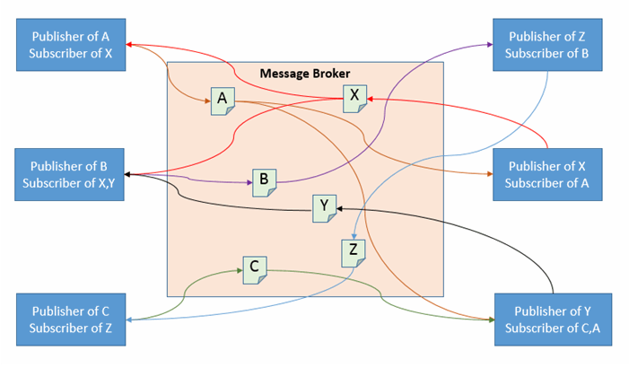
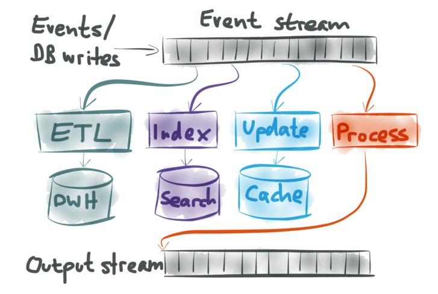
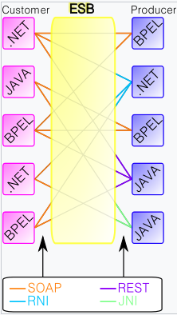

# 編碼和進程

資料在做儲存或輸出的時候是需要編碼（encoding）的，除了可以幫助壓縮資料量，好的編碼方式會在綱目（Schema）調整後，仍能做編（解）碼，也就是應用程式經過進程（evolution）後，仍能保持前後相容。

## 編碼

當你把資料存進記憶體中，可以透過各種資料型別去對資料進行操作，例如陣列、物件等等。然而當把資料存進磁碟（filesystem）中或者透過網路傳送給其他服務時，就需要以編碼後的資料（例如 JSON 格式）來儲存或輸出。

### 程式碼內建

我們都會透過程式語言來和記憶體溝通，不同程式語言預設就有些編碼方式，Java：`java.io.Serializable`、Ruby：`Marshal`、Python：`pickle`，然而

-   通常不同語言之間是無法互相接通的
-   可能會觸發物件的建置，有安全性疑慮
-   並非以「前後相容」為設計核心
-   效率通常很差

### 方便人類閱讀

JSON、XML、CSV，這些格式都很常見，不需要綱目就能解碼。然而

-   佔空間
    -   無法儲存二進位文字，雖然可以使用 Base64 把二進位轉換成 Unicode 文字，卻需要額外的效能和體積
    -   Base64 每 6 個 bit 轉成一個 ASCII 字元（1 個 byte），所以體積會比直接做二進位轉換大 1.3 倍
-   沒有綱目，花時間理解和管理
-   大數字不好儲存，整數、小數的區分

然而這些仍是主要的編碼方式，也因為大家很習慣這些方式的編碼，導致更有效和更方便管理的編碼方式很難吸引到大家的目光。

### 二進位 JSON

有些格式是以 JSON 為基礎做演化的，其嘗試解決上述問題，但是效率仍無法贏過專門的二進位編碼，以下圖為範例：

原始 JSON 資料：

```json
{
    "userName": "Martin",
    "favoriteNumber": 1337,
    "interests": ["daydreaming", "hacking"]
}
```


我們可以得到 66 Bytes 的資料，確實比原本 88 Bytes 好，但是和待會我們可以看到減少到 32 Bytes 的方式仍有差異。

### 二進位編碼

二進位編碼並不是新東西，早在 1984 年就有協定 [ASN.1](https://www.oss.com/asn1/resources/books-whitepapers-pubs/larmouth-asn1-book.pdf) 闡述如何進行二進位編碼，他和 [Thrift](#thrift)、[Protocol Buffer](#protocol-buffer) 一樣都使用 tag ID。且其應用（DER）如今仍被大量使用於 X.509。

但是他卻有過於複雜且綱目（Schema）建置困難的缺點，由此發展出以下幾個較新的方式。

-   [Apache Thrift] - 初始於 Facebook
-   [Protocol Buffer] - Google
-   [Apache Avro]

上述方式可以降低磁碟的使用量、高效能編（解）碼、有效製作文件檔，但缺點就是需要解碼才能讓人類讀懂訊息。

### 前後相容

在做編碼時都需要去考慮前後相容：

-   向後相容：舊的程式碼讀到的資料含有新的綱目定義的欄位時，仍然可以運行
-   向前相容：新的程式碼讀到的資料含有已經被刪除或不同格式的欄位時，仍然可以運行

由此可知，JSON 這類編碼方式新舊版本都可以做解碼，只要在程式邏輯上注意一下就可以保持前後相容。

除此之外還需要注意新的程式碼撰寫資料時，被同時存在的舊程式碼覆蓋掉：


> 在資料準備要送到資料儲倉（warehouse）時，也需要編碼，這時候可以把資料轉換成友善於行式資料庫（column-oriented database）的格式，例如 [Parquet](https://parquet.apache.org)。

## 二進位編碼的比較

以下就 [Apache Thrift]、[Protocol Buffer] 和 [Apache Avro] 來做二進位編碼的比較。

### Apache Thrift

[Apache Thrift] 會使用綱目：

```
struct Person {
  1: required string       userName,
  2: optional i64          favoriteNumber,
  3: optional list<string> interests
}
```

並有兩種方式做編碼，**BinaryProtocol** 和 **CompactProtocol**，依序方式為：

**BinaryProtocol**


**CompactProtocol**


### Protocol Buffer

[Protocol Buffer] 的綱目如下：

```
message Person {
  required string user_name       = 1;
  optional int64  favorite_number = 2;
  repeated string interests       = 3;
}
```


### 註

-   `required` 和 `optional` 在編碼時，不影響結果，僅會在做解碼時 runtime 輸出錯誤。
-   每個 tag ID 不去更動來保持前後相容。當使用舊的綱目去讀取未知欄位時，省略之。
-   新增欄位時若設定 `required` 會讓舊程式碼輸出錯誤，需要給定預設值。
-   變更檔案格式可能導致資料不完全，例如 `int8` 轉到 `int16`
-   _ProtocolBuffers_ 沒有 `list` 資料型態，讓他很好從 `repeated` 轉到 `optional`，但巢狀結構就會需要額外功來達成。

### Apache Avro

[Apache Avro] 的綱目：

```IDL
record Person {
  string               userName;
  union { null, long } favoriteNumber = null;
  array<string>        interests;
}
```

> Avro 是作者有貢獻的開源編碼方式

這裡多了一個 union，到時候在 encoding 時需要設定以說明該值屬於哪種型別。


#### 細節

Apache Avro 並沒有使用 tag ID 來辨認每個資料的位置，而是透過綱目不同版本間的轉換：


> 因此讀取資料時，需要先確保撰寫資料所使用的綱目版本。

Apache Avro 也利用 `union { null, int }` 來當作資料的 _required/optional_，同時給予預設值來滿足向後（前）相容。

除此之外，Apache Avro 還允許更改資料的**型別**和**名稱**，但只能滿足向後相容：

-   提供**型別**的轉換器
-   設定 `alias` 來滿足名稱的轉換

#### 如何知道撰寫者的綱目版本

根據應用程式而有差異：

-   若資料庫是在 Hadoop 架構之上，就可以在每份檔案前面添加綱目版本。
-   若資料庫的每筆資料都可能會有不同的版本，就需要在每筆資料前設定版本，如 [Espresso](https://dbdb.io/db/espresso)。
-   若是在網路上進行雙向溝通的應用程式，可以協商出彼此的版本，如 [Avro RPC](https://avro.apache.org/docs/current/spec.html#Protocol+Declaration)

#### 不需要使用 tag ID 有什麼好處

資料輸出成檔案時（Hadoop 架構下的資料庫常做的事），我可以很方便地從資料庫的綱目轉換成 Avro Schema，然後把檔案撰寫成二位元。同樣的，當資料庫的綱目更新時，已經輸出過的檔案就不再需要轉換，而是透過上述版本轉換機制。

相反的，用 Protocol Buffers 或 Thrift 就需要謹慎使用 tag ID 來避免任何衝突。

> Protocol Buffers、Thrift 並不是為了這類操作而設計的編碼格式

#### 弱型別語言上的應用

Protocol Buffers、Thrift 在強型別的語言（Java、C++、Dart）上很好用，因爲可以透過綱目去產生編碼後的程式碼，並執行二位元編碼的解碼。但是在弱型別的語言（JavaScript、Python、Ruby、PHP）上就需要做額外的功，如 TypeScript。除此之外，動態產生的綱目，如透過資料庫的綱目產生 Avro Schema，對於弱型別的語言就更麻煩。

Avro 提供一些手段減少這類困擾，例如在 Hadoop 架構之上的檔案，都包含綱目，也就是讓這份檔案能夠自描述（self-describing）。你可以直接透過程式庫打開這份檔案，並且操作上如同 JSON 格式的資料。

分析工具 [Apache Pig](https://github.com/apache/pig) 就是運用這特性，讓使用者直接透過 SQL 語法在 Hadoop 架構之上的資料庫進行分析，而不需要考慮任何綱目上的問題。

## 複習差異

JSON（Schema-less 編碼）可以透過文件方式補足綱目，有其優點：

-   在解碼時不會受綱目影響，可輕易（資料庫面）允許向後（前）的相容。
-   綱目因為是文件形式，能詳細限制資料。如：數字只能在 0~1 之間。

然而二進位編碼也有其好處：

-   儲存更緊密，體積小。
-   因為綱目（Schema）是必須的，不會出現文件和實際運作有落差（忘記補文件）。
-   在 compile 過程就能檢查程式碼是否符合綱目。
-   透過一些機制仍能保持向前（後）的相容

## 編（解）碼的使用情境

-   資料庫
    -   寫進磁碟的編、解碼，
    -   傳輸上的編、解碼
-   RPC/REST/SOAP APIs，兩個服務或使用者彼此編解碼。也就是：
    -   請求者把請求資訊編碼
    -   服務者解碼
    -   服務者把回應編碼
    -   請求者解碼
-   RPC 的編碼使用
    -   Protocol Buffers - Google [gRPC](https://github.com/grpc)
        -   之前有撰寫過[心得](../distributed-systems-with-node.js/protocol.md)
    -   Thrift - Twitter [Finagle](https://github.com/twitter/finagle)
    -   JSON - LinkedIn [Rest.li](http://github.com/linkedin/rest.li/)
    -   若對外，無法保證 client 使用最新版本的 Schema，所以較難維運。反之，RESTful API 可以利用：
        -   前綴詞加上版本
        -   HTTP 標頭（_Accept_）寫明使用版本
        -   請求時需攜帶 Token
-   在發送者和接收者間非同步訊息傳遞（Asynchronous message passing）。也就是：
    -   發送者編碼
    -   接收者解碼

### 非同步訊息傳遞

這塊較不熟悉，因此另外搜集資料。非同步訊息和同步訊息的差異在於

-   同步訊息預期收到請求，例如 REST API。這代表當沒收到請求時，需要做錯誤處理（Error handling）
-   非同步訊息則相反，送出訊息後，在確認對方收到前（根據設定可能不需要確認）可能又再送出一則訊息

非同步訊息傳遞書中主要介紹兩種方式：

-   消息代理（Message brokers）



> https://www.codeproject.com/Tips/1169118/Message-Broker-Pattern-using-Csharp
> 這段到第十一章，串流處理會更詳細的討論，這邊僅說明其會使用到編碼。

-   演員模型（Actor model）

除此之外，另外可能還有：

-   事件串流式架構（Event streaming platforms）
    -   僅提供多對一（pub/sub）的服務
    -   較適合處理大量訊息



> [Referrer](https://www.confluent.io/blog/making-sense-of-stream-processing/)

事件架構對於資料傳遞和整個組織的資料整合來說非常好用，未來會補個[說明](../index#讀完)

-   企業服務匯流排（Enterprise service bus）
    -   較大型的消息代理者，處理多對多的溝通，會負責把傳遞中的訊息格式統一。例如 XML 轉成 JSON
    -   [慢慢式微](https://www.ibm.com/cloud/learn/message-brokers#toc-message-br-oBdNX5GN)，因為會越搞越複雜



> [Referrer](https://zh.wikipedia.org/wiki/企业服务总线)

### 演員模型（Actor model）

演員模型是一種程式設計的哲學，其主旨是獨立每個運行的邏輯和其狀態，並把這獨立的單位稱為演員（Actor）。

例如現在有個演員會負責輸出「Hello World」，我們傳遞一個訊息給這個演員，告訴他我這裡有個變數 3，作出任何你應該要做的事情吧。然後這個演員就會開始輸出「Hello World」三次。

以 Java 的套件 [Akka](https://github.com/akka/akka) 為例：

> 該套件是以演員模型為核心思想去實踐一個框架的

```java
public class HelloWorld extends AbstractBehavior<HelloWorld.Command> {

  interface Command {}

  public enum SayHello implements Command {
    INSTANCE
  }

  public static class ChangeMessage implements Command {
    public final String newMessage;

    public ChangeMessage(String newMessage) {
      this.newMessage = newMessage;
    }
  }

  public static Behavior<Command> create() {
    return Behavior.setup(context -> new HelloWorld(context));
  }

  private String message = "Hello World";

  private HelloWorld(ActorContext<Command> context) {
    super(context);
  }

  @Override
  public Receive<Command> createReceive() {
    return newReceiveBuilder()
      .onMessageEquals(SayHello.INSTANCE, this::onSayHello)
      .onMessage(ChangeMessage.class,this::onMessageChange)
      .build();
  }

  private Behavior<Command> onSayHello() {
    System.out.println(message);
    return this;
  }

  private Behavior<Command> onMessageChange(ChangeMessage command) {
    message = command.newMessage;
    return this;
  }
}
```

上述演員在收到 `SayHello.INSTANCE` 就會執行 `onSayHello`，收到 `ChangeMessage` 這一類別的訊息時會執行 `onMessageChange`。

準備好演員，就可以開始執行劇場工作囉：

```java
ActorSystem<HelloWorld.Command> mySystem = ActorSystem.create(HelloWorld.create(), "MySystem");

// 告訴演員 `HelloWorld.SayHello.INSTANCE` 這則訊息
mySystem.tell(HelloWorld.SayHello.INSTANCE);
mySystem.tell(HelloWorld.SayHello.INSTANCE);
// 告訴演員 `HelloWorld.ChangeMessage` 這個型別的訊息
mySystem.tell(new HelloWorld.ChangeMessage("Hello Actor World!!"));
mySystem.tell(HelloWorld.SayHello.INSTANCE);
mySystem.tell(HelloWorld.SayHello.INSTANCE);
// 最後輸出：
// Hello World
// Hello World
// Hello Actor World!!
// Hello Actor World!!
```

演員模型的價值在於它不只局限於程式碼之間的訊息傳遞，你一樣可以通過網際網路的方式傳遞，就好像 API 一樣（類似 RPC 想做的事）。

[Referrer](https://youtu.be/rIFqJxMJ1MM)

---

[apache thrift]: http://thrift.apache.org
[protocol buffer]: https://developers.google.com/protocol-buffers
[apache avro]: http://avro.apache.org
