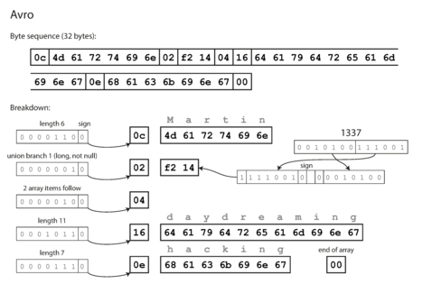

- [方便人類閱讀的格式](#方便人類閱讀的格式)
  - [二進位 JSON](#二進位-json)
- [二進位編碼](#二進位編碼)
  - [Thrift](#thrift)
    - [BinaryProtocol](#binaryprotocol)
    - [CompactProtocol](#compactprotocol)
  - [ProtocolBuffers](#protocolbuffers)
  - [註](#註)
  - [Avro](#avro)

資料在做儲存的時候是需要編碼（encoding）的。編碼後，認為格式需要調整，這時就需要演變（evolution）我們的格式，如何保持前後相容？

當你把資料存進記憶體中，可以透過各種資料型別去對資料進行操作，例如陣列、物件等等。然而當把資料存進磁碟中，也就是檔案系統中，需要以編碼後的資料（例如 JSON 格式）做儲存。

不同程式語言預設就有些編碼方式，Java：`java.io.Serializable`、Ruby：`Marshal`、Python：`pickle`，然而

- 通常不同語言之間是無法互相接通的
- 可能會觸發物件的建置，有安全性疑慮
- 不方便做前後相容
- 效率通常很差

## 方便人類閱讀的格式

JSON、XML、CSV，這些都很常見，然而

- 無法儲存二進位文字，雖然可以使用 Base64 把二進位轉換成 Unicode 文字，缺需要額外的效能和體積（$Base64 > 1.3 * Binary$）
- 沒有綱目（schema），花時間理解和管理
- 大數字不好儲存，整數、小數的區分

然而這些仍是主要的編碼方式，也因為大家很習慣這些方式的編碼，導致更有效和更方便管理的編碼方式很難吸引到大家的目光。

### 二進位 JSON

有些格式是以 JSON 為基礎做演化的，其嘗試解決上述問題，但是效率仍無法贏過專門的二進位編碼，以下圖為範例：

原始 JSON 資料：

```json
{
  "userName": "Martin",
  "favoriteNumber": 1337,
  "interests": ["daydreaming", "hacking"]
}
```


我們可以得到 66 Bytes 的資料，確實比原本 88 Bytes 好，但是和待會我們可以看到減少到 32 Bytes 的方式仍有差異。

## 二進位編碼

這裡不會做太多說明，看圖說故事滿明確的。

### Thrift

Schema：

```
struct Person {
  1: required string       userName,
  2: optional i64          favoriteNumber,
  3: optional list<string> interests
}
```

#### BinaryProtocol

59 Bytes


#### CompactProtocol

34 Bytes


### ProtocolBuffers

Schema：

```
message Person {
  required string user_name       = 1;
  optional int64  favorite_number = 2;
  repeated string interests       = 3;
}
```

33 Bytes


### 註

- `required` 和 `optional` 在編碼時，不影響結果，僅會在做解碼時 runtime 輸出錯誤。
- 每個 tag number 不去更動來保持前後相容。當使用舊的綱目去讀取新的資料時，省略之。
- 新增欄位時若設定 `required` 會讓舊程式碼輸出錯誤，需要給定預設值。
- 變更檔案格式可能導致資料不完全，例如 `int8` 轉到 `int16`
- _ProtocolBuffers_ 沒有 `list` 資料型態，讓他很好從 `repeated` 轉到 `optional`。

### Avro


