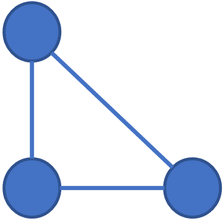
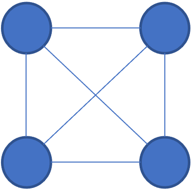

[2021 AWS Summit](https://aws.amazon.com/tw/events/taiwan/2021summit/) 提到：統一資料以發揮其價值，成為資料驅動型企業，其特色：

1. 知識及力量、運用資料擴展企業洞察力和決策權
2. 將資料大眾化，建立安全系統來收集、儲存及處理資料，提供給需要的人員和應用程式
3. 以創新方式讓資料發揮功用：資料科學、機器學習

**Table of contents**

1.  Foundation of Data Systems
    1.  Reliable, Scalable, and Maintainable Applications
    2.  Data Models and Query Languages
    3.  Storage and Retrieval
    4.  Encoding and Evolution
2.  Distributed Data
    1.  Replication
    2.  Partitioning
    3.  Transactions
    4.  The Trouble with Distributing Systems
    5.  Consistency and Consensus
3.  Derived Data
    1.  Batch Processing
    2.  Stream Processing
    3.  The Future of Data Systems

!!! quote "身為一個應用程式開發者，我該如何看待本書"

    如果你能夠了解資料庫的內部運作方式，你就能有一個較宏觀和清楚的視野去看待哪種工具或是參數的調校是最適合你的應用程式。雖然本書不會有任何產品的細節介紹，卻會讓你在看資料庫文件時，暸解不同名詞其背後可能代表的優劣勢。

    As an application developer you’re armed with this knowledge about the internals of storage engines, you are in a much better position to know which tool is best suited for your particular application. If you need to adjust a database’s tuning parameters, this understanding allows you to imagine what effect a higher or a lower value may have.
    Although this chapter couldn’t make you an expert in tuning any one particular storage engine, it has hopefully equipped you with enough vocabulary and ideas that you can make sense of the documentation for the database of your choice.

## 報告進程

### 資料模型和語法

對應書中的 **Data Models and Query Languages**，Relational Model 一路用到底？

!!! question "人際關係"

    假設有 $N$ 個點，點和點的連結就會有 $\frac{N^2-N}{2}$ 個。試想有百萬個社交媒體的用戶，若要使用 MySQL 建立一個彼此之間認識與否的人際網絡會需要多少 entry？這時候有沒有除了 Relational Model 之外的選擇？

    { width=100 }
    { width=100 }

-   Relational Model v.s. Document Model
-   Graph like model and more
-   Query Language

### 索引

對應書中 **Storage and Retrieval** 的前半段，如何加速資料的讀取。

!!! question "雙索引"

    MySQL 每次下 query 只會遵從其中一個 index，為什麼？若要做多個索引，需要犧牲什麼？

    有些情況必須要雙索引，例如：地理位置中的經緯度，只搜尋經度的話效能的提升有限。

-   Hash index
-   SSTables and LSM-Trees
-   B-Trees
-   and more

### 資料倉儲

對應書中 **Storage and Retrieval** 的後半段，如何區分線上和後台的資源。

!!! question "數據分析"

    如果我們要分析線上使用者的資料，如何避面和線上使用者搶效能？

-   OLTP or OLAP
-   Column-Oriented storage
-   Stars and Snowflakes schema
-   compression

### 編碼和進程

對應書中的 **Encoding and Evolution**，應用程式和資料庫之間的溝通最佳化和前後相容。

!!! question "舊版編碼如何讀新版資料"

    追求資料體積的極致壓縮，管理也很重要。若資料庫同時存在新版和舊版的資料，如何避免編碼失效。

-   JSON, XML, Binary
-   REST and RPC
-   Message-Passing
    -   Message Brokers
    -   Actor Model

### 競賽條件

### 分散式資料庫——複製

### 分散式資料庫——分區

### 網路和時間

### 共識

### 批次處理

### 串流處理

問題

-   [ ] Multiple indexing
-   [ ] Graph model - FB
-   [ ] Event streaming processing - FB

## 貫穿本書的目的

一個應用程式需要滿足許多需求才能提供特定服務。

-   功能性需求，例如：允許存取資料、搜尋等等。
-   非功能性需求，例如：
    -   安全性（security）
    -   可靠性（reliability）
    -   順從性（compliance）
    -   延展性（scalability）
    -   相容性（compatibility）
    -   維護性（maintainability）

### 可靠性

當服務發生狀況時，仍然能正確運行。狀況可能為

-   硬體，通常是無相關性且隨機的
-   軟體，通常是性統性的且難以解決
-   人為

容錯能力（Fault-tolerance）代表他能接受特定狀況的發生，並讓使用者不會受此影響。

### 可延展性

可延展性代表即使流量增加，表現仍是正常的。在討論延展性前，需定義流量（load）和表現能力（performance quantitatively）。以 Twitter 的個人首頁為例，利用回應時間的百分位數（percentiles）代表表現能力。即使流量增加，回應時間的百分位數仍低於特定水平。

在一個可擴充的系統，我們可以增加機器的量（processing capacity）來維持可靠的表現能力。

### 可維護性

可維護性有很多面向，基本上來說，就是為了讓工程師和運維工程師準時。讓系統保持抽象化（把維度提高）可以降低系統的複雜性，並且讓其更容易修改和適應新的功能。

好的操作性（operability）代表能觀察到系統內部運作狀態和健康檢查，並且擁有高效的方式去管理。

!!! note "結論"

    通常來說不會有一個辦法可以簡單且完整的讓應用程式可靠、好延展和維護。然而，都會有某種模式或工具幫助我們一個一個解決這些問題。

<!-- prettier-ignore-start -->
*[索引]: Index
<!-- prettier-ignore-end -->
