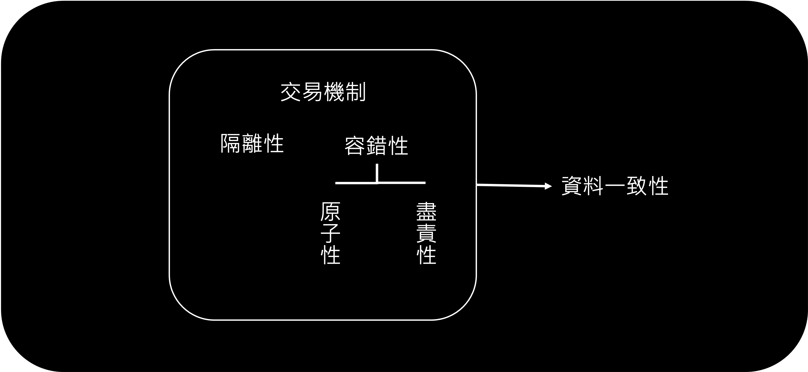
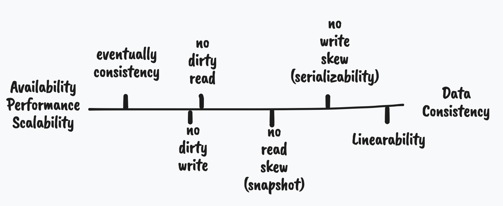

# 處理競賽情況

如何在高可用性（HA）和高一致性（Consistency）之間做取捨。

[HackMD 報告文本](https://hackmd.io/@Lu-Shueh-Chou/Skn6N6JTF)

## 競賽情況

我們先來看看什麼是競賽情況，再說明解決辦法和其帶來的權衡之計。

假設現在有個應用程式：信箱系統。如果使用者有尚未閱讀的信件時，服務會在應用程式的導航頁面放提示紅點，說明還有幾封信還沒看。我們可以用以下 SQL 搜尋語法達成這件事：

```sql title="取得未讀信件數量"
SELECT COUNT(*)
FROM emails
WHERE recipient_id = 2 AND unread_flag = true
```

隨著應用程式的成長，你發現這樣做會讓 `emails` 這個表格的存取次數變得太多了，於是希望能把未讀信件的數量額外存取在其他表格（去正規化的一種行為）。

每次新增信件之後，應用程式會再送一個資料庫請求，把 `mailboxes` 表格中欄位 `unread` 的數字加一。

```sql title="去正規化以提升效率"
-- INSERT INTO emails ..
-- 新增完之後，再增加未讀信件的數量
UPDATE mailboxes
SET unread = unread + 1
WHERE recipient_id = 2;
```

這時，問題就發生了。


上述例子是因為應用程式一個請求在更新資料，另一個請求卻同時讀取該值，從而觀察到尚未完成的狀態。

> 以這個例子而言，尚未完成的狀態為：`unread` 還沒增加。

這種兩個人同時請求存取（write/read）單一（或多個）物件，我們就稱其為「競賽狀況」。不只是多個物件的存取，我們來看看針對單一物件的存取時造成的競賽狀況：


除了加一，可能還有 compare-and-set 這類型的請求。例如，如果該值數量大於五，我就歸零，不然就加一。

> 針對單一值的操作稱作 Single-Object Operations；反之，多個值的操作稱為 Multi-Object Operations。

> 雖然這裡提的競賽狀況不管是單或多台資料庫，都會發生，但是處理分散式（多台）的競賽狀況會在之後（容錯的分散式服務）才講。

我們需要讓每個請求擁有兩種特性，以解決競賽狀況：

-   隔離性（isolation）：是用來避免競賽狀況
-   容錯性（fault-tolerance）：是當資料庫發生競賽狀況時，我們要如何復原資料庫狀態。

### 隔離性

避免別的請求看得到你未完成的狀態，以郵件為例，就是 使用者 2 要麻看不到他有新增郵件，要麻有新的郵件且數量顯示也正確，不會顯示尚未完成的狀態。要達成隔離性可以有幾種做法：

-   加一把鎖（lock）。
-   建立快照（snapshot），避免互相影響。
-   建立版本機制（version）。

詳細介紹會在下面講解！

### 容錯性

競賽狀況會形成錯誤的狀態，當發生錯誤時，系統要能有機制處理這些問題，而處理錯誤的能力我們稱其為容錯性（Fault tolerance）。


以上圖為例，當錯誤發生時，根據應用程式的考量可能有不同作法：

-   全部重來：剛剛新增的郵件讓資料庫自動捨去，讓應用程式重新送一次這一系列的請求。
-   重來錯誤的請求：以未讀郵件的例子來說，就是重新加一次未讀數量。
-   給你決定：資料庫告知應用程式發生錯誤，讓應用程式（或使用者）決定該怎麼做。

!!! info "重複做事"

    網路中斷可能發生在任何一段，不管是送過去時，還是回傳回來時。如果是回傳回來，就代表對於資料庫來說，資料已經成功添加進去。只是在通知應用程式他成功時，發生錯誤。這時應用程式如果再重來一次，就會讓資料被重複添加。

    我們可以於請求中添加 ID 來避免這件事發生（資料庫看到重複的 ID 就不做事），不過更細的討論於最後一章「作者期許」中說明。

#### 原子性

上面我們提的其中一種做法：重來錯誤的請求，如果請求的狀態是相依的，重來的機制可能是非常複雜的，這時讓錯誤的請求重來很可能會形成錯誤的狀態。而且這種狀況會再因為並行（concurrency）和災難復原（例如我們前面提的 WAL）而變得更為複雜。

通常資料庫的設計者為了避免去重來部分錯誤的請求時所造成的錯誤狀態，會使用原子性（atomic）。這個請求做到一半時，如果發生狀況，就完全捨棄之前做的所有事。

> 我們可以透過把執行的結果存在 `/temp` 的位置下，當請求完成時，再把 `/temp` 下的資料整合進資料庫中。
> 如果過程中有錯，則完全清除 `/temp` 下的資料，而不會把資料庫弄髒。

#### 盡責性

不是每個資料庫都會做重來的機制，有些資料庫為了滿足[高可用性（High Availability）](introduction.md#貫穿本書的目的)等目的，會盡可能做自己能做的事（best effort）。

例如清楚告知應用程式發生了什麼事，例如上個例子中，第二個動作（增加郵件未讀數量）若沒完成，則通知應用程式其未完成，但是第一個動作已經準確完成了。這時應用程式就要自己再重加一次未讀數量，或者在設計應用程式時應考量這個問題而減少這類的去正規化。

### 交易機制

我們來把上面的特性整合起來。如果資料庫在處理請求的時候可以滿足上述特性時，我們稱這一類請求為交易（transaction）。

根據上述特性被滿足的等級（例如最高的隔離性：線性執行），我們會稱該資料庫可以滿足特定等級的資料一致性（consistence）。



> 有些人可能會把隔離性和原子性當成一件事，但是實際代表的意義是不同的。
> 隔離性：避免其他請求（甚至線程）看到部分的結果，以上述郵件為例就是未讀郵件數量還沒增加就可以讀取未讀郵件。
> 原子性：為了達成容錯而把所有處理包裝成單一事件的設計理念（philosophy），其中並沒有並行（concurrency）的概念。
> 原子性是從 atomic 翻譯而來，在此也許用 abortability 更為恰當。

!!! warning "名詞意義"

    實際上，各個名詞的意義在溝通過程中，都已被泛化。在本文章中針對名個詞做的解釋並不適用所有的產品文件、部落客文章、書本。

    你必須通過前後文對照來找出其代表的意義，不必執著於哪個用法才是最為精準的。

### 應用

不是每個應用程式都需要使用交易機制，雖然他能提升容錯性並達成資料的一致性，卻會降低效能和可用性。

> 根據狀況我們可能可以透過交易以外的方式來達成一定等級的資料一致性。

1975 年，IBM 的 System R（[第一個 SQL 資料庫](http://citeseerx.ist.psu.edu/viewdoc/download?doi=10.1.1.84.348&rep=rep1&type=pdf)）首開先河的使用交易的機制。這之後，許多的關連式資料庫（SQL DB）都一定程度上的支援相似的理念。

但是到了 2010 年左右，[NoSQL](data-model.md) 的理念開始崛起。他們提倡的不只是[不同的資料架構](data-model.md#文件式模型)，也放棄使用多值（multi-object）的交易（單一值的交易很輕易就能達成，然而多值的交易卻需要付出龐大的代價），也由此，達成高擴增性、高可用性和高效能的資料庫。

!!! info "ORM 對交易的看法"

    儘管交易的價值就在於透過原子性當交易失敗時，你可以放心地重跑一次交易，ORM（Object-relational mapping） 的框架在處理交易時，通常不會預設 retry 錯誤的交易。

    因為並不是所有場景的都適合重做交易：

    - 資料庫在回應給應用程式時發生網路錯誤，造成實際資料庫已經跑完，而應用程式以為沒跑完。這時就要有應用程式層級的去重複（de-duplication）邏輯
    - 當資料庫因為大量請求而導致忙不過來並回應錯誤，重做一次只會讓狀況更糟糕
    - 當你的程式碼有錯或者請求寫入的值不符合綱目等等，重做一次並不會讓他執行成功

## 一致性等級

一致性等級從低到高，其犧牲的是效能、可用性、擴增性。



為了決定應用程式可以達成的一致性等級，我們就需要了解不同等級的狀況和解決辦法。這裡解釋的方式是使用較為生活化、範例性的說明，若需要暸解精準的定義，可以查看論文[^1][^2][^3]。

> 最終一致性（eventual consistence）代表在確定但不可預期的未來（不管是人為介入還是網路中斷的復原）裡，資料會被達成一致。
> 這是最弱的一致性，在考慮資料的一致性時，通常都預設資料庫有這一類型的保證。

### 使用提交後的資料

所謂的「使用」有兩種：讀取和寫入。以上述郵件為例，就是一種「讀未完成的資料」（dirty read），而下述例子代表「覆寫未完成的資料」（dirty write）：


因為 _Alice_ 和 _Bob_ 的資料彼此被覆寫了，所以導致最終的狀態破碎化：購買者是 _Bob_，發票上的收件者卻是 _Alice_。

我們稱這種狀況代表資料庫並沒有「使用提交後的資料」（read committed）。要達成這等級的一致性解決辦法通常就是加鎖，幾乎每個資料庫都有實作本等級。

!!! tip "資料遺失並不代表複寫未完成的資料"

    如果 _Alice_ 和 _Bob_ 先後完成請求，並且彼此僅有一方被覆寫，這時並不違反_使用提交後的資料_。這只是代表資料被覆寫而已，處理資料複寫的辦法會在資料庫複製中提到。

#### 覆寫未完成的資料

當寫入多筆資料時，鎖住寫過的物件。 以上述為例，當 _Alice_ 尚未完成交易（un-commit）前，`listings id=1234` 的物件會被鎖住，即使 _Bob_ 想修改，也需要等 _Alice_ 完成交易。

!!! info "寫入前先檢查"

    若你不希望 _Bob_ 覆寫掉 _Alice_ 的資料，你可以在更新的搜尋語法中加上檢查，讓這個搜尋變成「先檢查再寫入」（compare-and-set）。

    ```sql "先檢查沒有買家再更新"
    UPDATE listings
    SET buyer = 'Bob'
    WHERE id = 1234 AND buyer = NULL
    ```

#### 讀未完成的資料

若其他請求正在寫入資料時，我們避免其他請求並行讀取時，會大量降低效能（OLTP 的特性是大量讀取少量異動）。所以通常在實作鎖的時候，僅會避免同時寫入。

但是這樣就沒辦法達成我們要求的一致性等級：只讀完成的資料（no dirty read）。我們可以讓正在寫入的資料放在記憶體中，這時其他請求在讀取時，就是讀磁碟裡的資料，這樣就可以避免其他請求讀取到還未完成的資料。當正在寫入的資料完成時，再把做好的資料放回磁碟中。

> 已知的資料庫中，僅有 Microsoft SQL Server 當設定 [`read_committed_snapshot=off`](https://docs.microsoft.com/zh-tw/dotnet/framework/data/adonet/sql/snapshot-isolation-in-sql-server#understanding-snapshot-isolation-and-row-versioning) 時會讓鎖住的物件無法被讀取。

### 快照隔離

_使用提交後的資料_，好像已經很符合我們前面對於隔離性的意義：交易間不會互相影響。前面提到的例子，也都可以順利解決，使用者不會再看到有未讀郵件，卻沒有增加未讀郵件的數量（不讀未完成的資料）。然而：


有個請求同時讀取到交易開始前和結束後的狀態，這時就會顯示出狀態的不一致性。聽起來好像還好，我再重新整理就可以把狀態恢復原狀，但是你還需要考慮以下狀況：

-   資料庫的備份。當資料庫在針對線上資料庫做備份時，他仍然後遇到上述的問題。如果備份的資料是狀態不一致的，當未來需要用備份資料做復原時，就會造成這種短暫不一致性的資料變成永久性的
-   分析性的搜尋。若你需要做分析全部使用者的狀態時，很可能會得到這種破碎或不合乎邏輯的結果。

> 前面的圖提到的讀取偏斜（read skew）就代表這個讀取動作因為任何原因（網路排隊、運行暫停等等）被延遲了，導致其讀取的資料是傾斜的（狀態不一致的）。

我們稱這種狀況沒辦法達成「快照隔離」一致性。要達成這個等級的一致性，通常會使用**多版本並行控制**（multi-version concurrency control，MVCC），這也是很多資料庫會達成的等級。

!!! warning "專有名詞"

    有些資料庫會稱快照隔離為**可重複讀取**（repeatable read）或**序列化**（serializability），這是因為當初以 System R 為基礎建立的 SQL 協定就是使用可重複讀取這個名詞，資料庫為了宣稱其滿足 SQL 協定，就會把這個名詞寫進他們的文件中。

    雖然有論文[^4][^5]給予這一類的一致性一個定義，但是大部分資料庫在宣稱其擁有可重複讀取的一致性時並未滿足這個定義。更糟的是 IBM DB2 甚至把**序列化**當成**快照隔離**

    - 使用快照隔離的[資料庫](https://dbdb.io/browse?isolation-levels=snapshot-isolation&q=)
    - 使用重複讀取的[資料庫](https://dbdb.io/browse?isolation-levels=repeatable-read&q=)

#### 多版本並行控制

簡單來說，多版本並行控制就是替資料庫的狀態建立多個版本，每個交易根據當下擁有的版本號，限制執行哪些行為，這個版本號我們稱其為交易編號（transaction ID，`txid`）。

> 前面我們提到的*使用提交後的資料*就是讓資料庫擁有兩個版本，一個是交易正在修改時的狀態（un-committed）版本，一個是交易完成（committed）後的版本。
> 所有僅作讀取的交易只會使用到交易完成後的版本，而執行寫入的交易就會自己擁有正在修改時的版本（通常存放於記憶體）。


當交易在做讀取時，會根據一個一直增加的計數器給予其交易編號（以上圖為例就是 `txid=12`）。這時，資料庫會列出目前有哪些正在執行的交易，待會本交易在操作時，所有正在執行的交易都會被拒絕使用。同時，只能讀取時，小於其擁有的交易編號的資料（以上圖為例就是 `txid=13` 不能被讀取）。

其核心概念就是：所有的讀取都不會影響所有的寫入，反之亦然。

> 賦值的計數器當大於一固定數時是會歸零重算的。

#### 索引

前面我們有提過[資料庫的索引是如何運作的](db-index.md)，但是如果*多版本並行控制*需要被考慮進去時，就需要一些額外的功去調整機制。

一個作法是讓索引指向所有版本的資料（不管是頁導向中指向特定頁或者日誌結構的散列對照表的地址），但是根據不同實作方式可能會有很大的效能差異。

-   PostgreSQL 會盡量讓所有版本的資料都放進同一個頁
-   CouchDB、Datomic、LMDB 當交易需要更新資料時，讓他直接重新建立新的樹狀結構，完成後直接取代舊的樹狀結構。這樣其他讀取的交易就不會受到影響。但是他會需要背景執行垃圾回收和壓縮的工作

> CouchDB、Datomic、LMDB 雖然也是使用 B-Tree 做儲存，但是機制卻是 append-only/copy-on-write。當更新資料時，不去更動舊的頁，而是直接新增一個頁並讓它取代舊頁的位置。

### 寫入偏斜

上面提到的競賽狀況都是不同交易嘗試使用相同的物件，但是競賽狀況也是會發生在當不同交易同時寫入不同物件的時候。

我們先假設一個狀況，醫院在晚上值班的時候必須要至少擁有一個住院醫師，但是一般情況會讓兩個住院醫師值班（也就是允許讓其中一個醫生休假）。若他們同時在排班系統中，申請休假，狀況就發生了。


這時，用前面的解法並沒有辦法達成資料一致性，因為他們更新（或注入）的目標是不同的。

#### 假體判定

醫生值班的狀況這就是我們常見的訂票系統被超訂了。另外一個範例也包括預約系統：

```sql title="若有空位，則可預約"
BEGIN TRANSACTION;

SELECT COUNT(*) FROM bookings -- 1
WHERE room_id = 123 AND
end_time > '2015-01-01 12:00' AND start_time < '2015-01-01 13:00';

INSERT INTO bookings(room_id, start_time, end_time, user_id) -- 2
VALUES (123, '2015-01-01 12:00', '2015-01-01 13:00', 666);

COMMIT;
```

1. 檢查所有現存的與 12:00~13:00 重疊的預約
2. 如果之前的查詢顯示沒有重疊的預約（COUNT(\*) == 0）

這例子不像醫生的例子，因為醫生例子是根據**存在**的值（`on_call=true`）做判斷；反過來說，預約系統是根據**不存在**的值（`time IN (start, end)`）做判斷。

這種不存在的值而造成的寫入偏斜，我們稱其為假體判定（phantom）。其特徵是 `insert` 而不是 `update`。

無論如何，當發生寫入偏斜時就要使用更強的一致性等級：序列化。在介紹序列化之前，我們先來看看除此之外還有哪些方式可以避免特殊的寫入偏斜。

#### 限制狀態

其中一個簡單的解法就是給予限制（constraint）。例如 SQL 資料庫常見的 `UNIQUE`，其應用可能是使用者帳戶：

```sql
SELECT COUNT(*) -- 1
FROM users
WHERE user_account = 'new_user'

INSERT INTO users(user_id, user_account) -- 2
VALUES (123, 'new_user');
```

1. 檢查所有現存的使用者是否有 `new_user`
2. 如果之前的查詢顯示沒有該使用者（`COUNT(*) == 0`）

如果我們替 `user_account` 添加限制，讓他只能單一存在，就可以避免同時有兩個使用者帳戶一樣的競賽狀況。

但是以醫生值班為例，當涉及到多個物件時，大部分資料庫都不支援這樣的限制。除了 `UNIQUE` 之外可能還有外鍵（foreign key）、值的限制（例如正數）等等。

## 序列化

一般來說，我們都會稱序列化（serializability）為最強的隔離性等級，雖然前面的圖有說線性化（linearability）再更強，但是他需要犧牲的東西太多了，很少被實現。序列化的外顯樣子就是雖然多筆交易可能是並行處理的，但其結果卻是有順序性的（序列化的）。

當然，這麼強的一致性也是會需要犧牲的，根據實作方式不同，其需要付出的代價有所不同。

-   [實際序列化](#實際序列化)沒辦法有效的擴增
-   [兩階段鎖](#兩階段鎖)會讓潛時（latency）很不穩
-   [序列化快照](#序列化快照)也許會是未來標準

### 實際序列化

讓資料運行在單一線程下，就可以讓所有行為都成為序列化。這個想法很簡單，但是卻在大約 2007 年時才開始出現，原因是因為記憶體的價格低廉和整合快照隔離讓讀取的交易並行處理。

為什麼記憶體的價格會影響能否使用單一線程？這是因為要達成單一線程的資料庫前提是，每一個交易都是簡單而快速的。這樣交易彼此間就不會有過多的延遲。要達成快速執行交易，就需要把資料庫存進記憶體中。

接下來，我們來看看還有哪些情況會讓交易變得很慢，並說明其解決辦法。

#### 很慢的讀取

很慢的讀取可能有兩種：一種是牽涉到大量資料的讀取、一種是讀取的資料不在記憶體中，需要到磁碟中拉取。

前面有提過在寫入偏斜以前的一致性，可以透過快照隔離來達成，所以資料庫就可以透過快找隔離來執行那些需要大量讀取的搜尋（例如分析性的搜尋）。

如果資料在磁碟中，我們可以先退回交易（或者讓其他交易先執行），等磁碟的資料被拉進記憶體中再執行這個交易。

#### 互動式交易

有些交易是應用程式反覆和資料庫溝通進行的，例如先從資料庫拿取一些資料，做判斷和運算之後再執行交易中的下一步。這時，大量的時間都被消耗在網路溝通上。為了避免這種情況，這種實際序列化的資料庫通常只支援貯存程序（_stored procedure_）。


!!! example "有貯存程序的資料庫"

    - VoltDB 使用 JAVA 或 Groovy 作為貯存程序
    - Datomic 使用 JAVA 或 Clojure 作為貯存程序
    - Redis 使用 Lua 作為貯存程序

但是貯存程序的缺點就是很難達成擴增性，因為他特性是單一線程去執行這些事，當資料被放進多台資料庫時（partitioned），就會犧牲很多效能來達成這個目的。

相反的，如果資料能被合乎邏輯的放置不同位置（根據應用程式的商務邏輯），就可以在不同資料庫各自執行其範圍內的資料，達成分散式的單一線程。

### 兩階段鎖

兩階段鎖（(Strong Strict) Two-phase locking，(SS)2PL）就是在交易寫入時，避免其他交易讀取；反之亦然。

兩階段鎖中有兩種鎖，一種是共享鎖（shared mode）、一種是排他鎖（exclusive mode）。當交易在讀取資料時，會獲得該資料的共享鎖；反之，當交易在編輯時，會獲得該資料的排他鎖。排他鎖要等所有該資料的共享鎖被釋放，相反的，獲得共享鎖的前提就是該資料並沒有排他鎖。

> 兩階段的階段代表從限制其他交易寫入同物件的階段提升到限制提他交易讀取同物件的第二個階段。

#### 假體判定

前面的預約問題中，我們可能面臨的是寫入時的判斷機制受到尚未存在的資料影響（即所謂的假體判定）。這時後的機制就需要針對整體的表格或特定條件的資料做鎖定。

透過條件（以上述為例，就是 `room=1234`）去限制資料的鎖我們稱為預判鎖（predicate lock）；鎖定整體的表格（table）或是部分的索引位置，我們稱其為索引範圍鎖（index-range lock）。

若兩階段鎖能滿足假體判定，我們就能稱其為序列化的資料一致性。

!!! info "物化衝突"

    若該資料尚未存在，你除了鎖定整體的表格也可以透過物化衝突（materializing conflicts）來物化部分特徵以達成部份的鎖定。

    以前面的預約系統為例，你可以額外建立一個表格，並在其中放入每十五分鐘的時間區間，所以該表會有 `2000-01-01 00:00:00`、`2000-01-01 00:15:00` 等等的值。當你在做會議室有無預約時，可以鎖定該預約時段的值，避免被讀取，這時就可以達到鎖定部分值的效果，也就是讓假體變成實體。

    然而這個方法卻會讓你的應用程式變得很髒（在應用程式的程式碼中寫入資料庫的並行控制邏輯），除此之外這個做法根據實作場景很可能變得很困難，所以應該將其視為最後手段。

#### 低落的效能

不只是因為資料庫常常要加鎖、解鎖，當資料被鎖定時，其他交易就無法存取該資料，這大大的降低資料庫的效能。所以即使兩階段鎖從 1980 左右就已經存在，仍然讓許多資料庫在設計資料庫時，不會考慮序列化的一致性。

當交易和交易間因為鎖的關係被互相限制住了，例如：交易 1 針對資料 a 進行排他鎖，交易 2 針對資料 b 進行排他鎖，之後交易 2 要讀取資料 a，交易 1 要讀取資料 b，這時兩個交易會因為排他鎖，而被迫進入永久的等待，這種狀況稱為閉鎖（deadlock）。

資料庫在實作兩階段鎖時，還要實作偵側閉鎖並釋放其中一個交易，這時因為其中一個交易必須透過應用程式重新發送，讓資料庫工作又進一步的提升。

### 序列化快照

序列化快照（Serializable Snapshot Isolation，SSI）於 2008 年的一篇[論文](http://www.cs.nyu.edu/courses/fall12/CSCI-GA.2434-001/p729-cahill.pdf)中提出，相較於兩階段鎖的理念：無論有沒有競賽狀況，我讓資料避免被閱讀就可以避免可能的競賽狀況，序列化快照的理念是：我一樣讓交易**同時進行**，但是當發現彼此有衝突時，放棄後面的交易。

> 這種透過判斷決定是否有競賽狀況的方式在早期就有出現，但是缺點就是當有大量交易同時存取相同的物件，就很可能造成大量的交易被拒絕，從而進一步提升資料庫的負載（因為被放棄的交易很可能還會被重做）。相對而言，這種方式就很適合交易存取的是較為稀疏的資料，或者交易編輯資料時是不在乎順序的（例如 `count=count+1`）。

序列化快照和早期判斷是否有競賽狀況的演算法的主要差異在於，序列化快照是基於快照隔離的機制而建立的。

以下就根據序列化快照在不同的競賽狀況發生時，他所處理的方式討論之。

#### 判斷是否讀到舊資料

我們可以透過隔離快照的多版本並行控制來判斷交易是否使用到舊的資料：當提交時，其使用的資料版本已經被更新了。


如果 _交易 43_ 第二個搜尋不是會異動資料的搜尋（也就是 _交易 43_ 僅是做讀取的交易）時，就不需要退回該交易，因為序列化快照避免的只是寫入偏斜，在滿足讀取偏斜的情況下，這筆交易是不需要被退回的。

#### 判斷寫入後是否影響其他人


在兩階段鎖的時候有提到索引範圍鎖，但是這裡的鎖並不會限制其他人讀取，僅是紀錄哪些交易使用到這些資料，以利之後判斷是否受影響。

#### 效能和擴增性

我們前面提到[實際序列化](#實際序列化)和[兩階段鎖](#兩階段鎖)分別有低擴增性和低效率性的缺點，然而序列化快照卻修正了這些缺點，進而**可能**成為未來實作序列化一致性時的標準做法。

序列化快照的效能受到一些實作細節影響，我們在記錄交易的過程時（以利之後判斷其他交易是否會受影響），其細節程度會需要做一些權衡：

-   記錄的越細，越能判斷其他交易是否受影響，進而捨棄該交易。[PostgreSQL](http://drkp.net/papers/ssi-vldb12.pdf)
-   紀錄的越少，執行效能越快，記憶體的需求越低。

至於擴增性，當使用序列化快照時因為任一交易都不會影響其他交易同時進行，僅在交易結束後進行判斷是否有衝突，所以他可以很輕易地達成擴增性的需求。[FoundationDB](http://web.archive.org/web/20150427041746/http://blog.foundationdb.com/databases-at-14.4mhz)

## 修復寫入衝突

不論哪一種一致性（就算是完全線性）都會造成資料的複寫（在不退回交易的前提下），有一個研究領域就是在專門討論怎麼整合這些衝突。例如同時修改維基百科的資訊，兩個人如果都改同一個段落，第二個提交的很可能就會把第一個提交的更改覆蓋掉。

這狀況尤其容易發生在多台資料庫的叢集之下，細節我們就留到資料庫複製（replicated）再來討論。不過這裡提一下，在一些簡單的資料型別是可以達到整合多個修改的，例如：

-   數字增加，先後加一不論順序都會造成資料加二。
-   陣列加元素，若不考慮陣列的順序，先加和後加都會被加進陣列裡而不會遺失。
    -   [Redis](https://redis.io/commands/append)
    -   [MongoDB](https://docs.mongodb.com/manual/reference/operator/update/push/)
    -   [Riak 2.0](https://web.archive.org/web/20161023195905/http://blog.joeljacobson.com/riak-2-0-data-types/)

## 其他要注意的地方

你很難一眼看出這個應用程式或者程式碼會面臨競賽狀況，或者確定當資料庫達成特定等級的一致性時，該應用程式或程式碼就可以安全地被執行。所以我們除了應盡可能思考所有能發生的狀況，還要做好充分的測試來滿足這些狀況（雖然實現這些測試是困難的）。

> 即使資料庫宣稱他能達成某些效果，大部分情況你仍需要在使用前做好測試，因為你的情況很可能不是資料庫設計者在開發時考慮的狀況。
> 遺憾的是，並不是所有資料庫設計者都清楚暸解這些一致性的等級區分。[^6][^7]

!!! quote "我們該怎麼考慮交易機制"

    使用交易機制來保持資料的一致性會帶來效能的影響。與其考慮效能而拒絕使用，不如在設計應用程式時避免「過度」使用交易機制。

    這時，對應用程式設計者來說，就能大量降低時常要考慮競賽狀況所消耗的工時和錯誤。

    —— Spanner：Google 的全球分散式資料庫（2012）

[^1]: https://www.microsoft.com/en-us/research/wp-content/uploads/2016/02/tr-95-51.pdf
[^2]: http://pmg.csail.mit.edu/papers/adya-phd.pdf
[^3]: http://arxiv.org/pdf/1302.0309.pdf
[^4]: http://pmg.csail.mit.edu/papers/adya-phd.pdf
[^5]: http://arxiv.org/pdf/1302.0309.pdf
[^6]: https://www.microsoft.com/en-us/research/wp-content/uploads/2016/02/tr-95-51.pdf
[^7]: http://arxiv.org/pdf/1302.0309.pdf
