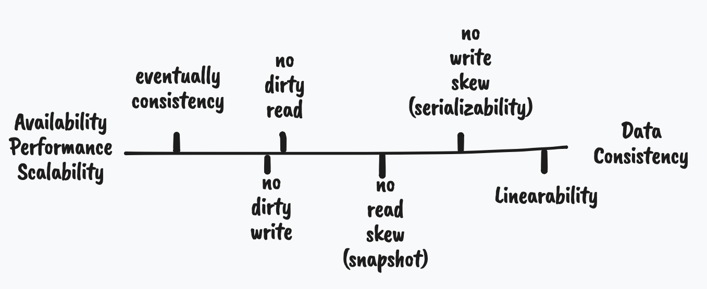

# 處理競賽情況

如何在高可用性（HA）和高一致性（Consistency）之間做取捨。

## 競賽情況

我們先來看看什麼是競賽情況，再說明解決辦法和其帶來的權衡之計。

假設現在有個應用程式：信箱系統。如果使用者有尚未閱讀的信件時，服務會在應用程式的導航頁面放提示紅點，說明還有幾封信還沒看。我們可以用以下 SQL 搜尋語法達成這件事：

```sql title="取得未讀信件數量"
SELECT COUNT(*)
FROM emails
WHERE recipient_id = 2 AND unread_flag = true
```

隨著應用程式的成長，你發現這樣做會讓 `emails` 這個表格的存取次數變得太多了，於是希望能把未讀信件的數量額外存取在其他表格（去正規化的一種行為）。

每次新增信件之後，應用程式會再送一個資料庫請求，把 `mailboxes` 表格中欄位 `unread` 的數字加一。

```sql title="去正規化以提升效率"
-- INSERT INTO emails ..
-- 新增完之後，再增加未讀信件的數量
UPDATE mailboxes
SET unread = unread + 1
WHERE recipient_id = 2;
```

這時，問題就發生了。


上述例子是因為應用程式一個請求在更新資料，另一個請求卻同時讀取該值，從而觀察到尚未完成的狀態。

> 以這個例子而言，尚未完成的狀態為：`unread` 還沒增加。

這種兩個人同時請求存取（write/read）單一（或多個）物件，我們就稱其為「競賽狀況」。不只是多個物件的存取，我們來看看針對單一物件的存取時造成的競賽狀況：


除了加一，可能還有 compare-and-set 這類型的請求。例如，如果該值數量大於五，我就歸零，不然就加一。

> 針對單一值的操作稱作 Single-Object Operations；反之，多個值的操作稱為 Multi-Object Operations。

### 隔離性

要避免上述狀況，就需要讓資料庫擁有隔離性（isolation）。要達成隔離性可以有幾種做法：

-   加一把鎖（lock）。
-   建立快照（snapshot），避免互相影響。
-   建立版本機制（version）。

詳細介紹會在下面講解！

### 容錯性

競賽狀況會形成錯誤的狀態，當發生錯誤時，系統要能有機制處理這些問題，處理錯誤的能力我們稱其為容錯性（Fault tolerance）。


以上圖為例，這時，根據應用程式的考量可能有不同作法：

-   全部重來：剛剛新增的郵件讓資料庫自動捨去，讓應用程式重新送一次這一系列的請求。
-   重來錯誤的請求：以本例來說，就是重新加一次未讀數量。
-   給你決定：資料庫告知應用程式發生錯誤，讓應用程式（或使用者）決定該怎麼做。

!!! info "重複做事"

    網路中斷可能發生在任何一段，不管是送過去時，還是回傳回來時。如果是回傳回來，就代表對於資料庫來說，資料已經成功添加進去。只是在通知應用程式他成功時，發生錯誤。這時應用程式如果再重來一次，就會讓資料被重複添加。

    我們可以於請求中添加 ID 來避免這件事發生，不過更細的討論於最後一章「作者期許」中說明。

#### 原子性

上面我們提的其中一種做法：重來錯誤的請求，如果請求的狀態是相依的，重來的機制可能是非常複雜的。例如改了某一值之後，根據結果再改另外一個值。這時讓錯誤的請求重來很可能會形成錯誤的狀態。狀況會因為並行（concurrency）和災難復原（例如我們前面提的 WAL）而變得更為複雜。

通常資料庫的設計者為了避免去重來部分錯誤的請求時所造成的錯誤狀態，會使用原子性（atomic）。這個請求做到一半時，如果發生狀況，就完全捨棄之前做的所有事。

> 我們可以透過把執行的結果存在 `/temp` 的位置下，當請求完成時，再把 `/temp` 下的資料整合進資料庫中。
> 如果過程中有錯，則完全清除 `/temp` 下的資料，而不會把資料庫弄髒。

#### 盡責性

不是每個資料庫都會做重來的機制，有些資料庫為了滿足[高可用性（High Availability）](introduction.md#貫穿本書的目的)等目的，會盡可能做自己能做的事（best effort）。

例如清楚告知應用程式發生了什麼事，例如上個例子中，第二個動作（增加郵件未讀數量）若沒完成，則通知應用程式其未完成，但是第一個動作已經準確完成了。這時應用程式就要自己再重加一次未讀數量，或者在設計應用程式時應考量這個問題而減少這類的去正規化。

### 交易機制

我們來把上面的特性整合起來。如果資料庫在處理請求的時候可以滿足上述特性時，我們稱這一類請求為交易（transaction）。

根據上述特性被滿足的等級（例如完全隔離，同一個值同一時間只能被一個請求讀取或寫入），我們會稱該資料庫可以滿足特定等級的資料一致性（consistence）。


> 有些人可能會把隔離性和原子性當成一件事，但是實際代表的意義是不同的。
> 隔離性：避免其他請求（甚至線程）看到部分的結果，以上述郵件為例就是未讀郵件數量還沒增加就可以讀取未讀郵件。
> 原子性：為了達成容錯而把所有處理包裝成單一事件的設計理念（philosophy），其中並沒有並行（concurrency）的概念。
> 原子性是從 atomic 翻譯而來，在此也許用 abortability 更為恰當。

!!! warning "名詞意義"

    實際上，各個名詞的意義在溝通過程中，都已被泛化。在本文章中針對名個詞做的解釋並不適用所有的產品文件、部落客文章、書本。

    你必須通過前後文對照來找出其代表的意義，不必執著於哪個用法才是最為精準的。

### 應用

不是每個應用程式都需要使用交易機制，雖然他能提升容錯性並達成資料的一致性，卻會降低效能和可用性。除此之外，我們也可以透過交易以外的方式來達成一定等級的資料一致性。

1975 年，IBM 的 System R（[第一個 SQL 資料庫](http://citeseerx.ist.psu.edu/viewdoc/download?doi=10.1.1.84.348&rep=rep1&type=pdf)）首開先河的使用交易的機制。這之後，許多的關連式資料庫（SQL DB）都一定程度上的支援相似的理念。

但是到了 2010 年左右，[NoSQL](data-model.md) 的理念開始崛起。他們提倡的不只是[不同的資料架構](data-model.md#文件式模型)，也放棄使用多值（multi-object）的交易（單一值的交易很輕易就能達成，然而多值的交易卻需要付出龐大的代價），也由此，達成高擴增性、高可用性和高效能的資料庫。

!!! info "ORM 對交易的看法"

    Object-relational mapping（ORM）的框架在處理交易時，並沒有預設 retry 錯誤的交易。

    儘管交易的價值就在於透過原子性當交易失敗時，你可以放心地重跑一次交易。然而，事實上並不是所有場景的都適合重做交易：

    - 資料庫在回應給應用程式時發生網路錯誤，造成實際資料庫已經跑完，而應用程式以為沒跑完。這時就要有應用程式層級的去重複（de-duplication）邏輯
    - 當資料庫因為大量請求而導致忙不過來並回應錯誤，重做一次只會讓狀況更糟糕
    - 當你的程式碼有錯或者請求寫入的值不符合綱目等等，重做一次並不會讓他執行成功

## 一致性等級

一致性等級從低到高，其犧牲的是效能、可用性、擴增性。



這裡解釋的方式是使用較為生活化、範例性的說明，若需要暸解精準的定義，可以查看論文[1][2][3]。

1. HA v.s. Consistency，在兩端中選擇不同等級。展示不同等級的一致性並放入線性中（透過例子，但是都有明確定義於論文中）
    - Eventually Consistency <--> Serializable isolation
    - No dirty read
    - No dirty write, enough to call "transaction" QQ
    - No read skew -> snapshot
    - No write skew(phantoms) -> serializability
2. Serializability
    - Actual Serial execution -> don't scale well
    - Two-phase locking(2PL) -> don't perform well
    - Serializable snapshot(SSI, MVCC) 透過快照，找到哪個寫入要退回
3. Lost updates
4. Warnings
    - Testing!
    - ACID is missing points!

為了決定應用程式可以達成的一致性等級，我們就需要了解不同等級的狀況和解決辦法。

雖然這裡提的競賽狀況不管是單或多台資料庫，都會發生，但是處理分散式的競賽狀況會在之後（容錯的分散式服務）才講。

我們必須盡可能思考所有能發生的狀況，並做好充分的測試來滿足這些狀況。

> 即使資料庫宣稱他能達成某些效果，大部分情況你仍需要在使用前做好測試，因為你的情況很可能不是資料庫設計者在開發時考慮的狀況。

!!! quote "我們該怎麼考慮交易機制"

    使用交易機制來保持資料的一致性會帶來效能的影響。與其考慮效能而拒絕使用，不如在設計應用程式時避免「過度」使用交易機制。

    這時，對應用程式設計者來說，就能大量降低時常要考慮競賽狀況所消耗的工時和錯誤。

    —— Spanner：Google 的全球分散式資料庫（2012）

[1]: https://www.microsoft.com/en-us/research/wp-content/uploads/2016/02/tr-95-51.pdf
[2]: http://pmg.csail.mit.edu/papers/adya-phd.pdf
[3]: http://arxiv.org/pdf/1302.0309.pdf
