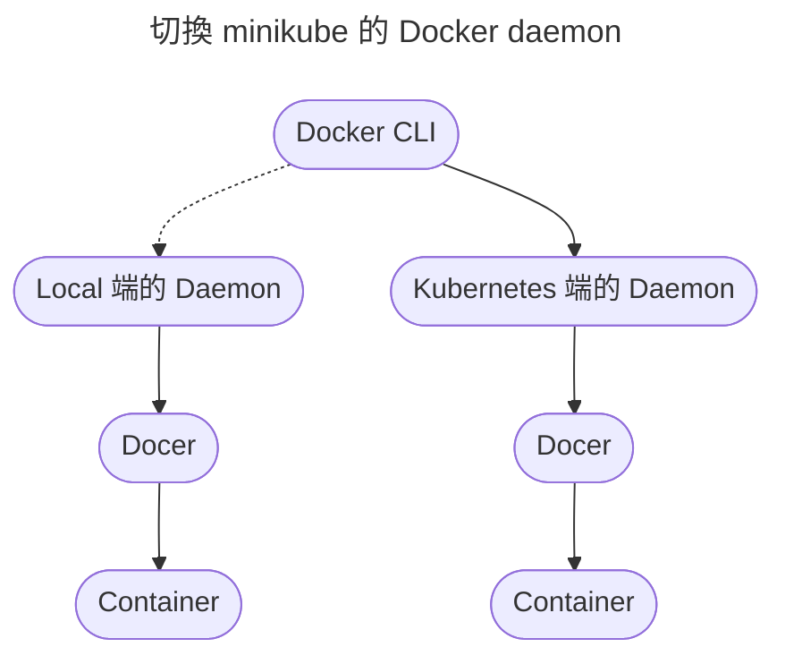

# Container Orchestration and Misc

上一份報告說明 Container 的價值和建構邏輯。而 Docker 不僅作為包裝應用程式的工具，也幫我們管理 Container。

但是仍有一些狀況需要解決：

- 如何做 Scaling，單一或多台機器
- Load Balance
- Health Check and Replacement
- 多服務間的溝通，docker-compose 僅能在單一台機器下協助溝通
- 新版本的應用程式如何無縫接軌

這時便需要一個調度容器（Container）的工具。

## Kubernetes

Kubernetes 可以解決上述提到的問題。接下來會先簡單介紹其中各名詞代表的意義，然後再實作，這樣對於實作時操作的各個指令就會比較有感。

### 單位

以下將逐一介紹 Kubernetes 的基本單位。

- Container
- Volume
- Pod
- Node
- Master
- Cluster

#### Container

管理容器化的應用程式，除了 Docker 外，上一份報告提到的 rkt 也是允許的應用程式。

#### Volume

和 Host 的 filesystem 做連接的服務，對 Container 提供資料存取的地方。

#### Pod

用來包裝 Container 和 Volume 的單位，一個 Pod 會被分配到一個 IP。若 Pod 中含有多的 Container 的話，各個 Container 會共用該組 IP。

有上述三個單位可以畫出一個圖：


#### Node

如同 Docker 管理 Container 一般，Node 就是管理 Pod 的單位。
一個 Node 底下需要一些輔助工具來幫助管理各個 Pod 和 Container：

- Kubernetes Daemon（稱作 Kubelet）
- Container Daemon（如：Docker）
- Network Proxy（稱作 Kube Proxy）


#### Master

用來管理 Node，並對外開放 API，提供途徑去操作各個 Node。
如：開發者可以通過 `kubectl` 透過 Master 去操作各個 Node。
（類似於 `Docker CLI` 透過 `Daemon` 去操作各個 `Container`）

#### Cluster

一組由 Master 和多個 Node 組成的群組。

#### 完整概略圖


### 概念

每次呼叫 Master 做事情，事實上就是指定一個 Cluster 應該有的狀態，如：

> 我希望某某 Node 裡面有 10 個版本 2 的 Pod。

此時 Kubernetes 就會針對該狀態開始做事，不管是降低、升高數量或升降版本的操作都是由 Kubernetes 去執行。

> 此處包括執行邏輯，例如預期 10 個 Pod，現有 4 個，需增加 6 個，此處的 6 個就是 Kubernetes 自行去計算出的數字。

接下來會介紹幾個在本次實作會應用到的觀念。

- Deployment
- Selector
- Label
- Scheduler
- Controller
- ReplicaSet
- Probe


#### Deployment

用來表達部署時欲達成的狀態，通常是最常接觸的工具。

狀態可能包括數量、版本等。

#### Selector

用來指定特定 Pod 的條件，例如：有高運算需求的就會要求有 `machine:physical` 這個 Label 的 Pod。

#### Label

用來幫 Node 和 Pod 貼標籤，以 Node.js 為例：

- `platform:node`
- `playform-version:v14`
- `machine:physical`
- `kernel:3.16`
- `app:web-api` `app:recipe-api`

> Label 不必唯一，你可以重複設定一樣的 key，如：`platform:node`、`platform:alpine`


#### Scheduler

Kubernetes 會測試現有環境（如 CPU/Memory）是否適合添加 Pod。若無，則等待。

預設做 Scheduling 的工具為 _kube-scheduler_。

#### Controller

用來控制 Kubernetes 各種狀態的控制器，通常開發者不會直接接觸。

#### ReplicaSet

除了 ReplicaSet 外，根據需求還有其他種類的群組，如：

- StatefulSet 是可以提供狀態儲存的群組。

> Stateful 的應用程式在這幾次報告都不會討論，因為對於需要儲存狀態的應用程式，其建構、部署的策略是另一項領域。

#### Probe

用來做 Health Check。


- Ingress
- Service


#### Service

如同 Docker 會決定哪一個 Container 有對外的 port 一樣，Service 也會利用 Selector 決定哪一個 Pod 是可以對外的。
類似於 reverse-proxy 般，決定外部哪些請求可以送進 Pod 裏面。

> 在前幾次報告中常常提到 service，其代表的意義是服務或應用程式，有別於此處提到的 Service

#### Ingress

管理 Cluster 外部的請求。

### Alternatives

由上述可知，Kubernetes 擁有非常豐富的功能，並且可以透過多種方式達成同一個目的（例如 dev/stg 的環境分割）。這裡也並未完全涵蓋 Kubernetes 的概念（例如以 [etcd](https://etcd.io) 做儲存的演算法）

> _Apache Mesos_ 和 _Apache Marathon_ 的組合能達到類似 Kubernetes 的功能。
> _Docker Swarm_ 是 _Docker_ 原生的容器化調度工具，但 _Docker_ 已經捨棄並改採和 Kubernetes 的兼容了。

## minikube

為了簡化實作上需要做的設定，本次實作會透過 _minikube_ 來操作。_minikube_ 是一個簡化版的 Kubernetes，他減少很多功能的設定，讓使用者可以快速開始實作，並且把 Master/Node 融合再一起。

- 確認 kubectl 的安裝：`kubectl version --client`

> `brew install kubernetes-cli`

- 確認 minikube 的安裝：`minikube version`

> `brew install minikube`

### kubectl

- 啟動

```bash
$ minikube start
😄  minikube v1.20.0 on Darwin 11.4
🎉  minikube 1.22.0 is available! Download it: https://github.com/kubernetes/minikube/releases/tag/v1.22.0
✨  Using the hyperkit driver based on existing profile
💡  To disable this notice, run: 'minikube config set WantUpdateNotification false'

👍  Starting control plane node minikube in cluster minikube
🔄  Restarting existing hyperkit VM for "minikube" ...
🐳  Preparing Kubernetes v1.20.2 on Docker 20.10.6 ...
🔎  Verifying Kubernetes components...
    ▪ Using image k8s.gcr.io/ingress-nginx/controller:v0.44.0
    ▪ Using image kubernetesui/dashboard:v2.1.0
    ▪ Using image docker.io/jettech/kube-webhook-certgen:v1.5.1
    ▪ Using image kubernetesui/metrics-scraper:v1.0.4
    ▪ Using image gcr.io/k8s-minikube/storage-provisioner:v5
    ▪ Using image docker.io/jettech/kube-webhook-certgen:v1.5.1
🔎  Verifying ingress addon...
🌟  Enabled addons: storage-provisioner, default-storageclass, ingress, dashboard
🏄  Done! kubectl is now configured to use "minikube" cluster and "default" namespace by default
```

- 查看現有 Pods

```bash
$ kubectl get pods
No resources found in default namespace.
```

因為預設使用 `default` namespace

- 查看所有 namespace

```bash
$ kubectl get namespace
NAME                   STATUS   AGE
default                Active   48d
ingress-nginx          Active   48d
kube-node-lease        Active   48d
kube-public            Active   48d
kube-system            Active   48d
kubernetes-dashboard   Active   48d
```

- 查看系統的 Pods

```bash
$ kubectl get pods --namespace=kube-system
NAME                               READY   STATUS    RESTARTS   AGE
coredns-74ff55c5b-sq5jt            1/1     Running   1          48d
etcd-minikube                      1/1     Running   1          48d
kube-apiserver-minikube            1/1     Running   1          48d
kube-controller-manager-minikube   1/1     Running   1          48d
kube-proxy-vslx5                   1/1     Running   1          48d
kube-scheduler-minikube            1/1     Running   1          48d
storage-provisioner                1/1     Running   2          48d
```

- 查看 Node

```bash
$ kubectl get nodes
NAME       STATUS   ROLES                  AGE   VERSION
minikube   Ready    control-plane,master   48d   v1.20.2
```

- 使用 minikube 的 Docker daemon



1. 先查看現有 Docker process list：`docker ps`
2. 再套用 minikube 的 Docker daemon `eval $(minikube -p minikube docker-env)`

    ```bash
    $ minikube -p minikube docker-env
    export DOCKER_TLS_VERIFY="1"
    export DOCKER_HOST="tcp://192.168.64.2:2376"
    export DOCKER_CERT_PATH="/Users/evan.lu/.minikube/certs"
    export MINIKUBE_ACTIVE_DOCKERD="minikube"

    # To point your shell to minikube's docker-daemon, run:
    # eval $(minikube -p minikube docker-env)
    ```

3. 再一次呼叫 `docker ps`

```bash
$ docker ps
CONTAINER ID   IMAGE                  COMMAND                  CREATED          STATUS          PORTS                                                                      NAMES
c3a17f71f9f9   435df390f367           "/usr/bin/dumb-init …"   35 minutes ago   Up 35 minutes                                                                              k8s_controller_ingress-nginx-controller-5d88495688-ljjlx_ingress-nginx_44335178-30e5-4dc5-a481-7980627f281d_1
825f8d008c8f   86262685d9ab           "/metrics-sidecar"       35 minutes ago   Up 35 minutes                                                                              k8s_dashboard-metrics-scraper_dashboard-metrics-scraper-f6647bd8c-zbbkd_kubernetes-dashboard_13929488-084b-407c-9339-1b6b7b7feb2d_1
8258d336d0d1   6e38f40d628d           "/storage-provisioner"   35 minutes ago   Up 35 minutes                                                                              k8s_storage-provisioner_storage-provisioner_kube-system_182b3e9c-2cd2-429f-aa0f-3103f916f32a_2
9edd75250040   9a07b5b4bfac           "/dashboard --insecu…"   35 minutes ago   Up 35 minutes                                                                              k8s_kubernetes-dashboard_kubernetes-dashboard-968bcb79-4l99k_kubernetes-dashboard_5cfcc5ce-7fb2-4304-baa1-6bf491e71469_1
c53e01b79ee7   k8s.gcr.io/pause:3.2   "/pause"                 35 minutes ago   Up 35 minutes   0.0.0.0:80->80/tcp, :::80->80/tcp, 0.0.0.0:443->443/tcp, :::443->443/tcp   k8s_POD_ingress-nginx-controller-5d88495688-ljjlx_ingress-nginx_44335178-30e5-4dc5-a481-7980627f281d_1
72d0bf46751a   k8s.gcr.io/pause:3.2   "/pause"                 35 minutes ago   Up 35 minutes                                                                              k8s_POD_storage-provisioner_kube-system_182b3e9c-2cd2-429f-aa0f-3103f916f32a_1
b5ef7f9450a2   43154ddb57a8           "/usr/local/bin/kube…"   35 minutes ago   Up 35 minutes                                                                              k8s_kube-proxy_kube-proxy-vslx5_kube-system_e9319a11-d048-41ed-8cb1-92a0a17d67b5_1
0cb200215df8   bfe3a36ebd25           "/coredns -conf /etc…"   35 minutes ago   Up 35 minutes                                                                              k8s_coredns_coredns-74ff55c5b-sq5jt_kube-system_8f238e64-e20d-4899-8a46-96d783fa8250_1
7ffd1a33f25c   k8s.gcr.io/pause:3.2   "/pause"                 35 minutes ago   Up 35 minutes                                                                              k8s_POD_dashboard-metrics-scraper-f6647bd8c-zbbkd_kubernetes-dashboard_13929488-084b-407c-9339-1b6b7b7feb2d_1
b589a1d27625   k8s.gcr.io/pause:3.2   "/pause"                 35 minutes ago   Up 35 minutes                                                                              k8s_POD_kubernetes-dashboard-968bcb79-4l99k_kubernetes-dashboard_5cfcc5ce-7fb2-4304-baa1-6bf491e71469_1
809d46696a2e   k8s.gcr.io/pause:3.2   "/pause"                 35 minutes ago   Up 35 minutes                                                                              k8s_POD_kube-proxy-vslx5_kube-system_e9319a11-d048-41ed-8cb1-92a0a17d67b5_1
a6e5be9a3bb9   k8s.gcr.io/pause:3.2   "/pause"                 35 minutes ago   Up 35 minutes                                                                              k8s_POD_coredns-74ff55c5b-sq5jt_kube-system_8f238e64-e20d-4899-8a46-96d783fa8250_1
41d81fb8bbd9   0369cf4303ff           "etcd --advertise-cl…"   35 minutes ago   Up 35 minutes                                                                              k8s_etcd_etcd-minikube_kube-system_cf26ec9554c6f440822285b6ff9668f3_1
c7a6eca2d3f9   ed2c44fbdd78           "kube-scheduler --au…"   35 minutes ago   Up 35 minutes                                                                              k8s_kube-scheduler_kube-scheduler-minikube_kube-system_6b4a0ee8b3d15a1c2e47c15d32e6eb0d_1
3e9a5a9df7da   a27166429d98           "kube-controller-man…"   35 minutes ago   Up 35 minutes                                                                              k8s_kube-controller-manager_kube-controller-manager-minikube_kube-system_474c55dfb64741cc485e46b6bb9f2dc0_1
dcbf747b8975   a8c2fdb8bf76           "kube-apiserver --ad…"   35 minutes ago   Up 35 minutes                                                                              k8s_kube-apiserver_kube-apiserver-minikube_kube-system_0a7845e36bfd593e2ff9a027038089d3_1
ac54b241757d   k8s.gcr.io/pause:3.2   "/pause"                 35 minutes ago   Up 35 minutes                                                                              k8s_POD_kube-scheduler-minikube_kube-system_6b4a0ee8b3d15a1c2e47c15d32e6eb0d_1
6a91f7f8e57c   k8s.gcr.io/pause:3.2   "/pause"                 35 minutes ago   Up 35 minutes                                                                              k8s_POD_kube-controller-manager-minikube_kube-system_474c55dfb64741cc485e46b6bb9f2dc0_1
495996cf491c   k8s.gcr.io/pause:3.2   "/pause"                 35 minutes ago   Up 35 minutes                                                                              k8s_POD_kube-apiserver-minikube_kube-system_0a7845e36bfd593e2ff9a027038089d3_1
6ea9c36a7ff8   k8s.gcr.io/pause:3.2   "/pause"                 35 minutes ago   Up 35 minutes                                                                              k8s_POD_etcd-minikube_kube-system_cf26ec9554c6f440822285b6ff9668f3_1
```

### Dashboard

有一個 UI 介面會讓你對 Kubernetes 更了解

```bash
$ minikube dashboard
🤔  Verifying dashboard health ...
🚀  Launching proxy ...
🤔  Verifying proxy health ...
🎉  Opening http://127.0.0.1:56616/api/v1/namespaces/kubernetes-dashboard/services/http:kubernetes-dashboard:/proxy/ in your default browser...
```

> minikube 很適合用來做 local 端測試或教學，但是對於線上環境，仍建議直接安裝 Kubernetes。

## 部署應用程式

目標：


開始部署應用程式之前，先把應用程式用 image 包裝好。

### 應用程式

必須使用 minikube 的 Docker 建置 image。

```bash
eval $(minikube -p minikube docker-env)
docker build . -t recipe-api:latest
```

### 部署

分別部署應用程式和 Service

#### 應用程式


??? info "tldr"

    ```
    H4sIAAAAAAAACs1c245a2RH9lRHPbLTvF79NFCXxSzTKRMrDZB721UbBTYduzyUj/3vWPnRzjtuGLqBbPpYsQVMcqMXadVlV8MfiJn6oizeLv9dfv/vzNn/8UG/uF8tFW2/q3+JN2eCxm4+bzXJRHh9888diXfAM/AGGX3/6L3V3t97eLN4IszLLxW18V+/6E/uNwwWGO4cr/IB73wncz+/Xm/L2ptTf8PTl4u59vN0/2amqg5CeRRE4095IJo03LKukKm9Zc2EOFycZLxf3v9/2F9/VfB9v3m0m7+cfkz/dxh38ejt500/e5O123ZH5SXu/lJr/jLe9/h+u8pP0emkU7u+29/F+gITjwfvfO7B/LPJ2s93hqmkT838Wj89a3H2Imw3uru/+st5sKl63xc1dxYcQ79536Hfx126dY7+M+LRcbGKqGzyyeLj5w8Mb4oAf/3+GiVe+2VoUE6k2pqMrjDdrGefK5ZaVMaId4CMZvwx88nP4lLJT+OzSiFnAJ6IMThXNXBSGaWsEUzx5ZkJ0VRVfWhMH+EjGB/ju62/3I3L/3N87DZoaQTNBgnP+KUjDRd8s3t6829W7u8WLo4YYse2vjz/s1rf9HfdX/H6zfofXX3xYlx47PnXgisjwmDMndWKaO8+49Y7FIKzVgCLkMSaQjK8BTk+AcxYfr9LuCHT/qum7H+vul/Xwkt8KPqNk0jInlqvNTGuvmMIJZC0qZTQvUhV3gI9kTIaPB2+tFYLlEIYPozCJsMlkyi7Ehj96eyIWOrnUxh4H9983P2zLN0S2GOUKL4H55iTTtWnGcykIeTYX0WNe1GO2oxhfEBAvwHgaMI1d6mm+cWYZwiziJcmxR3SJKDyg+263/Xg7IvvXh7unD745F7XhybgiHqeeKxJJfn75D6STOQYXq5csc6OZVqkyURxnUdoiUhRWpzE9kYzJYSLrKLPLgaWCwK1TkUylbFhN0klug+UyHQ8Tlvt5hwlVc8gyWCZcDKgktWdKwr2SVY3cNMFdOiBLMr4gTFyAsfy8RJhpmPAGby7UjIPiUWgqVOyqec6Ujl4VbiIKzrEqpRiTeVt9xImsnFkVgamyjqlYLVNWNxmb0imf4K3Tet681QhQOrvGiu/uSe6YDIhZKtico3Y8Rn5AlmR8AW8vwHjCWyf9XHlLOpCP6BJP7zXpzZ172qfpjZgPSMHtddIbiUePcBNJdw3cgp/L0inexDhGOpSvg7cqwvjk0bZmOzSwmQkRGqu61hRzTMWMwYNkfE3TJiZx11i+BHpH4i7C0Pq2zqBtq1q14HCGGq+oaGs0qAJNYIKX5KziRdUxr5GMX0iseiK3GK9nKbdYWR2AkKwirDDdnAAkKTDoAPhLMhU9wgE/kjGZgEqYLHRqjIti0YzgQijvG2s6lIpIXq3Tx+sCL+XSen+Sn9+6NGhKQmcxhXmLFkX7CJWlIP7E5kuINQsZ1QFckvEF5LwA5gl3vbBL6+QcS4PaTDW8okXkHqfZ+4o4zxPjqrXcoD3XOna+JGMydZFYpNU1sOqcwkGA9K1iMSzwlEwJ+KT4CfXaiflT10hTdKqGOct7DcKRaxrk1cB5sjLGymsY5TCK8QXUvQBm+QTmeVI3pRSRshUzA2AW8qtsUbCYEFQdeFrymPZJxnQVIalSnYkM+i+u5kov2qD8Vq+Uix7SSgynVYS5U1c6K6pOlmVvwBqvUP8lpHoJN5sw0rc0DmBIxpcICefDPKGu5Xyu1K1VcZEc6k+cQtTUsQNmI+OOa1RRVVifx6hLMSZTN2qJUrfhQjn3DClRfhQuWDMxxVagEcYTQoIOdvbUzZlDoHWOQcGsXf+UGAdivKVARLgeDf6P3S7F+ALqXgDzk2J3ptR1CY11gfodowIlTW/xRPEsNRelka6INlKXZEymLpoL1HES1ZwuELaRFdnQmCr8E8YKjkHwceoqTLfnTt3WpE8KLWlzKiLgccN45QplZsoNur2Mdoy6JOMLqHsBzBPqKjfbWpdUxB90AlrFf5Uuo89tEaa6DLGPJHVEr6PLkCrPiVxOKVOvwtueW9dO8SY2P6Qy/nXwJpVLh8RHq62uwtufKsbsM3gTK3ZS7fk6eJNy/CPexILgGrwlP1VBPIc3scwkFUyvgzcpMR1kNloWuwrvk2nvObyJtREpy78O3roYG6rEqQoCL200JkEBmq/TzQBZJI84ypok4wPecbfb/jri/f3D3WfwniySWemWWJZ8SO5PYE71pgw33g9bocNC5t193I37oPt7QGN/5cnB4cs+HMnx5k94bPHmfvex9oat337sx3D78MxJgSlWBhuBYRXc0wvgHeH2+ubd4BmSQ0xSWdYU8puWBjMqINdvGe+LxDJZWHR9Y/qi6bNXnRCPr1wAEiuQbVitqHm7G5AYvB4u8YD2p29UdjXpUnQBYzrX9wv7aqHS2NZsHhOjBB4juIxFLcX4ShpNyi6LcRiGhPOiERqVTiN7mkZWZZw01EpZBCQURDtsHyK1SETuVK1B/PPn0AiD2E4jP1caca6byglbSthWRYARDYWVDojvKrjSROR+9JNkfCWNJktaVoYVzr4PL0yilbyYRnw5THlPECjbkEvAKYsJ5ZM2mInyKkClhFrcuqR9MucQSCwlnyt5akU96DVnnqeHIbaIGLWnopzgwSQVxtaPZHwleSatiA5uZfuRly/LHmlXyl7BH4WEdppB2AbJaeghogRQJThkMlRbGd2nSNrkeE4IEmqFjkGYlTNzpVGyBvswrbLoNYochXVJJVGbRZ9yUUY4bDuMjlKMr6TRZJPGcYcI5OaUyjQSq10q+xyPHJogHqBd8IIqWCNmo3bklTlXTVACnRG0FjKPpFohqwu/krPlUeQSfNAOva3CwakW4lJCE5V8lFo6H10eRVSS8ZU8mnTqOqil0WJWPFIrj+zyLI+wdYQltYTmn1vkMYCDpewkmC3R2CyFTeIcHolVEEtEpfnySCcnhbKcSdGbLhwiJiWWvhtOk0kZrdhk1EEyvpJH4fMOzaCOnQmHZA8KvaxWpzkUsgODgmeVZ8ggSUHaqNANGnry4GrWhdszctoKIm8vq91cKZRcLhUKAwScDBk59804GwoTMukcdLQmjF9UJBlfRyE1XVZEEIdoCy3hZVmkhx7r8spImucikbIp6oqiyAqkfS0grApso6JQMlXzBtXMtzMi0b47kzOujEwoJgS0WVYIOJyRqbiBxhkVmi2hlMXzxlUXivGVNJqmD3xeKiytci9LI+dXVlxBI7D7GRoV53RUWeKAGY+hiC5MFq9xt2XDA0RMHek0QvQDLGHG+Qw6eG4WEqeJGf5izxiRBiKZak6XaIN3fvxiEMn4ShZNv5eCKCQ6i144pWnei5srWPRsWWRF3yNvCNMK0yioiwhGLWAk5YVxtpaUijgrGGmxnHN1raHyYOccsyxp+qTOdWVdomBGcWgLerJQRj9JxleyaKpbK+SyzqLXLos+p0Asmrs+fUqpOkwRVILAirsqoIPXIXsuhk6dVkmZoZCSp18SQ0/T9RIMpHv7Wx1GSQUDAYHpBqRJhfqznlNIQW/rhZSdK+tc6JPJAhGt9PI6GLRpCoPIIqzwirfqxLhETzK+knUTmdtxBcrNSubu72b4RJ+rpHD+tMGgFJPFYSAATReZnMXiW9AGSw36jGlJVwUcUuB8CykZIZvlkDDgaxh7Z7jKoSNhAAIUtMhgybjuTjK+kkYTmRubGXOjkRUrhNfnaWSFxNwa4xGrUXdqJzB0g1rQB8OuSg21N5whVSq+svOmUWim6ewsq6WntRowAOkNLQ8S431MIKUdlQGS8VW/ADKRuw3KZhx88xUKHXbx/vux3t1/sz28TwfqDB8naV47UoZg/MWJbLvth7fnTNG3b8/43aD9gdx/xXUg9DizeTzJZY3DedN/20TYYdOCMFscNy0Ixsddpk589y4Tf+vnfJdJ07DD8hTF+LjL1Onk3mXiF3LPd5k0vjlMVCnGx12mztT2LhN/YuOEy5gk8ZX6itOkWcOhTKMYH3eaOgHaO038JvAJp3sfifrmS6dJwvihI6IYH3eaOq54cJr2bdITTuv+SVv9pdMkDe6w7ksxPvFJE4XRl3LaqH6kv/JJk+TrQ96nGJ9IVsSBwos5/fUwRhLJHl0mGR93mapc7l0m7iCecJkH+Cy+kqApks4hQVOMTyRoos6295m453oqdPcoJvyXTpNEjMPUlGJ8gttEWehSbj/2Qs+ymySjHCRRivFLOU3cID//QJNa/kPgphgfd5kqxDxUn7QvKZxK0fIIuUkN6niiCcbHnabKBttzvvt+ymmsIWEQ+tTpodPq3eKP6AGP/+bqXd3gi0q1vC0w+Wlo8z/U3RDSD7IOBs9AYD8m/N92+2HfJ9eyvn8QAPrvwg47+3d39b6/1JM7/weEPuoeXFYAAA==
    ```

使用設定檔來部署應用程式。

> 這裡不細講設定檔各行意義，僅概述。
> [web-deployment](https://github.com/evan361425/distributed-node/blob/master/minikube/web-deployment.yml)、[recipe-deployment](https://github.com/evan361425/distributed-node/blob/master/minikube/recipe-deployment.yml)

- 定義 Pod 和 Label
- 透過 Selector 決定 scaling 要使用哪一些 Pod
- 要求達到的狀態。以此設定檔為例：長到 3/5 個 Pods
- Container 設定。版本、port 和 health-check

套用至 minikube：

```bash
kubectl apply -f minikube/recipe-deployment.yml
```

這時可以看看是否都啟動成功

```bash
$ kubectl get deployment
NAME         READY   UP-TO-DATE   AVAILABLE   AGE
recipe-api   5/5     5            5           19h
web-api      3/3     3            3           18h
```

#### Service


使用設定檔來部署 Service。

> 在 web-service 中一同設定 Ingress。
> [web-service](https://github.com/evan361425/distributed-node/blob/master/minikube/web-service.yml)、[recipe-service](https://github.com/evan361425/distributed-node/blob/master/minikube/recipe-service.yml)

- 定義應用程式對外的 port（Node 外、Cluster 內）
- 設定 Ingress 導引條件，放如 `host1` 引到 `Service A` 或 `/api/v1` 引到 `Service B`

套用至 minikube：

```bash
kubectl apply -f minikube/recipe-service.yml
```

### 測試

取得 Cluster Ingress address

```bash
$ kubectl get ingress
NAME              CLASS    HOSTS         ADDRESS        PORTS   AGE
web-api-ingress   <none>   example.org   192.168.64.2   80      96s
```

```bash
curl -H "Host: example.org" http://192.168.64.2
```

## 核心價值

上述範例可以透過 docker-compose 達成，但是 Kubernetes 不僅如此。

### 版本

當有新版本的應用程式需要部署時，Kubernetes 會先把新版本的 Pod 啟起來，等舊版本的 Pod 處理完請求時，取代之。

先把設定檔 `web-deployment.yml` 對 Container 的版本調整至 `v2`，再套用新的設定檔到 minikube。

> `--record=true` 可以記錄本次指令到 revision，幫助未來退版確認版本

```bash
kubectl apply -f minikube/web-deployment.yml --record=true
```

> Kubernetes 足夠聰明去判斷你改動了哪裡，然後作出調整。

現在來看看部署的過程吧。

> `-w` 可以用來監控狀況，`-l` 篩選特定 label 的 Pod

```bash
$ kubectl get pods -w -l app=web-api
NAME                       READY   STATUS              RESTARTS   AGE
web-api-769dc9c8b7-5824q   1/1     Running             0          19h
web-api-769dc9c8b7-6x9bc   1/1     Terminating         0          19h
web-api-769dc9c8b7-hk2dp   1/1     Running             0          19h
web-api-d85b66d56-pkrv5    1/1     Running             0          3s
web-api-d85b66d56-bgw55    1/1     Running             0          2s
web-api-769dc9c8b7-hk2dp   1/1     Terminating         0          19h
web-api-d85b66d56-6qsp4    0/1     Pending             0          0s
web-api-d85b66d56-6qsp4    0/1     ContainerCreating   0          0s
web-api-d85b66d56-6qsp4    1/1     Running             0          2s
web-api-769dc9c8b7-5824q   1/1     Terminating         0          19h
```


你也可以看看有過哪些資源。

```bash
$ kubectl get rs -l app=web-api
NAME                 DESIRED   CURRENT   READY   AGE
web-api-769dc9c8b7   0         0         0       20h
web-api-d85b66d56    3         3         3       6m34s
```

退版時，先確認版本號碼：

```bash
$ kubectl rollout history deployment.v1.apps/web-api
REVISION  CHANGE-CAUSE
1         <none>
2         kubectl apply --filename=web-api-deployment.yml --record=true
```

退版：

```bash
$ kubectl rollout undo deployment.v1.apps/web-api \
  --to-revision=1
```

### Scaling

手動增長到十個

```bash
$ kubectl scale deployment.apps/recipe-api --replicas=10
deployment.apps/recipe-api scaled
$ kubectl get deployment
NAME         READY   UP-TO-DATE   AVAILABLE   AGE
recipe-api   5/10    10           5           1m
web-api      3/3     3            3           1m
```

> 除了透過指令增減 Pod 數量，也可以改動 Deployment 檔，再引入。

在 scaling 的過程中，Kubernetes 會確定可以被引用才引用，移除時亦同。

> 這裡的 scaling 是動態調整的，而 docker-compose 是當初設定的數量後做啟動，並非 scaling。

除了手動增長減少，Kubernetes 也可以自動化：

- [Horizontal Autoscaler](https://kubernetes.io/docs/tasks/run-application/horizontal-pod-autoscale/) 透過 CPU 或其他系統資源去增減 Pod。
- Cron Job 透過排程去增減 Pod。

> Kubernetes 還有很多功能，我自己也才剛開始摸索，希望未來有人能深入瞭解並和大家分享！

## Misc

- Live migration
- Retry strategy
- Chaos resiliency
- Data atomicity
- Dependency security
- Dependency upgrade

> 上述這些在本書中都有討論到，個人覺得也很有趣，有興趣的人都可以看看。
