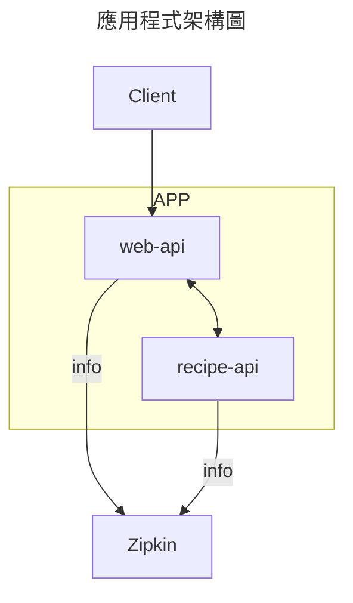

# Container

## 服務從一個變多個

問題往往就發生在當服務從一個變成多個時。

### Protocol

**JSON** - 當你只有一個 API Endpoint，足矣。

> 但是當你有越來越多 Endpoint 甚至同一時間需要各個 Endpoint 的資源...

**GraphQL** - 只需要對應一個端點，就可以獲得多個 API 的資訊且可以自行組織查詢內容

> 但是 API 的行為越來越複雜，牽涉到多種邏輯...

**gRPC** - 只需要專心撰寫程式邏輯，相關的 HTTP client 皆已經處理完。

### SLA and Load Test

怎麼確保產品在經過多次傳輸後仍能維持可預期的保證

1. SLO
2. Load Test
3. Baseline

### Observability

當產品越來越多，怎麼快速精準的獲取應用、服務、設備的資訊。

- Log
- Metric
- Tracing
- Alert
- Health Check

## 部署方式

有很多種方法可以提升服務的數量，各種方式都需權衡：

- 可攜帶性 - 相依套件須一併攜帶，包括 Binaries Depending
- 效率 - 每次部署需消耗的成本
- 安全性 - 機敏資訊的暴露
- 脆弱性 - 相依套件版本的衝突等

### 比較


- 實體機 - 若和其他服務（如 Load Balancer）有套件的衝突，會很麻煩。
- VM - 適合 DB 和其他需要儲存穩定狀態的應用程式。
- Container - 適合高迭代、高部署率的應用程式。

> Container 包括 Image、Port Mapping、Volume Mappings
> Volume 就是管理 Container 端和 Host 端的 filesystem

## Docker

Docker 是一個管理、建置 Container 的工具，其主要有三個工具：

1. _dockerd_ daemon，對外提供 API，進行 Container 的建置和管理
2. _Docker CLI_ 提供語法對 API 進行呼叫和設定。
3. _Docker Hub_

> _Docker Desktop_
> Docker 是執行在 Linux 之上的工具，若機器不是 Linux，就會需要 _Docker Desktop_。
> 其不僅可以建立 VM 來模擬 Linux 環境，也提供其他好用功能，如 UI 和 Kubernetes 的整合。


### Docker Image

把應用程式包裝成 Image 再依此建立 Container。
應用程式大部分都需要建立在特定環境之上，以 Node.js 的應用程式為例：


每個環境都稱為一組 stage，如 `Linux`、`Node.js` 和 `Application`。
每個 stage 中會有很多層 layer，分別代表建立過程的一個步驟。

以 Node.js 並包裝在 Alpine 之上的 Image 為例：

```bash
$ docker pull node:lts-alpine
c9b1b535fdd9: Pull complete
750cdd924064: Downloading [==>              ]  2.485MB/34.53MB
2078ab7cf9df: Download complete
02f523899354: Download complete
```

| #   | Layer                                   | Size     |
| --- | --------------------------------------- | -------- |
| 1   | ADD file ... in /...                    | 2.69 MB  |
| 2   | CMD \[\"/bin/sh\"\]                     | 0 B      |
| 3   | ENV NODE_VERSION=14.17.3                | 0 B      |
| 4   | /bin/sh -c addgroup -g 1000 ...         | 34.53 MB |
| 5   | ENV YARN_VERSION=1.22.5                 | 0 B      |
| 6   | /bin/sh -c apk add --no-cache ...       | 2.14 MB  |
| 7   | COPY file ... in /usr/...               | 281 B    |
| 8   | ENTRYPOINT \[\"docker-entrypoint.sh\"\] | 0 B      |
| 9   | CMD ["node"]                            | 0 B      |

> /Image 大小為 39.35 MB，[連結](https://hub.docker.com/layers/node/library/node/lts-alpine/images/sha256-5c33bc6f021453ae2e393e6e20650a4df0a4737b1882d389f17069dc1933fdc5)
>
> 有改變 filesystem 的步驟（會改變 Image 大小），才會列出來。
>
> SHA 值計算方式是上一個 SHA 值加上現行的指令組出來的。

若改為 Debian（預設值）則為：

```bash
$ docker pull node:lts
199ebcd83264: Pull complete
ddbb155879c0: Pull complete
c194bbaa3d8b: Pull complete
6154ac87d7f3: Pull complete
0c283e88ced7: Pull complete
dba101298560: Pull complete
1d8bfd4e555f: Downloading [=====>       ] 7.56MB/33.38MB
757e41ffbdcc: Download complete
6e055c4b8721: Download complete
```

| #   | Layer                                    | Size     |
| --- | ---------------------------------------- | -------- |
| 1   | ADD file ... in ...                      | 43.28 MB |
| 2   | CMD \["bash"\]                           | 0 B      |
| 3   | /bin/sh -c set -eux; apt-get ...         | 10.77 MB |
| 4   | /bin/sh -c set -ex; if ...               | 4.14 MB  |
| 5   | /bin/sh -c apt-get update && ...         | 47.46 MB |
| 6   | /bin/sh -c set -ex; apt-get ...          | 204.5 MB |
| 7   | /bin/sh -c groupadd --gid 1000 ...       | 4.09 KB  |
| 8   | ENV NODE_VERSION=14.17.3                 | 0 B      |
| 9   | /bin/sh -c ARCH= && dpkgArch="$(dpkg ... | 33.38 MB |
| 10  | ENV YARN_VERSION=1.22.5                  | 0 B      |
| 11  | /bin/sh -c set -ex ...                   | 2.23 MB  |
| 12  | COPY file ... in ...                     | 295 B    |
| 13  | ENTRYPOINT \[\"docker-entrypoint.sh\"\]  | 0 B      |
| 14  | CMD \["node"\]                           | 0 B      |

> /Image 大小為 345.75 MB，[連結](https://hub.docker.com/layers/node/library/node/lts/images/sha256-c31c7a8a41bcef8e260953bae91e65839f2cc29e5fbaa89407859ff7b7f144e3)。
>
> Container 部署實作上仍建議以較小的 Image 為基底，除了加速部署流程外，較小的檔案面積理論上也能降低被攻擊的機會。


### 實作

相信了解 Image 製作原理後，對於實作就不會有太大問題，這裡有實作相關的文件，有興趣可以去查看

- [以 Node.js 為基礎的製作範例](../../essay/architecture/made-container.md)
- [各語言的範例](https://docs.docker.com/language/) - 官網

### 和 Container 的互動

透過 Docker CLI 可以和 Container 互動，除了讓我們了解其內部運作過程，也可以幫助我們 Debug。

#### 進入 Container

```bash
docker run -it ubuntu /bin/bash
```

- `-i` 代表要以互動模式進入 Container
- `-t` 代表是以 TTY session 進入，和 `-i` 整合為 `-it`
- 並使用 `bash`

進入後，即可透過 `ps -e` 輸出所有 process。

```shell
$ ps -e
PID TTY          TIME CMD
  1 pts/0    00:00:00 bash
 10 pts/0    00:00:00 ps
```

> bash 作為初始行為，必須在 PID 1。

由此可看出，Container 的行為相當單純，不像實際使用的電腦，會有各種服務在背景運作。

#### 對 Container 內部下達指令

`docker exec ubuntu /bin/ls /var`

#### 把檔案丟進 Container 中

```bash
$ curl -o index.html http://example.org
$ docker run --rm -p 8080:80 \
  -v $PWD:/usr/share/nginx/html nginx
```

> `-p` 即為前面提到的 port-mappings
> `-v` 即為 volume-mappings（filesystem）

### Alternative

現在已經較少其他管理 Container 的產品：

- RedHat 有一個已經 archive 的專案 [rkt](https://github.com/rkt/rkt)
- [Open Container Initiative](https://opencontainers.org/) 則嘗試制訂 container 標準。

## 分散式系統上的應用

多個服務要怎麼透過 Docker 建立？有幾個方法：

- `docker run exmaple/server1` `docker run exmaple/server2`

> 多次 `docker run exmaple/server` 去建立不同的應用程式會難管理且容易出錯。

- 把不同服務包裝成同一個 Image

> 有時相似的應用程式可以包裝成同一個 Image，如上一次報告提到的 `ELK`，但是 _分散式系統上_ 不同的應用程式若包裝成同一個 Image 會讓服務的獨立性消失。

docker-compose 便是用來解決這一問題的方案。

以上一份 Tracing 中的 Zipkin 為例：



就可以依此建立 docker-compose.yaml：

```yaml
version: "3.7"
services:
    zipkin:
        image: openzipkin/zipkin-slim:2.19
        ports:
            - 9411:9411
    recipe-api:
        build:
            context: ./recipe-api
            dockerfile: Dockerfile-zipkin
        ports:
            - 4000:4000
        environment:
            ZIPKIN: zipkin:9411
        depends_on:
            - zipkin
    web-api:
        build:
            context: ./web-api
            dockerfile: Dockerfile-zipkin
        ports:
            - 3000:3000
        environment:
            TARGET: recipe-api:4000
            ZIPKIN: zipkin:9411
        depends_on:
            - zipkin
            - recipe-api
```

## Docker Registry

Docker Hub 提供存放 Image 空間，但對於私人空間的存放數量有限制。
可以根據預算，考慮其他 Docker Registry，例如：

- JFrog Artifactory
- Cloud based

## 註

這次分享省略

- 上傳 Image 到 Docker Registry
- 自製 Docker Registry UI
