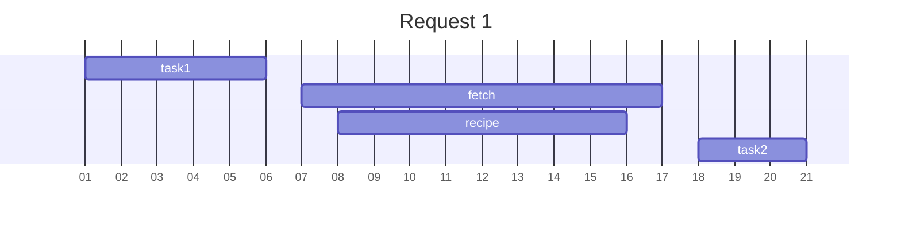

# Observability

## 說明

應用程式是需要維運的，分散式系統的維運和傳統上有什麼差異呢？

本章會依序介紹 Log、Tracing、Metric、Alert 和 Health Check。

### Log

在本地端測試時，時常用 `console.log` 或 `print` 這類函示來確認請求在執行過程中沒有發生什麼意料之外的事。

若在線上部署後，我要怎麼從遠在他方的 server 中取得相關訊息？

下面會介紹 [ELK](https://www.elastic.co/what-is/elk-stack)（`Elasticsearch`, `Logstash`, and `Kibana`）怎麼讓你拿到 server 的 log 資訊。

### Tracing

若一個請求歷程會經過多項服務，我要怎麼區分不同的請求？

> 例如：發現 A 服務在和 B 服務請求資料時，得到錯誤資料。
> 於是接著查看 B 服務的 log，然而同一時間卻有很多請求，茫茫大海如何尋？

此時就可以使用 Tracing 的機制，範例中會使用 [Zipkin](https://zipkin.io)。

```
┌────┐ Request┌───────┐ Request┌──────────┐
│user├────────►web-api├────────►recipe-api│
└────┘        └───────┘        └──────────┘
```

> `request ID` 代表各個請求的 ID，必須是不能重複的字串。

### Metric

除了針對單一請求的流程檢閱，若我要做統計呢？

> 例如：機器的 CPU 使用率、回應 4xx/5xx 的比率、API 使用分佈

這一類需要累積的資料，我們便稱其為 Metric，範例中會使用 [Graphite](https://graphiteapp.org)，[StatsD](https://github.com/statsd/statsd) 和 [Grafana](https://grafana.com)。

### Alert

有了 Metric，我們便可以設定些閥值，來通知開發人員以及早得知服務的狀態。

> 例如 5xx 比率超過 3% 時，提出警告通知

範例中會使用 [Grafana](https://grafana.com)。

### Health Check

若服務的依賴（例如 DB）連線斷掉或甚至服務本身斷線時，我們能否及早知道？同時自動重新建立連線，或甚至重新啟動該服務。

範例中會使用 [HAProxy](http://www.haproxy.org)

### 比較

| 種類    | 多服務才有意義 | 功能  | 所屬（概略） |
| ------- | -------------- | ----- | ------------ |
| Log     | X              | Debug | Dev          |
| Tracing | O              | Debug | Dev-Ops      |
| Metric  | X              | 統計  | Ops          |
| Alert   | X              | 分析  | Dev-Ops SE   |

## 實作

接下來進入一系列實作。

### Log

`ELK` 是 [Elastic](https://www.elastic.co) 開發的開源產品，其開發的不僅僅是 `ELK` 這三項產品。

本範例僅會討論 `ELK` 代表的 Elasticsearch、Logstash、Kibana 這三個，其中各產品定位和功能如下。

#### Elasticsearch

一種資料庫，並對外提供 API，會高效的搜尋相關資訊。並且有其標準的 query 語法。

> Elasticsearch is fast. Really, really fast.

> Elasticsearch 擁有很多功能，本次僅會示範幾種，若需要更多資訊，[詳見](https://www.elastic.co/guide/en/elasticsearch/reference/current/index.html)。

#### Logstash

Elasticsearch 是一種資料庫，但是儲存的資料需要有人給他，這便是 Logstash 的功能。負責把收到的資料整合送給 Elasticsearch。

> 送什麼資料是由應用程式方決定的，可以是 log file、HTTP 等。
> 本範例是透過 HTTP on UDP 來傳送。

#### Kibana

Elasticsearch 是一種資料庫，但是並未提供 UI 介面，這時 Kibana 就是把 API 轉成可讓人透過網頁的方式來操作。

#### 架構圖

```
                ┌────────────────────────────┐
                │            ELK             │
┌─────────┐     │ ┌────────┐                 │
│ Browser ├─────┼─► Kibana │ ┌─────────────┐ │
└─────────┘     │ └────────┘ │Elasticsearch│ │
                │            └─────────────┘ │
┌─────────┐ UDP │ ┌──────────┐               │
│   APP   ├─────┼─► Logstash │               │
└─────────┘     │ └──────────┘               │
                └────────────────────────────┘
```

#### 範例程式碼

[web-api](https://github.com/evan361425/distributed-node/blob/master/src/web-api/consumer-http-logs.ts)

對使用來說，不需要去考慮傳送到 Logstash 的邏輯

```javascript
logger.info(
  {
    path: req.url,
    method: req.method,
    ip: req.ip,
    ua: req.headers["user-agent"] || null,
  },
  "request-incoming"
);
```

> 無論用什麼格式撰寫 log，統一就好。

初始化 logger

```javascript
const client = dgram.createSocket("udp4");
const stream = {
  write: (msg: string) => {
    client.send(msg, LS_PORT, LS_HOST);
  },
};
const logger = pino({ level: "trace" }, stream);
```

#### Alternative

- [Datadog](https://datadoghq.com)
- [Sumo Logic](https://sumologic.com)
- [Splunk](https://splunk.com)
- Cloud (AWS, GCP, ELK)

### Metrics

其架構會和 Log 很像，Elasticsearch 也包含這類的 query 語法。
其重點差異便是在 log 處理對象為單一請求，而 metrics 處理的是服務在累積流量或時間後的狀態，如[上](#metric)所述。

範例中會使用的是 `Grafana`、`Graphite` 和 `StatsD`。

#### 架構

```
                ┌──────────────────────────┐
                │        Metrics           │
┌─────────┐     │ ┌─────────┐              │
│ Browser ├─────┼─► Grafana │ ┌──────────┐ │
└─────────┘     │ └─────────┘ │ Graphite │ │
                │             └──────────┘ │
┌─────────┐ UDP │ ┌────────┐               │
│ Service ├─────┼─► StatDs │               │
└─────────┘     │ └────────┘               │
                └──────────────────────────┘
graph LR
  0[Browser]
  1[Service]
  subgraph Metrics
    2[Grafana]
    3[Graphite]
    4[StatsD]
  end
  0 --> 2
  2 --> 3
  3 --> 2

  1 -- UDP -->4
  4 --> 3
```

> 和 log 非常相似，這裡就不贅述其意義。

#### 程式碼

[web-api](https://github.com/evan361425/distributed-node/blob/master/src/web-api/consumer-http-metrics.ts)

初始化 client

```javascript
const client = new StatsDClient({
  host: "localhost",
  port: 8125,
  prefix: "web-api",
});
```

統計請求時間和次數

```javascript
const begin = new Date();

await got(`http://${TARGET}/recipes/42`);

client.timing("outbound.recipe-api.request-time", begin);
client.increment("outbound.recipe-api.request-count");
```

統計系統資源

```javascript
setInterval(() => {
  client.gauge("server.conn", server.connections);

  const m = process.memoryUsage();
  client.gauge("server.memory.used", m.heapUsed);
  client.gauge("server.memory.total", m.heapTotal);

  const h = v8.getHeapStatistics();
  client.gauge("server.heap.size", h.used_heap_size);
  client.gauge("server.heap.limit", h.heap_size_limit);

  // try to mock memory heap
  fs.readdir(__dirname, (err, list) => {
    if (err) return;
    client.gauge("server.descriptors", list.length);
  });
}, 10_000);
```

> 範例中，把記憶體等相關資訊放在應用程式中。
> 實際上，為了避免應用程式斷線，導致收集不到服務的資訊，這類的資料收集應在服務外使用。

#### Alternative

- `Graphite` -> Prometheus, InfluxDB
- `StatsD` -> cAdvisor, MetricBeat

### Tracing

在分散式系統中，多個服務間的溝通或請求都可能在過程中得到非預期的結果，為了能快速找到問題點，需要辨別同一支請求在各個服務中的位置。

> 透過建立 request ID 來辨別同一支請求在多個服務中的位置。

#### 架構

```
               ┌────────────────┐
               │       APP      │
┌────────┐     │  ┌─────────┐   │ info ┌────────────┐
│ Client ├─────┼──► web-api ├───┼─────►│            │
└────────┘     │  └──▲────┬─┘   │      │            │
           Response  │    │Request ID  │   Zipkin   │
               │ ┌───┴────▼───┐ │      │            │
               │ │ recipe-api ├─┼──────┤            │
               │ └────────────┘ │ info └────────────┘
               └────────────────┘
```

產出範例：



> web-api 會傳送 `task1`、`fetch` 和 `task2`
> recipe-api 會傳送 `recipe`

#### 程式碼

[web-api](https://github.com/evan361425/distributed-node/blob/master/src/web-api/consumer-http-zipkin.ts)

```javascript
const tracer = new Tracer({
  ctxImpl,
  recorder,
  localServiceName: "web-api",
  sampler: new sampler.CountingSampler(1),
});
```

紀錄請求開始時和結束時

```javascript
app.use(expressMiddleware({ tracer }));
```

紀錄需要執行 100ms 的任務

```javascript
await tracer.local<Promise<void>>(
  'do_some_task',
  () => new Promise((resolve) => setTimeout(resolve, 100)),
);
```

使用包裝後的 `got` 來去請求，在使用時不需要考慮其 tracing 邏輯。

```javascript
await instance(`http://${TARGET}/recipes/42`).json();
```

```javascript
const instance = got.extend({
  hooks: {
    init: [(opts) => (opts._zipkin.parentId = tracer.id)],
    beforeRequest: [
      (opts) => {
        // ...
      },
    ],
    afterResponse: [
      (res) => {
        // ...
      },
    ],
    beforeError: [
      (err) => {
        // ...
        return err;
      },
    ],
  },
});
```

[recipe-api](https://github.com/evan361425/distributed-node/blob/master/src/recipe-api/producer-http-zipkin.ts)


### Alert

Demo in production

### Health Check

這大部分會和 Alert 一起實作，目的是持續打特定 route 去得知服務現有狀況。

但現有狀況會有些模糊地帶，例如：

有產品使用 cache 去達到 SLA。當 cache 失去運作，對應用程式來說仍能運行。但整體效率會降低，進而提高 Latency，這時服務的狀態算是健康還是不健康？

> 這種模糊地帶被稱作 `degraded`，至於該怎麼處理，就和商務邏輯的實作有關了。

#### 範例

> 範例中，會用 r-proxy 做 health check 且應用程式綁在一起。
> 但實作上，仍建議讓應用程式外的產品或甚至外單位的產品去做 health check。
> 例如：[PagerDuty](https://pagerduty.com)、[Nagios](https://nagios.org)、[Pingdom](https://pingdom.com/)。
> 除了 r-proxy，專做 health check 的開源軟體有：[Cabot](https://cabotapp.com/)。

HAProxy 的設定黨

```
# ...

backend web-api
  option httpchk GET /health
  server web-api-1 localhost:3001 check
  server web-api-2 localhost:3002 check
```

[web-api](https://github.com/evan361425/distributed-node/blob/master/src/web-api/consumer-http-healthcheck.ts)

```javascript
app.get("/health", (_req, res) => {
  return res.send("OK");
});
```
