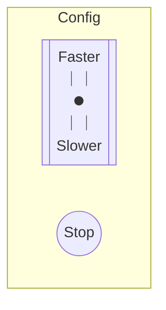

# 設定檔的最佳實踐

設定檔會異動的時間點通常有兩個，一個是你在建立服務之初，一個是在緊急情況需要調整服務行為。

每一次異動設定檔都是一個風險，為了讓對於服務不熟悉的人能夠快速理解設定檔的意義，
需要在設計設定檔的時候，把可讀性和安全性等各個面向考慮進去。

- 可讀性的原則就是設計時，把目的和實作細節區分開來。
- 安全性的原則就是要留退路給自己。

文中給了很多面向的建議、實際範例還有推薦設定語言來減少[勞動力](./toil.md)。

## 最完美的設定

如果我們假設最完美的設定是都沒有設定，開箱即用，且用得很好，
這樣所謂設計一個好的設定架構，就代表盡量減少可以設定的地方。

我們可以把目的抽象起來，例如

抽象成只有一個推桿可以控制速度，另外一個按鈕用來暫停進程：

