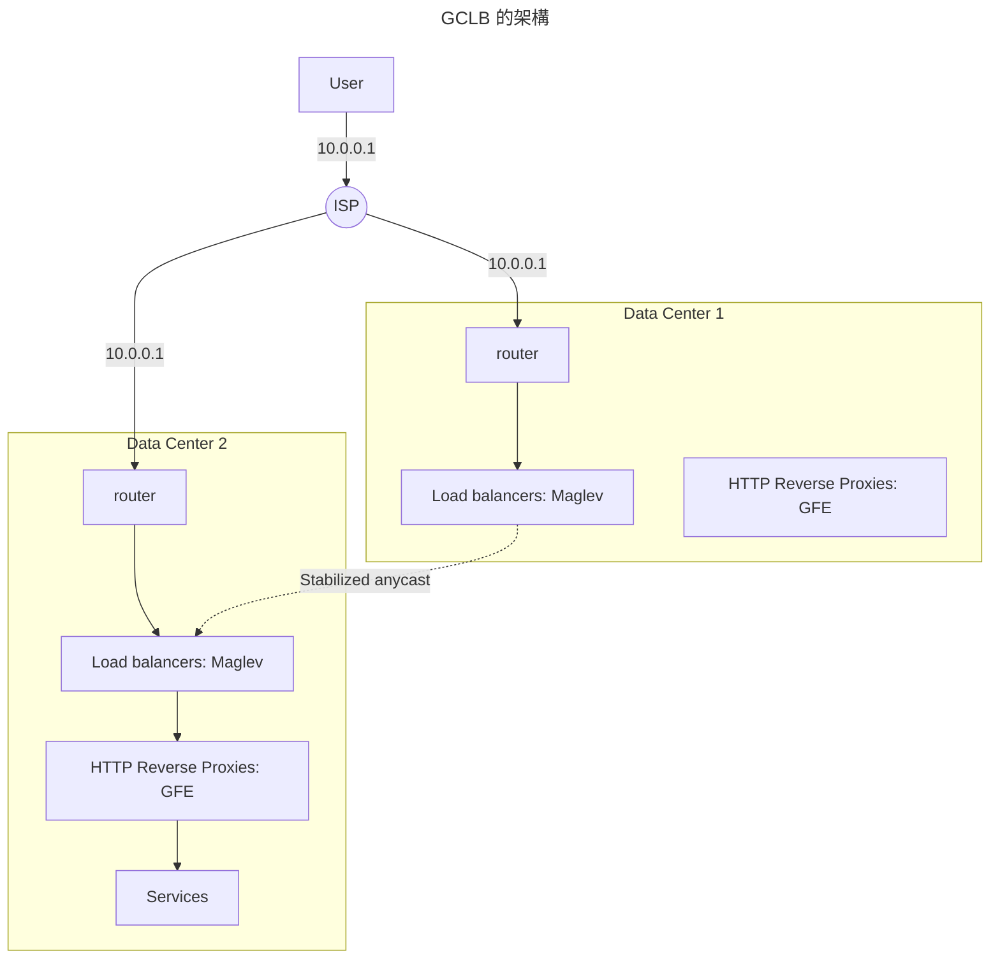
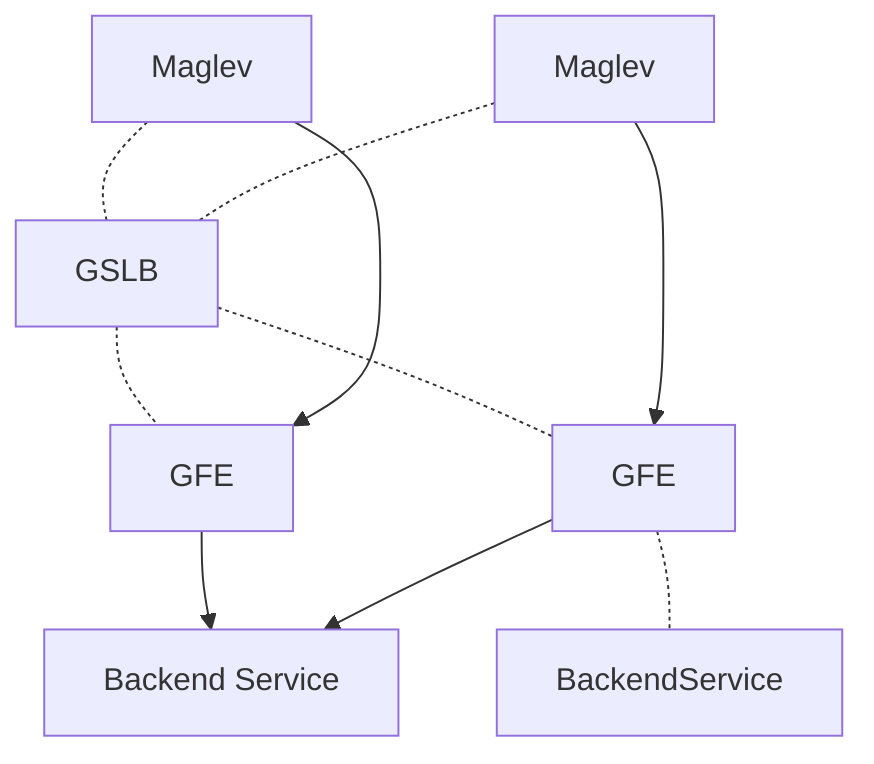

# 負載管理

通常一個大型服務的負載管理機制包含這以下三種方式：
負載平衡（load balancing）、負載削減（load shedding）和自動擴增（auto scaling）。
但是這些機制都需要同步彼此的狀態，否則很可能在某些時候造成錯誤設置，並破壞可用性。

在這些千奇百怪的狀況中，本章節提供一些建議來遵循。

!!! info "負載平衡的基礎"
    在 SRE 中，透過兩種負載平衡的不同角度切入，讓大家理解相關設計上的困境和常見解法。

    - [前端](https://sre.google/sre-book/load-balancing-frontend/)，
      使用者走到資料中心門口的平衡；
    - [資料中心裡面](https://sre.google/sre-book/load-balancing-datacenter/)，
      在可控範圍內的管理和設計。

## Google Cloud Load Balancing

第一段先透過 Google 雲端的負載平衡機制（GCLB），來提出幾個建議的模式供參考。
從使用者的請求送出，到最終到達提供服務的節點，中間的每一個環節的負載管理，都值得探討。

要均衡使用者送出的請求，最方便的就是使用 DNS。
DNS 透過使用者的 IP 給予最適當的資料中心 IP，來達到負載的分散。
但是使用者會快取 IP，如果資料中心失能時，要如何讓使用者重新請求新的 IP，
而不是等到期限到期才去重新請求？

這些都是實作上的困難，所以 GCLB 採用 anycast 的機制。
不同於 unicast 的路由方式只會點對點的傳輸，
anycast 在路由過程中，路由器會判斷最近的資料中心，並送往指定位置。

??? question "路由器怎麼知道有哪些資料中心"
    每個資料中心透過 [BGP](https://networklessons.com/bgp/introduction-to-bgp)
    發送自己的資訊給網路世界。
    而當使用者透過網路服務提供者（ISP）發送封包時，他們會透過 BGP 的資訊，
    來幫使用者的封包傳到最適合的資料中心。

但這仍會有幾個問題：

- 單一的資料中心仍可能被附近的使用者沖垮；
- ISP 經常會重新計算 BGP 路徑，導致使用者的目標叢集在連線過程中可能會被改變。

### GCLB 的架構

當封包送到 `Data Center 1` 的路由器時，其下游是 *Maglev*；
對 Maglev 來說，下游是 Google Front End（GFE），而對 GFE 來說，其下游就是真正的服務節點，
可能是 Kubernetes 的 ingress 也可能只是單純的 Nginx。

如果 Maglev 發現封包的目的地（服務的 VIP）是其他叢集（透過 [VIP matching](../../essay/web/maglev.md#vip-matching)），
就會把封包送給該叢集。更多 Maglev 說明，請參考[另一篇](../../essay/web/maglev.md)針對該論文的探討。

Maglev 下的 GFE 通常就會是 TCP 和 SSL sessions 的處理位置，並且根據 HTTP 路徑等資訊分配請求。
除此之外，他也會：

- 和上游進行長連線，以確保收到請求時能馬上把請求送達；
- 服務的健康檢查和無中斷的抽離失能節點，也就是會等待請求結束再把上游下線；
- 和上游服務溝通時，雙方會進行[加密](https://cloud.google.com/docs/security/encryption-in-transit)，
  進一步達成更大範圍的點對點加密。

但是當叢集內服務失能或負荷高時，Maglev 又或者 GFE 要怎麼把流量分散到其他叢集呢？
他們靠的是 Global Software Load Balancer（GSLB）的協調。

GSLB 會控制對 GFE 的連線和送往服務的請求分佈：

- 當 Maglev 透過 GSLB 發現 GFE 降能或甚至失能時，就可以把請求送到其他叢集。
- 當 GFE 透過 GSLB 發現下游服務的請求分佈過高時，就可以把請求送到其他叢集。

也就是說，GSLB 是一種把 Maglev 和 GFE 聯繫在一起的膠水，
讓 Maglev 可以找到最靠近且健康的 GFE 也讓 GFE 找到最靠近且健康的服務群組。

透過這些措施，讓整個 GCLB 成為一個低延遲、高可用的服務，並且解決了 anycast 的兩個問題。

### GCLB 的延伸

Google 透過把 Maglev 和 GFE 大量置於各個資料中心，
來盡可能減少使用者和服務的多次 TCP/TLS 來回交握。
當使用者和 GFE 完成連線後，他會使用和上游建立好的安全連線來進行請求，進一步降低延遲。

GCLB 提供 SLA 99.99% 的高可用性，並且提供很多服務來讓使用者進一步提高可用性。
例如預設會讓使用者透過[金絲雀部署](./canary-release.md)，每次部署新版本的應用程式時，
都可以事先放出先行版來進行測試，避免一次性部署造成的毀滅性災難。

## 案例研究一： Pokémon GO
