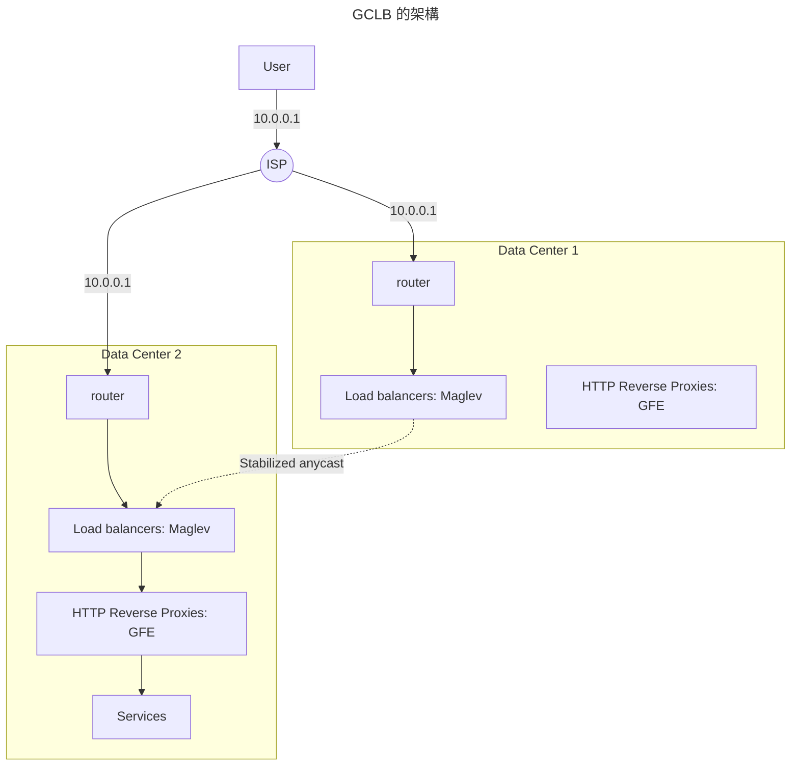
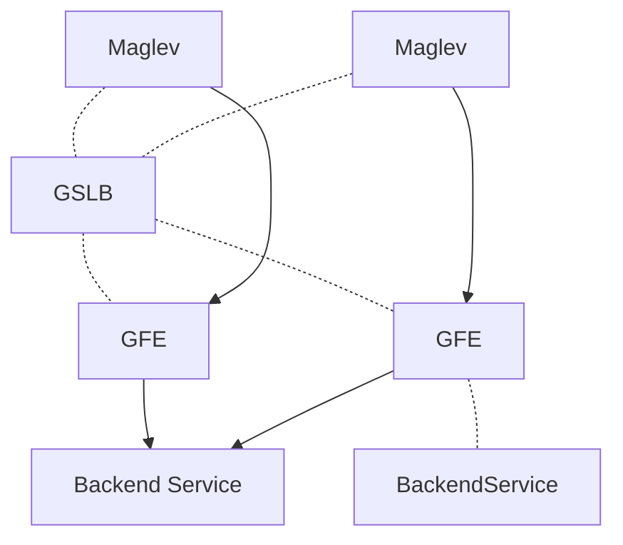

# 負載管理

通常一個大型服務的負載管理機制包含以下三種方式：
負載平衡（load balancing）、負載削減（load shedding）和自動增減（auto scaling）。
但是這些機制都需要同步彼此的狀態，否則很可能在某些時候造成錯誤設置，並破壞可用性。

在千奇百怪的線上狀況中，本章節提供一些建議來遵循。

!!! info "負載平衡的基礎"
    在 SRE 中，透過兩種負載平衡的不同角度切入，讓大家理解相關設計上的困境和常見解法。

    - [前端](https://sre.google/sre-book/load-balancing-frontend/)，
      使用者走到資料中心門口的平衡；
    - [資料中心裡面](https://sre.google/sre-book/load-balancing-datacenter/)，
      在可控範圍內的管理和設計。

## Google Cloud Load Balancing

首先我們透過 Google 雲端的負載平衡機制（Google Cloud Load Balancing, GCLB），
來提供幾個建議的架構當作參考。

從使用者的請求送出，到最終到達提供服務的節點，中間的每一個環節的負載管理，都值得探討。
要均衡使用者送出的請求，最方便的就是使用 DNS。
DNS 透過使用者的 IP 給予最適當的資料中心 IP，來達到負載的分散。
但是使用者會快取 IP，如果資料中心失能時，要如何讓使用者重新請求新的 IP，
而不是等到期限到期才去重新請求？

這些都是實作上的困難，所以 GCLB 採用 anycast 的機制。
不同於 unicast 的路由方式只會點對點的傳輸，
anycast 在路由過程中，路由器會判斷最近的資料中心，並送往指定位置。

!!! question "路由器怎麼知道有哪些資料中心"
    每個資料中心會使用 [BGP](https://networklessons.com/bgp/introduction-to-bgp)
    來發送自己的資訊給網路世界。
    而當使用者透過網路服務提供者（ISP）發送封包時，ISP 會利用 BGP 的資訊，
    幫助使用者的封包傳到最適合的資料中心。

但這仍會有幾個問題：

- ISP 經常會重新計算 BGP 路徑，導致使用者的目標資料中心在連線過程中可能會被改變。
- 單一的資料中心仍可能被附近的使用者沖垮；

要解決這些問題，我們就來介紹一下 GCLB 的架構。

### GCLB 的架構

當封包送到資料中心的路由器時，其首先接觸的下游是 *Maglev*；
對 Maglev 來說，下游是 Google Front End（GFE），而對 GFE 來說，其下游就是真正的服務節點，
可能是 Kubernetes 的 ingress 也可能只是單純的 Nginx。

如果 Maglev 發現封包的目的地（服務的 VIP）是其他資料中心，它就會把封包送給該叢集。
如上圖的 `Stabilized anycast`。依此，就可以解決 *使用者的目標資料中心在連線過程中可能會被改變* 的問題

!!! tip "什麼是 Maglev"
  更多 Maglev 說明，請參考[此篇](../../essay/web/maglev.md)。

  例如它是透過 [VIP matching](../../essay/web/maglev.md#vip-matching) 找到封包是否為其他資料中心。

Maglev 下的 GFE 通常就會是 TCP 和 TLS 連線的處理位置。除此之外，他也會：

- 根據收到的 HTTP 路徑等資訊分配請求；
- 和下游進行長連線，以確保收到請求時能馬上把請求轉送給目的地；
- 服務的健康檢查和無中斷的抽離失能節點，也就是說會等待節點的請求全部結束後再進行下線；
- 和下游服務溝通時，雙方會進行[加密](https://cloud.google.com/docs/security/encryption-in-transit)，
  進一步達成更大範圍的點對點加密。

回到前面提的另一個問題 *單一的資料中心仍可能被附近的使用者沖垮*。
當叢集內服務失能或負荷高時，Maglev 又或者 GFE 要怎麼把流量分散到其他叢集呢？
他們靠的是 Global Software Load Balancer（GSLB）的協調。

GSLB 會控制對 GFE 的連線和送往服務的請求分佈：

- 當 Maglev 透過 GSLB 發現 GFE 降能或甚至失能時，就可以把請求送到其他叢集。
- 當 GFE 透過 GSLB 發現下游服務的請求分佈過高時，就可以把請求送到其他叢集。

也就是說，GSLB 是一種把 Maglev 和 GFE 聯繫在一起的膠水，
讓 Maglev 可以找到最靠近且健康的 GFE；
也讓 GFE 能夠找到最靠近且健康的服務群組。

透過這些措施，讓整個 GCLB 成為一個低延遲、高可用的服務，並且解決了 anycast 的兩個問題。

### GCLB 的延伸

Google 透過把 Maglev 和 GFE 大量置於各個資料中心，
來盡可能減少使用者和服務的多次 TCP/TLS 來回交握。
當使用者和 GFE 完成連線後，他會使用和上游建立好的安全連線來進行請求，進一步降低延遲。

GCLB 提供 SLA 99.99% 的高可用性，並且提供很多服務來讓使用者進一步提高可用性。
例如預設會讓使用者透過[金絲雀部署](./canary-release.md)，每次部署新版本的應用程式時，
都可以事先放出先行版來進行測試，避免一次性部署造成的毀滅性災難。

## 案例研究： Pokémon GO

透過失能案例，來了解到 GCLB 的高彈性和高可用性。

Pokémon GO 是一款由 Niantic 和寶可夢公司合作開發的擴增實境遊戲，
他們的遊戲方式是需要全世界各地玩家在當地的實景中進行高度互動，例如拿取資源和捕捉角色，
這代表他們需要 *即時更新遊戲狀態* 給附近所有的玩家。

在遊戲發布前，他們使用估計最大流量的 5 倍去進行流量壓力測試，
但是當他們實際發布之後，流量來到了當初估計的 50 倍，
這樣的流量暴漲勢必考驗他們幾乎所有的軟體技術堆棧的承載能力。
包括 Google，在遊戲正式發佈後的兩天，該遊戲已經是 GCLB 服務中，最大的使用者了，
而且輕鬆地贏過其他前十的 GCLB 使用者。

一開始，他們只有透過 Maglev 來負載流量。
當 Maglev 收到封包後，就會直接傳給應用程式的負載均衡器 Nginx，並在那裡完成 TCP/TLS 的連線，
進一步緩衝 HTTP 請求，等待發送給後端服務。
這會有幾個問題：

- 使用者需要走更遠才能完成連線，增加 Nginx 處理時間，降低整體通量；
- Nginx 同時要完成 TCP/TLS 連線，又要處理 HTTP 應用邏輯的路由；
- 讓 Nginx 直接暴露到網路層的攻擊，例如 [SYN flood](../../essay/web/tcp.md#tcp-信號)

### Pokémon GO 的轉型

由於受到 SYN flood 的攻擊，促使他們開始使用 Maglev 加上 GFE 的組合。
當在流量低峰時完成轉型後，他們卻在流量高峰時得到了先前高峰 2 倍的流量，
這導致應用程式的 Nginx 完全來不及處理連線，進一步拖垮了後面整個服務的處理。
最終導致後端服務的緩慢（並非失能）讓很多請求都在 Nginx 中超時，而使用者在收到超時的回覆時，
會直接重新嘗試該請求，加劇了整個災難的發生。

同時，全世界的 GCLB 的容積也在這時下降到一半。
這是由於 Pokémon GO 的應用程式當請求失敗時，會馬上進行重傳，接著等待固定時間後，再次重傳。
如果此時 Nginx 重啟，瞬間所有連線斷掉又會馬上被使用者重傳，讓請求在一瞬間飆高到之前高峰的 20 倍。

這時 Google 針對 GFE 採取了幾個緊急措施：

- 針對 Pokémon GO 這個服務，建立專屬的 GFE 叢集，避免影響其他 GCLB 的使用者；
- 加大 GFE 叢集數量，直到 Pokémon GO 後端增長到足夠的數量，這並沒有解決問題，
  但是可以幫助開發者快速找到整條路線的瓶頸；
- 在 GFE 中進行限流，幫助 Pokémon GO 完成部分的請求，而不是大家都慢。

這件事讓 GFE 的效能評估中，更重視當後端緩慢時的處理狀況。
而對 Pokémon GO 的開發者來說，他們使用調整了重傳的機制，以及更有經驗的處理如何應付高流量。

## 負載管理的手段

*負載平衡*、*負載削減* 和 *自動增減* 就是這其中需要拿捏、權衡的三大工具。
這裡先介紹自動增減這個工具。

透過自動增長機制，來增加服務的通量，避免高峰造成的緩慢；
透過自動縮減機制，來增加資源的使用率，避免資源的浪費。

以下是簡述自動增減的最佳實踐、常見錯誤配置以及現階段的限制：

- 處裡異常節點：
  避免把還沒啟動好、卡住的節點納入服務和算力統計，同時允許讓自動化機制重啟或恢復服務；
- 有狀態請求的考量：
  例如長連線、sticky session 等，透過應用層級去處理流量分配，
  若使用垂直擴張（單節點算力提高）時，應注意流量是否分配平均；
- 閥值要保守：
  避免輕易擴張和縮減，其中縮減的閥值要更保守，避免快速大量的節點關閉。
  當服務負責處理外部進來的請求時，
  應[預備更多的算力](https://sre.google/sre-book/service-best-practices/#capacity-planning-wPsEUPo)避免流量急升；
- 限制增長和縮減的量：
  不能無限制的增加和減少；
- 允許切換到手動增減：
  確保值班的同仁可以手動增減節點數，同時該操作要直觀、簡單、快速且擁有充分的手冊指引；
- 避免讓服務的依賴過載：
  節點增加會讓其依賴負載增加，例如資料庫，應確保增加的量不會把依賴沖垮。
  所以，請嘗試暸解依賴的負載能力；
- 避免區域間的不平衡：
  多個區域（例如兩個資料中心）可能因為量的不同，會有不同的節點數，
  應盡量平衡每個區域的節點數；

最後，上面提的手段應該同時被考慮進去，
也就是說，請嘗試用多種策略去管理負載。
例如：

- 節點群和群彼此有獨立的自動擴張性，且要有負載平衡在前端平衡彼此的流量。
- 為了盡量滿足更多的使用者，緩慢的請求應優先被捨棄，例如來自地球另一端的請求。

### 負載平衡和負載削減協作失敗的案例

假設有個線上商城為了高可用性，在三個區域建置了各自的服務叢集，在這些叢集前面裝了一個負載平衡器。

他們的負載平衡不是根據請求去分配，而是根據下游叢集的 CPU 使用率。
若每個請求使用的 CPU 越低，將會分配給這個叢集越多的請求。
例如 *區域A* 每秒送了 10 個請求之後，CPU 增加了 5%，這代表負載平衡器可以發送每秒 160 個請求給它，
因為閥值設在 CPU 使用率達到 80% 後就不能再給。
而 *區域B* 每秒送了 10 個請求後，CPU 增加到 8%，這時就只會給他 RPS 100 的量。

早上 10:46 時因為折扣，使用者增加，RPS 從常態的 90 拉高到 120，這時正好是 11:00。
此時 *區域A* 的請求剛好比較多，導致他率先突破 CPU 使用的臨界點（例如前述的 80%），
進而導致服務的負載削減觸發。

*區域A* 的服務為了避免傷害擴大，而提早回應請求，並且讓錯誤率拉高。
但由於這個錯誤讓請求很快就回應，導致服務處理請求的 CPU 使用率很低。
最終負載平衡器開始把大量請求送過去，導致狀況越來越糟。

這個案例就使典型的負載平衡和負載削減彼此之間協作失敗。

### 手段落實的建議

- 當使用一些新的負載管理手段時，請確保測試和理解這工具和其他工具的相互關係；
- 監控整個回饋機制，確保緊急關閉按鈕可以在任意階段中執行；
- 若流程成熟，考慮加上自動化；

Load balancing

Load balancing minimizes latency by routing to the location closest to the user. Autoscaling can work together with load balancing to increase the size of locations close to the user and then route more traffic there, creating a positive feedback loop.

If demand is primarily closest to one location, that location will grow in size until all serving capacity is in one spot. If this location goes down, the remaining locations will become overloaded and traffic may be dropped. Scaling these locations up will not be instant. You can avoid this situation by setting a minimum number of instances per location to keep spare capacity for failover.

Load shedding
It’s a good idea to set your thresholds such that your system autoscales before load shedding kicks in. Otherwise, your system might start shedding traffic it could have served had it scaled up first.
Managing load with RPC

Handling the right requests is important for efficiency: you don’t want to autoscale up to serve requests that won’t benefit users, or shed load unnecessarily because you’re processing unimportant requests. When using both autoscaling and load shedding, it’s important that you set deadlines on your RPC requests.

Processes hold resources for all in-flight requests, and release those resources when the requests are completed. In the absence of a specific deadline, the system will hold resources for all in-progress requests, up to the maximum possible limit. By default, this deadline is a very large number (which depends on the language implementation—some language APIs work in terms of a fixed point in time, and others with a duration of time). This behavior causes clients, and ultimately users, to experience higher latency. The service is also at risk of running out of resources (like memory) and crashing.

To handle this scenario gracefully, we recommend that the server terminates requests that take too long, and that clients cancel requests that are no longer useful to them. For example, a server shouldn’t start an expensive search operation if the client already returned an error to the user. To set behavior expectations for a service, you could simply provide a comment in the API’s .proto file to suggest a default deadline. Also, set deliberate deadlines for the client (for examples, see our blog post “gRPC and Deadlines”).
