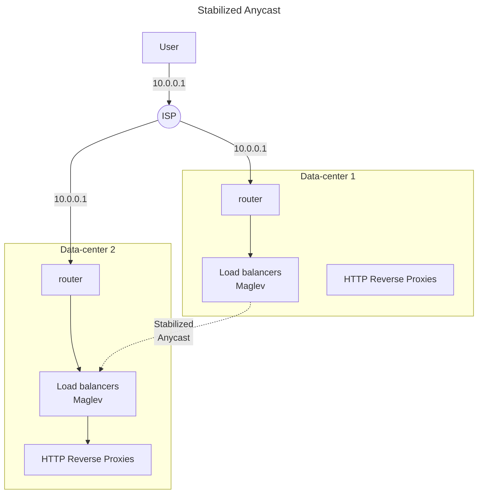

# 負載管理

負載平衡（load balancing）、負載削減（load shedding）和自動擴增（auto scaling），
這些機制都可以幫助改善服務的負載狀況，通常一個大型服務的負載管理機制包含這上述三種方式。
但是這些機制都需要同步彼此的狀態，否則很可能在某些時候造成錯誤（自動化的）設置，並破壞可用性。

在這些千奇百怪的狀況中，本章節提供一些建議來遵循。

!!! info "負載平衡的基礎"
    在 SRE 中，透過兩個負載平衡的不同角度，讓大家能夠理解設計上的困境和常見解法。

    - [前端](https://sre.google/sre-book/load-balancing-frontend/)，
      使用者走到資料中心門口的平衡；
    - [資料中心裡面](https://sre.google/sre-book/load-balancing-datacenter/)，
      在可控範圍內的管理和設計。

## Google Cloud Load Balancing

第一段先透過 Google 雲端的負載平衡機制（GCLB），來提出幾個建議的模式供參考。
從使用者的請求送出，到最終到達提供服務的節點，中間的每一個環節都負載管理，都值得探討。

要均衡使用者送出的請求，最方便的就是使用 DNS。
DNS 透過使用者的 IP 給予最適當的資料中心 IP，來達到負載的分散。
但是這需要把使用者的 IP 保留下來，而且當資料中心失能時，要讓使用者重新請求新的 IP，
而不是等到期限到期才去重新請求。

這些都是實作上的困難，所以 GCLB 採用 Anycast 的機制。
不同於 Unicast 的路由方式只會點對點的傳輸，
Anycast 在路由過程中，路由器會判斷最近的資料中心，並送往指定位置。

??? question "路由器怎麼知道有哪些資料中心"
    每個資料中心透過 [BGP](https://networklessons.com/bgp/introduction-to-bgp)
    發送自己的資訊給網路世界。

但這仍會有幾個問題：

-   單一的資料中心仍可能被附近的使用者沖垮
-   使用者可能會因為切換路由路徑而斷開連線

### 跨資料中心時確保連線的維持

為了讓使用者在跨資料中心時能確保連線的維持，Google 透過穩定化的 anycast（stabilized anycast）來達成。

當連線在 `Data-center 1` 建立時，路由器下面的負載平衡器
（Google 命名為 [*Maglev*](https://research.google/pubs/maglev-a-fast-and-reliable-software-network-load-balancer/)）
會把連線資訊同步給其他資料中心。
而這個負載平衡器只會處理 L4 的封包，並且透過 Equal-Cost Multi Path（ECMP）的轉送方式，
達成可以讓多個負載平衡共享連線資訊，當需要提高負載能力時，只需要單純的增加機器即可。
