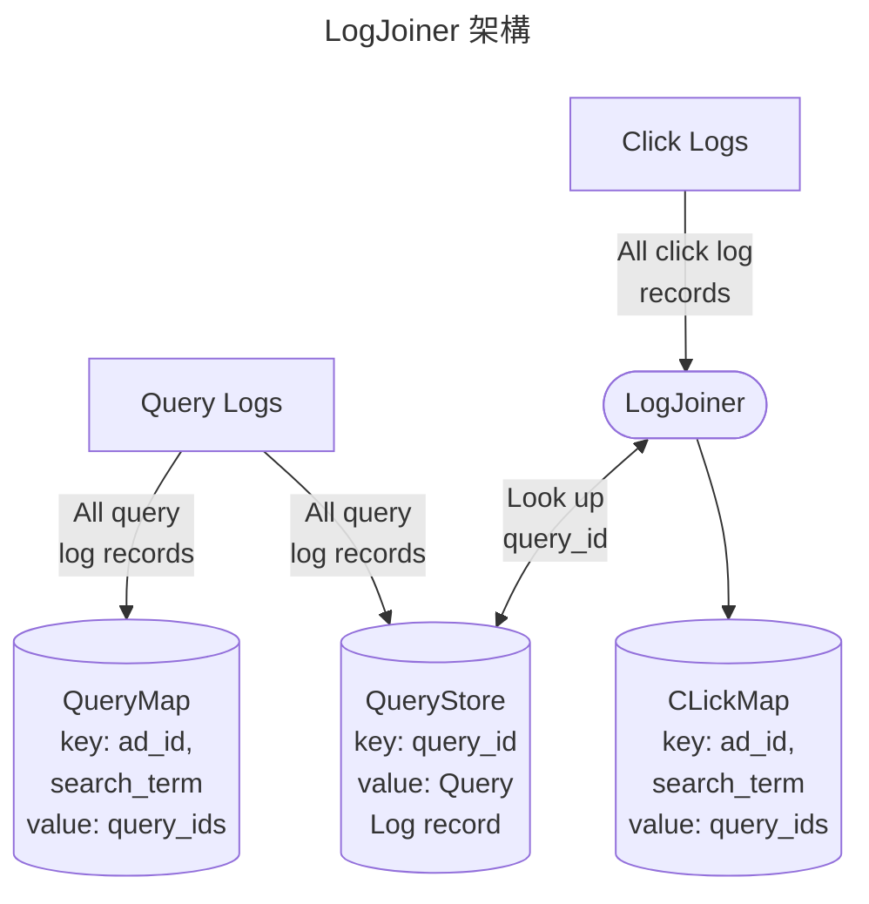
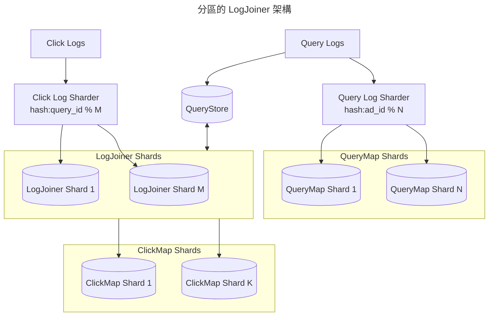
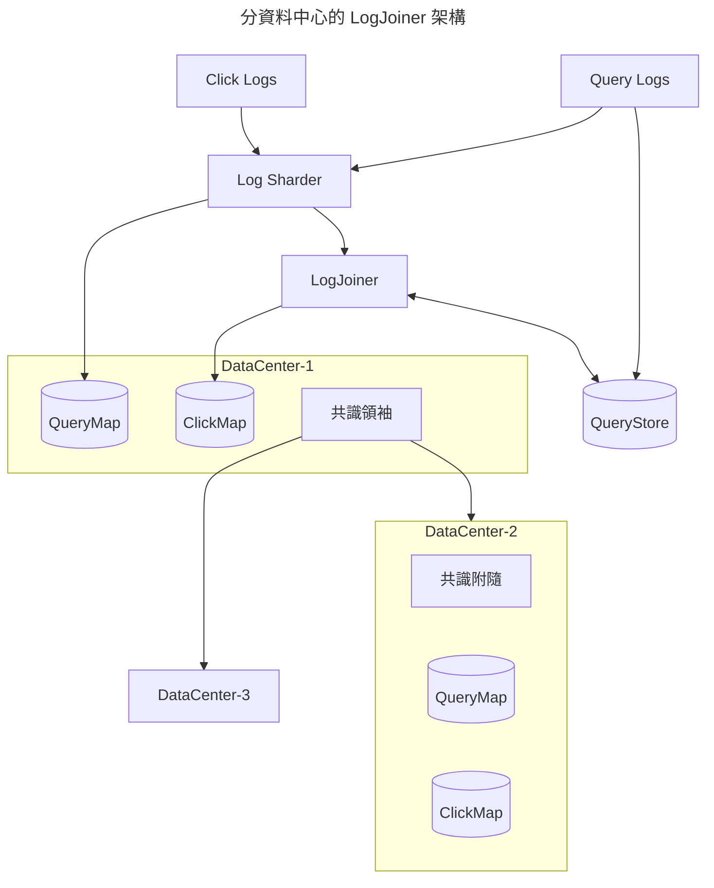

# 非抽象大型系統設計

非抽象大型系統設計（Non Abstract Large System Design, NALSD）的目的在於讓開發者設計系統架構時，
能夠有個依據來建立穩健而又高擴充的系統。

本文先透過定義問題，收集需求並反覆審視、循序改善架構的設計，最終得到一個可靠的系統設計解方。
目標是讓開發者能設計出一個在初期便擁有高穩健性且同時擁有未來調整的環境，
而這個過程，就是把抽象的需求，落地成實際可被分析的數字。
這些分析包括：

- 容量（capacity）預估
- 功能獨立性（類似艙壁原則，bulkheads），避免單一功能的損壞影響全部的服務。
- 允許服務降能（degradation）

這些實踐讓 SRE 有能力在面對系統設計時，
思考系統的擴充性和可能的瓶頸，並專注在這些點上。
在接下來的練習中，每一次設計的迭代，都可以反覆問自己這四個問題：

- *這個設計可能嗎？* 假設不去管資源議題，這個設計可以滿足需求嗎？
- *有沒有更好的方法？* 可以讓他更快、更輕便、更有效率嗎？
- *這方法可以在有限的設備數量、時間和金錢內達成嗎？*
- *這個架構允許降能嗎？* 當某組建壞掉會發生什麼事？當資料中心壞掉會發生什麼事？

!!! success "練習的目的"
    所有的系統最終都要實際跑在真實的資料中心和真實的設備上，
    我們需要反覆練習將白板上的架構圖，轉化成實際要使用的設備數量、網路通量等等。
    聽起來很瑣碎，但是不去練習和規劃，當我們實際上線時，可能會付出更慘痛的代價。

    練習中的假設和推估會比最終實際結果重要。
    早期的假設會很大程度影響最終的成果，但是在 NALSD 中，
    我們並不是要練習出完美的假設，而是在多個**不完美但是合理的假設**中導出一個更好被詮釋的結果

## 練習流程

開始前，先簡述一下流程。
我們將使用反覆迭代的方式去設計系統，每次迭代都會定義出相關的設計並找出它的優勢和弱點。
而每次迭代的分析，都會幫助我們找出優點在下一次的迭代中設計出更好的系統。
在初始階段我們會根據以下兩個問題來設計系統：

- 這個設計可能嗎？
- 有沒有更好的方法？

接著我們會去思考針對**初始設計的擴充性**，這時就會再去回應以下三個問題：

- 這方法可以在有限的設備數量、時間和金錢內達成嗎？
- 這個架構允許降能嗎？
- 有沒有更好的方法？

雖然這裡列出順序，但實際練習時這些問題可能是反覆詰問的。
例如在初始階段，我們可能就會先考慮它的可擴充性。
如果這個設計在後面的問題無法得到好的回答，我們就會修正或替換某個組件，接著重頭開始。

## 練習：AdWords

AdWords 是 Google 一項產品，用來在使用者透過 Google 搜尋時，推出純文字的廣告。
這次練習，是要設計出一個系統，可以觀測並回報正確的 *click-through rate*
（CTR，*使用者點擊廣告次數* 除以 *廣告推播數*）。

對於使用者來說，會想要知道推播的廣告是 *因為哪些關鍵字被投放廣告* 以及 *哪些關鍵字讓廣告更容易被點擊*，
進而去改變廣告關鍵字的組合然後調整廣告價錢。
這些資訊也就是需要組合 *關鍵字對廣告投放率* 以及 *關鍵字對廣告點擊率*。

### 定義需求的 SLO

首先我們站在使用者的角度去思考，對我們來說最關心的是什麼？
假設最關心的是 **面板中的請求是否快速** 以及 **資料是否即時**，由此訂定出 SLO：

- 99.9% 的請求都要在 1 秒內完成；
- 99.9% 的 CTR 資訊都要顯示 5 分鐘內的資料。

### 評估需求的資源

系統中已經存在機制把使用者的每個 *搜尋* 和 *廣告點擊* 記錄下來，以下是這些日誌的內容：

| 名稱 | 變數名稱 | 型別 | 佔位（bytes）|
| - | - | - | - |
| 時間 | `time` | 64-bit integer | 8 |
| ID | `query_id` | 64-bit integer | 8 |
| ADs | `ad_ids` | array of 64-bit integers | 8~24（每次搜尋最多放 3 個廣告） |
| 關鍵字 | `search_terms` | array of char | ≈500 |
| 元資料 | `metadata` | array of char | 500~1000（使用語言、哪台機器服務的等等） |

> 搜尋的日誌內容

| 名稱 | 變數名稱 | 型別 | 佔位（bytes）|
| - | - | - | - |
| 時間 | `time` | 64-bit integer | 8 |
| ID | `query_id` | 64-bit integer | 8 |
| AD | `ad_id` | 64-bit integers | 8 |

> 廣告點擊的日誌內容

??? question "為什麼不把 search_term 放進廣告點擊的日誌"
    如果我們直接把 `search_term` 放進廣告點擊的日誌中，
    我們就可以直接透過該日誌找到我們想要的指標 *關鍵字對廣告點擊率*。

    但現實是這些點擊紀錄是透過 HTTP URL 傳遞，換句話說這個 URL 是有長度限制的，
    除此之外，Google 需要提供的指標不只是 CTR，為了資源使用率和資料一致性的考量，
    不會把 `search_term` 到處丟。

假設：

- 服務每秒會有 500k 的搜尋（Google search）和 10k 的廣告點擊；
- 搜尋每筆日誌大小為 2KB，這是高估，但是為了避免非預期大流量，高估是可被接受的。

### 設計可行架構

我們針對三種架構討論：

- [MySQL](#mysql)；
- [MapReduce](#mapreduce)；
- [LogJoiner](#logjoiner)。

#### MySQL

問題：*這個設計可能嗎？*

如果把資料放進 MySQL 裡面，我們可以透過以下的 SQL 找出「某個廣告，針對某個關鍵字的點擊率」。

```sql
-- 把 Query Log 分成：query_ads、query_terms 和 query_metadata 三個資料表。
SELECT a.search_term, a.click_count / b.query_count
FROM (
    SELECT COUNT(*) AS click_count
    FROM click_history AS c
    LEFT JOIN query_terms AS q ON q.query_id = c.query_id AND q.search_term = ?
    WHERE c.ad_id = ?
) a,
(
    SELECT COUNT(*) AS query_count
    FROM query_ads AS a
    INNER JOIN query_terms AS t ON t.query_id = q.query_id AND t.search_term = ?
    WHERE a.ad_id = ?
) b
WHERE a.search_term = b.search_term
```

問題：*這方法可以在有限的設備數量、時間和金錢內達成嗎？*

為了放進這些資料，我們需要多大的資料庫？
根據前面估計的量，1 天的搜尋日誌大小約為 86.4TB：

\begin{flalign}
\left( 5 \times 10^5 \mathrm{\ queries/second} \right)
\times \left( 2 \times 10^3 \mathrm{\ bytes} \right)
\times \left( 8.64 \times 10^4 \mathrm{\ seconds/day} \right) \\
=86.4 \mathrm{\ TB/day}
\end{flalign}

保守估計需要約 100TB 容量，假設我們使用 4TB 的 HDD（硬碟），而每個硬碟又受限於 200 IOPS，
然後根據前面的 MySQL，我們需要把資料存進 4 個資料表，此時我們就會需要約 10,000 個硬碟：

\begin{align*}
\left( 5 \times 10^5 \mathrm{\ queries/second} \right)
\times \left( 4 \mathrm{\ IO/query} \right)
/ \left( 200 \mathrm{\ IOPS/disk} \right) \\
= 1 \times 10^4 \mathrm{\ disks}
\end{align*}

單純的計算點擊率，搜尋日誌就使用 10,000 個硬碟，
為了不因 IOPS 而去選擇大量硬體，我們決定直接評估一下 RAM 的可行性，而放棄其他儲存類型，例如 SSD。
假設一台 16C/64G/1G（16 core CPU、64 GB RAM、1G 網路通量）的電腦，我們就會需要 1563 台電腦：

\begin{align*}
\left\lceil
  \left( 100 \mathrm{\ TB} \right)
  / \left( 64 \mathrm{\ GB\ RAM/machine} \right)
\right\rceil \\
= 1,563 \mathrm{\ machines}
\end{align*}

這麼多台的 MySQL 叢集，如果對他做上述的搜尋指令，
這些叢集就會開始進行大量跨節點的運算，其中還要考量資源的備援、冗余，顯然不太實際。

#### MapReduce

!!! tip
    在閱讀下文前，建議先理解
    [MapReduce](../designing-data-intensive-applications/derived-batch.md#mapreduce)。

問題：*這個設計可能嗎？*

把搜尋日誌和點擊日誌的 `ad_id` *剖析*（map）出來，之後 *合併*（reduce）進每個 `search_term` 的點擊次數。
雖然 MapReduce 可以輕易做到分散式的計算，當需要更多設備時也可以輕易補上，但是我們還要考量我們的 SLO。

SLO：*99.9% 的 CTR 資訊都要顯示 5 分鐘內的資料*。

為了滿足即時資料的需求，我們必須要把批次處理的級距變得很小，例如，每分鐘批次計算一次。
但是在進行合併計算時，如果相同搜尋和點擊的日誌並沒有放在同一個批次裡
（搜尋和廣告點擊根據使用者的行為，可能沒辦法在一分鐘內完成），
就沒辦法組出 `search_term` 和點擊次數。

如果要處理這種跨批次的運算對於 MapReduce 來說很耗資源，同時也不是他原生適合處理的事情。
面對這個困境，我們選擇往其他可能的架構來討論。

#### LogJoiner

問題：*這個設計可能嗎？*

比起讓搜尋日誌存進 MySQL，
我們使用 BigTable
或[排序字串表](../designing-data-intensive-applications/foundation-index.md#排序字串表)，
這種好做[分區]的資料庫，
然後根據特定欄位做索引後，接著單純寫入即可，不需支援 SQL 的跨節點搜尋。



透過 ClickMap 和 QueryMap 存放我們需要的 `ad_id` 和 `search_term` 對應的點擊數和搜尋數。
就可以快速取得需要的廣告點擊率，接著我們計算下各自需要的儲存空間，以此來推算能否使用記憶體來存取。

我們一樣需要一個存放 100TB 的搜尋日誌，*QueryStore* 不像前面提到的 MySQL，
QueryStore 只需要以 `query_id` 作為鍵，然後存放該筆搜尋的資料即可，
這樣就可以輕易做到擴展性。

每次廣告點擊的日誌進來，*LogJoiner* 就會去取得該筆的搜尋資料，每筆資料如前述為 2KB，
此時的網路通量為 160Mbps：

\begin{align*}
\left( 10^4 \mathrm{\ clicks/sec} \right)
\times \left( 2\times 10^3 \mathrm{\ bytes} \right) \\
= 20 \mathrm{\ MB/sec} = 160 \mathrm{\ Mbps}
\end{align*}

接著 LogJoiner 再把 `query_id`、`time`、`ad_id` 和 `search_term` 存進 ClickMap 中，
假設總共使用 1KB，此時的網路通量為 80Mbps：

\begin{align*}
\left( 10^4 \mathrm{\ clicks/sec} \right)
\times \left( 10^3 \mathrm{\ bytes} \right) \\
= 80 \mathrm{\ Mbps}
\end{align*}

對於 ClickMap，他需要存放以 `ad_id` 和 `search_term` 為鍵，
多筆 `time` 和 `query_id` 的陣列為值的鍵值對。
這樣一整天 ClickMap 中，值的大小就會是 14GB：

\begin{align*}
\left( 10^4 \mathrm{\ clicks/sec} \right)
\times \left( 8.64 \times 10^4 \mathrm{\ seconds/day} \right)
\times \left( 8 \mathrm{\ bytes} + 8 \mathrm{\ bytes} \right) \\
= 14 \mathrm{\ GB/day}
\end{align*}

而鍵的大小則是根據廣告數和廣告關鍵字組合的數量決定，假設有 1 億個廣告和關鍵字的組合，
這樣也僅是使用約 800MB 的大小。
最後，我們大方的估計 ClickMap 每天需要 20GB 的儲存空間，這完全可以存放在一台設備的記憶體中。

最後我們來計算下 QueryMap 的大小，假設每個搜尋都會配上 3 個廣告，我們就會需要約 2TB 的大小：

\begin{align*}
3 \times \left(5 \times 10^5 \mathrm{\ clicks/sec} \right)
\times \left( 8.64 \times 10^4 \mathrm{\ seconds/day} \right)
\times \left( 8 \mathrm{\ bytes} + 8 \mathrm{\ bytes} \right) \\
= 2 \mathrm{\ TB/day}
\end{align*}

問題：*有沒有更好的方法？*

雖然可以用一台機器的磁碟來存放 2TB 的資料，但是前面我們也看到他容易受到 IOPS 的限制，
所以我們勢必需要設計一個可以進行[分區]的資料叢集，接著我們就往下討論此架構。

#### 分區的 LogJoiner

根據不同的 `ad_id`，我們可以把這些資料分配在不同的 QueryMap 和 ClickMap 節點中，藉此達到：

- 擴展性：透過把計算和儲存分配到不同節點中，可以避免單一機器的 IO 瓶頸；
- 高可用：不只分區，也可以把資料複製到多台節點，以達到高可用性；
- 效率性：當資料夠小時，就可以使用記憶體來儲存，加快整個流程。

問題：*這個設計可能嗎？*

相關做法就是對 `ad_id` 做雜湊得到一個數字後，根據該數字的位置分配給指定的節點，
例如假設有 N 個節點，把流量分配給雜湊結果模除（modulo）N 得到的數字。
當廣告商想要找特定廣告的點擊率時，就用一樣的方法去做搜尋。
同樣的做法也可以套用在 LogJoiner，只是會根據 `query_id` 進行分配。

問題：*這個架構允許降能嗎？*

最後，為了達到高可用，我們可以使用[複製](../designing-data-intensive-applications/distributed-replication.md)，
把請求同時分配給多個不同的 LogJoiner、QueryMap 或 ClickMap 節點，
以避免有特定節點失能時，該區段的資料都會丟失，導致輕易超過我們的錯誤預算。

最終的架構就會是：



??? question "為什麼要用 query_id 做分區的鍵"
    可以看到不同的日誌使用不同的鍵，點擊日誌使用 `query_id` 分區，而搜尋日誌使用 `ad_id`，
    為什麼這樣選擇？

    對於 QueryMap 來說，它會使用 `ad_id` 作為鍵，所以搜尋日誌透過 `ad_id` 來分區很合理。
    但是對點擊日誌來說，它會需要使用 `query_id` 來和 QueryStore 拿取搜尋資訊，
    透過 `query_id` 來分區可以和它後續動作匹配，最後在根據 `ad_id` 分發給不同的 ClickMap。
    當然，實作時可以根據相關數據來進行分析，怎麼樣效率更好，或更直觀。

### 延伸架構去滿足 SLO

如果我們要盡可能讓他高可用，單一叢集的多節點之外，我們也要做到多叢集。
換句話說，什麼樣的架構可以滿足多資料中心的高可用呢？

問題：*這個架構允許更高強度的降能嗎？*

為了避免單一叢集的風險，我們需要在收到點擊或搜尋日誌時，同時送給其他叢集。
但是在分發的同時，要怎麼避免彼此狀態不同步，導致使用者得到的 CTR 會不一樣？
這個問題是經典的分散式容錯。

!!! info "分散式容錯"
    這裡不展開什麼是分散式容錯，或者說共識演算法，因為這個東西如果用兩三行來解釋，很容易造成誤會。
    不過之前有寫過一些[相關介紹](../designing-data-intensive-applications/distributed-ft.md)，歡迎閱讀。

根據評估，每次資料的同步需要約 25ms，這個時間會因為兩個資料中心的距離遠近而有所改變，
換句話說，單一連線每秒最多只能進行 40 次的同步。

為了滿足共識演算法的最低要求，我們需要把資料分派給另外兩個資料中心，達到總共三個節點的高可用性。
原本每秒 500k 的搜尋日誌，將因此變成每秒 1m 的請求，而點擊則同樣要乘以 2 倍。
最終，我們可以得到每次同步會需要處理 25.5k 個日誌，或者說，
我們同時要有 25.5k 個連線（或稱任務）來傳遞資料：

\begin{align*}
\left(1.02 \times 10^6 \mathrm{\ logs/sec} \right)
/ \left( 40 \mathrm{\ operations/sec} \right) \\
= 2.55 \times 10^4 \mathrm{\ connections}
\end{align*}

因為要把 QueryMap 的資料傳給其他兩個資料中心，
所以每個連線要承載 157MB 的資料：

\begin{align*}
\left(4 \times 10^{12} \mathrm{\ bytes} \right)
/ \left( 2.55 \times 10^4 \mathrm{\ connections} \right) \\
= 157 \mathrm{\ MB/connection}
\end{align*}

而一台設備的記憶體只有 64GB，換句話說，每台設備只能承載 408 個連線：

\begin{align*}
\left(6.4 \times 10^{10} \mathrm{\ bytes/machine} \right)
/ \left( 1.57 \times 10^8 \mathrm{\ bytes/connection} \right) \\
= 408 \mathrm{\ connection/machine}
\end{align*}

另外兩個資料中心總共會需要 63 台設備，平均分配的話一個資料中心要有 32 台設備來處理這些量。
現在，我們來算算每台設備的網路通量是多少。假設每個日誌佔用 2KB 的大小，
且每台設備只能處理 408 個連線，這樣每台設備的網路通量為 262Mbps：

\begin{align*}
\left(1.02 \times 10^6 \mathrm{\ logs/sec} \right)
\times \left( 2 \times 10^3 \mathrm{\ bytes} \right)
\times \frac{408 \mathrm{\ connection/machine}}
  {2.55 \times 10^4 \mathrm{\ connections}} \\
≈ 262 \mathrm{\ Mbps}
\end{align*}

這樣的數量大約只佔用一台 1Gbps 通量的設備的四分之一，綽綽有餘。
最終，我們的架構就會成為：



這樣的架構透過以下分析，我們認為可以滿足相關的 SLO：

- 99.9% 的請求都要在 1 秒內完成，
  因為直接透過記憶體的鍵（`ad_id`）值（`click count` 和 `search count`）對去尋找相關紀錄；
- 99.9% 的 CTR 資訊都要顯示 5 分鐘內的資料，
  因為每個組件都是獨立的，當發現某個瓶頸時，可以輕易做到水平擴充。

## 總結

NALSD 是一個設計系統時反覆迭代的過程，首先把架構拆成對應的邏輯元件，並想像其置入線上環境的資源需求。
在這之中 SLO 的訂定變得尤為重要，因為 SLO 會驅動架構設計的進化，並在設計過程中不會迷航。

之所以說反覆迭代，就是在設計過程中每一次結束都要反覆問自己還能更好嗎？
讓設計者除了能依據 SLO 這個準繩之外，還能透過前一次的架構或前幾次的架構，最終產出更好的架構。

根據 Google 的經驗，**把抽象的需求轉化成實際的資源**，
例如 CPU、記憶體、Network throughput 等等，
對於架構最終的穩定性非常重要。

[分區]: ../designing-data-intensive-applications/distributed-partition.md
